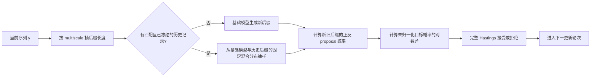
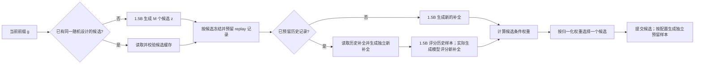

# 推理扩展算法：基础、原理与实现

本文档集中说明仓库中全部推理算法及其执行实现。第 2.1 节先给出当前 Qwen2.5-1.5B 默认 MH 与 IS 路径的
完整数据流；后续各节再分别展开目标分布、有限预算算法、关键代码、统计性质和成本来源。批处理、KV 复用、
异步奖励、vLLM 和计算量统计统一列在第 17 节。[运行与评测](../experiments/GSM8K_EXPERIMENT_DESIGN.md)
说明统一入口和统计方式；非默认方案的筛选结论集中在[第 19 节](#alg-nondefault-notes)。

## 1. 统一记号与实现边界

给定 token 化提示 $`x`$，记基础模型的完整生成分布为

```math
p(y\mid x)=\prod_{t=1}^{|y|}p(y_t\mid x,y_{\lt t}).
```

在已经生成前缀 $`g`$ 时，下一段候选记为 $`z`$，候选后的补全记为 $`u`$。奖励写作
$`r(g,z,u)`$，奖励温度写作 $`\tau\gt 0`$。仓库中最常用的显式奖励目标是

```math
\pi_r(y\mid x)
=\frac{p(y\mid x)\exp\{r(y)/\tau\}}
       {\sum_{y'}p(y'\mid x)\exp\{r(y')/\tau\}}.

```

<p align="right">式 (1)</p>

另一类目标是幂分布

```math
\pi_\alpha(y\mid x)
=\frac{p(y\mid x)^\alpha}{\sum_{y'}p(y'\mid x)^\alpha},
\qquad \alpha\gt 0.

```

<p align="right">式 (2)</p>

本文使用三类性质：

- **目标分布保持不变**：若当前状态服从指定目标，执行一次 MH 更新后仍服从该目标；有限更新轮次仍有链的收敛误差。
- **估计量无偏**：普通 IS 或 replay 恒等式对条件奖励权重给出无偏估计；有限候选数下的归一化重采样仍是近似。
- **执行等价**：批处理、流式完成和预取保持随机请求与统计量固定。

下文中，MH 指 Metropolis--Hastings，IS 指重要性采样（Importance Sampling），SIR 指
采样—重要性加权—重采样（Sampling-Importance-Resampling），SMC 指序贯蒙特卡洛
（Sequential Monte Carlo），GRPO 指组相对策略优化（Group Relative Policy Optimization），ESS 指
有效样本量（effective sample size）。边缘分布指只保留一部分随机变量、对其余随机变量的概率求和后得到的
分布；细致平衡指任意两个状态之间按目标概率加权后的正向与反向转移概率相等，因此一次更新保持目标分布不变。

为与代码和配置字段对应，文档保留少量英文标识。rollout 指从当前候选继续生成到终止位置的补全；proposal
指产生候选的提议分布；behavior 指实际产生历史样本的分布。代码中的 `fresh` 表示本次新生成的样本，
`history` 表示此前保存的样本。转移核指“给定当前状态时，下一状态的条件分布”。代码字段名继续写在
反引号内，说明文字使用上述中文含义。

重要性修正要求 $`p(y)\gt 0\Rightarrow q(y)\gt 0`$。把部分概率直接截为零的 top-k/top-p 可能破坏该条件；权重截断以偏差换取
有限权重范围。

### 1.1 模型无关算法层与生成适配层

AR-LLM 与 dLLM 的生成状态不同：前者追加 token 后缀，后者更新掩码块或完整反向轨迹。算法层仅依赖
候选、目标值和 proposal 概率，不直接调用具体模型。实现边界如下。

| 共享对象 | 算法层操作 | AR-LLM 适配 | dLLM 适配 |
| --- | --- | --- | --- |
| `StepwiseGenerationBackend` | 生成候选、估计条件奖励权重、归一化、重采样、提交候选 | token 块与自回归补全 | 掩码块与扩散补全 |
| `MonteCarloRolloutWeightProvider` | 汇总 on-policy、off-policy 或不校正的 rollout 权重 | token 条件概率比 | 轨迹或生成块的条件概率比 |
| `IteratedSIRTransition` | 保留完整当前状态、加入独立 proposal、按权重重采样 | 候选 token 块及其补全 | 可由其他逐步生成适配层复用 |
| `TruncatedReplayRolloutWeightProvider` | 合并历史样本与独立新补全 | 历史 token 补全 | 历史扩散轨迹 |
| `MetropolisHastingsProposal` | 根据未归一化目标概率与正反 proposal 概率执行接受或拒绝 | 随机后缀 proposal | block、轨迹或整段 proposal |
| `allocate_variance_cost_budget` | 按方差与单样本成本冻结最终估计配额 | token rollout 配额 | 扩散轨迹配额 |
| SMC 公共核 | 归一化对数权重、系统重采样、按条件拆分 rollout 样本池 | token 后缀粒子 | 分块轨迹粒子 |

对任意逐步生成模型，MH 适配层为当前状态 $`y`$ 和 proposal $`y'`$ 提供四个标量：
$`\log\widetilde\pi(y)`$、$`\log\widetilde\pi(y')`$、$`\log q(y'\mid y)`$ 与
$`\log q(y\mid y')`$。共享核计算

```math
\log A=\min\left\{0,
\log\widetilde\pi(y')-\log\widetilde\pi(y)
+\log q(y\mid y')-\log q(y'\mid y)
\right\},
```

再以 $`\log U\leq\log A`$ 接受 proposal，其中 $`U`$ 为 $`[0,1)`$ 上的均匀随机数。后缀切点、扩散
生成块、批处理和异步预取属于 proposal 的执行方式，不改变该接受核。

<a id="alg-overview"></a>
## 2. 方法总览

| 方法 | 采样或估计对象 | 有限预算下的性质 | 主要实现 |
| --- | --- | --- | --- |
| Base / greedy / beam / Best-of-$`N`$ | 基础模型采样或确定性搜索 | 基线分布或奖励最大化 | `experiments/run_reproduction.py` |
| 幂分布 MH | 式 (2) | 目标分布保持不变；有限更新存在收敛误差 | `shared/mh.py` + 两侧 proposal 适配 |
| 奖励目标 MH | 式 (1) | 目标分布保持不变；每次 proposal 通常需完整奖励 | `shared/mh.py` + 两侧目标评分 |
| 条件 IS | 式 (1) 的逐块 SIR | $`K,M\to\infty`$ 时趋近目标 | `shared/stepwise.py` + 两侧生成适配 |
| 迭代条件 IS | 式 (1) 的逐块 i-SIR | 固定非负权重下，有限候选池的转移核保持扩展目标不变 | `experimental/shared/iterated_sir.py` + AR 补全适配 |
| off-policy 条件 IS | 同上，补全来自其他 proposal | 未截断普通 IS 对条件奖励权重无偏 | `shared/importance.py` + 两侧轨迹评分 |
| 未校正 rollout 加权 | $`p(z)\,\mathbb E_q[e^{r/\tau}\mid z]`$ | 有意改变目标的消融 | 同上，`apply_importance_correction=False` |
| 基础模型候选的 rollout replay | 式 (1) 的逐块 SIR | 历史样本与独立新样本组成的条件权重估计无偏 | `shared/importance.py` + 两侧 replay 存储 |
| 可枚举候选 logit adjustment | 式 (1) 的下一步条件分布 | 枚举候选后直接归一化；误差只来自条件权重估计 | 理论参考，当前未接入执行入口 |
| 动态候选 IS | 辅助候选、外层 IS、replay | 使用实际候选 proposal 的 $`p/q_c`$ | `shared/budget.py` + 两侧候选适配 |
| 分阶段 IS | 初始样本分配预算，独立样本执行最终估计 | 最终权重仅使用独立的最终估计样本 | `shared/budget.py` + 两侧 rollout 适配 |
| 固定样本的流式 IS | 固定设计下允许样本异步到达 | 固定样本集合上的顺序不变性 | `experimental/arllm/streaming_is.py` |
| SMC 多树搜索 | 分块粒子近似 | 有限粒子、有限后续权重估计的 SMC 近似 | `shared/smc.py` + 两侧粒子状态 |
| 两阶段延迟接受 MH | 式 (1) | 两阶段接受率保持目标不变 | 公共接受核 + 两侧近似/精确奖励评分 |
| 冻结历史混合 proposal 的 MH | 式 (1) | 冻结混合 proposal 的正反概率均进入 Hastings 比 | 公共接受核 + 两侧历史 proposal |
| GRPO / VRPO | 参数化策略的训练近似 | 受模型族、优化轮次与采样预算影响 | AR token 对数似然 / dLLM 掩码证据下界（ELBO） |

表中的相对源码路径均位于 [`src/inference_scaling`](../../src/inference_scaling/)。
默认组件由 `experiments/shared/components.py` 定义。表中位于 `experimental/` 的实现以及动态
候选、分阶段 IS、SMC、两阶段延迟接受和草稿模型专项实验均需显式选择，不会随 `full` 自动运行。

### 2.1 当前 Qwen2.5-1.5B 默认执行规则

当前默认设置区分算法设计与执行调度。算法设计决定候选、概率、权重、接受随机数和 replay 数据；执行调度
只合并已经确定的生成与评分请求。统一入口将多尺度后缀配置 `multiscale` 传给 MH，并默认调度 `replay` 与
`async` 组件；
根级复现入口将这些组件作为独立任务调度；持续运行服务中的请求级自动路由尚未接入。冻结的历史记录只有在提示、模型、采样策略、
奖励版本和生成位置全部匹配时才进入 replay 路径；其他请求执行新生成路径。在线成本只把运行前已经存在且
匹配的历史记录计作可复用资源，临时构建历史库的成本单列。

<a id="alg-qwen-default-mh"></a>
#### 2.1.1 默认后缀 MH

同一执行流程支持幂目标式 (2) 和奖励目标式 (1)。幂目标使用
$`\log\widetilde\pi(y)=\alpha\log p(y\mid x)`$；奖励目标使用
$`\log\widetilde\pi(y)=\log p(y\mid x)+r(y)/\tau`$。当前 Qwen 默认入口采用 `multiscale`
后缀长度分布；存在匹配历史记录时，冻结历史 proposal 是优先降低墙钟的路径；以 FLOPs 为主要指标或没有
匹配历史记录时使用基础模型 proposal。



固定当前阶段长度 $`T`$ 后，一次更新执行：

1. 从与当前序列无关、对 $`1,\ldots,T`$ 全支持的 $`\rho(\ell)`$ 抽取后缀长度 $`\ell`$，令切点
   $`c=T-\ell`$；
2. 若调用方提供匹配且在链开始前冻结的后缀库，从基础模型与历史经验分布组成的固定混合分布抽取新后缀；
   否则从基础模型抽取；
3. 对旧后缀和新后缀计算同一个 proposal 的概率。replay 命中仍需计算完整混合分布概率；单独使用
   历史记录的频率不满足 MH 接受率的要求；
4. 计算幂目标或奖励目标的未归一化对数概率差，调用共享 MH 核；
5. 用请求局部的均匀随机数接受或拒绝，随后进入下一次更新；
6. 当前阶段完成 `steps_per_block` 次更新后扩展到下一阶段，直到长度 $`L`$。

单链单次更新的逻辑工作量如下；多链批处理减少物理提交次数，不改变每条链的逻辑请求。

| proposal 路径 | 新后缀生成 | 概率计算 | 奖励调用 |
| --- | --- | --- | --- |
| 基础模型 | 1 条长度 $`\ell`$ 的后缀 | 生成时保存新后缀概率；旧状态概率缓存 | 奖励目标对新完整序列调用一次；幂目标无需外部奖励 |
| replay 命中 | 0 条新后缀生成 | 读取已缓存的基础概率，缺失时对给定的历史后缀做并行概率评分；随后计算新旧完整混合概率 | 奖励目标对新完整序列调用一次 |
| replay 未命中 | 与基础模型路径相同 | 与基础模型路径相同 | 与基础模型路径相同 |

`multiscale` 只改变各个后缀长度的固定混合比例；replay 只改变给定长度下的 proposal。每个分量都在
Hastings 比中使用完整正反概率，因此两项可以组合。直观上，短后缀降低生成成本，完整后缀的正概率提供
全局移动；增加更新轮次会继续减小有限链误差，但实际速度取决于 proposal 与目标的重叠程度。

主要入口为
[`run_mh_chain`](../../src/inference_scaling/arllm/algorithms/mh.py)、
[`run_mh_chains_batched`](../../src/inference_scaling/arllm/algorithms/mh.py)和
[`run_reward_mh_chain_replay_proposal`](../../src/inference_scaling/arllm/algorithms/mh_acceleration.py)。
执行比较可通过统一入口的 `infra` 组件调用
[`benchmark_is_mh_reuse.py`](../../experiments/arllm/benchmark_is_mh_reuse.py)。

<a id="alg-qwen-default-is"></a>
#### 2.1.2 默认条件 IS 与已有历史 replay

普通 `conditional_is` 从基础模型生成候选和新的 rollout。`replay` 组件在存在匹配且尚未使用的最终估计
历史记录（代码字段为 `evaluation`）时使用式 (14)，并复用建库阶段已经生成的同一组候选；连续批处理只改变
这些请求的物理执行顺序。调用入口和 replay 记录清单明确选择新生成或历史复用路径，专用组合入口负责对
两条路径进行成对验证。



一次候选选择步骤的完整顺序为：

1. 生成 $`M`$ 个 $`z_m\sim p(\cdot\mid x,g)`$。若 replay 匹配键构建阶段已经用同一随机种子生成并返回这组
   `SequenceSample`，在线阶段先逐项校验，再直接复用；
2. 对每个非终止候选冻结最多 $`H`$ 条最终估计历史记录。冻结操作只返回数量和实际生成分布标识，不读取
   补全、奖励或概率；
3. 预留结果为空时，生成 $`F`$ 条新的基础模型补全并计算普通样本均值。受控的纯新生成对照可显式
   使用 $`H+F`$ 条新 rollout，使最大 rollout 数与 replay 实验组相同；
4. 预留结果非空时，一次性读取历史记录并标记为已使用，生成 $`F`$ 条独立的新补全，重新校验历史记录的
   实际生成概率，用 1.5B 对历史记录计算目标概率，并用实际生成模型对新补全计算式 (14)
   所需的 $`b(v)`$；
5. 使用式 (14) 合并截断历史项和独立新样本项，得到每个候选的 $`\widehat h_m`$；
6. 按 $`\widehat h_m/\sum_j\widehat h_j`$ 选择候选并追加到 $`g`$；
7. 当前新生成的 rollout 只进入设计集。候选选择完成后另行生成的独立预留样本才能写入未来的最终估计集，从而
   避免当前奖励反过来影响本轮数据选择；
8. 不同提示的候选生成、补全、1.5B 重评分和奖励任务可以连续批处理，但请求标识、随机种子、
   proposal 概率和候选选择随机数保持不变。

模型职责如下。表中的 0.5B 只是一种实际生成模型；历史记录也可以来自其他可精确评分且满足支持条件的
proposal。

| 操作 | Qwen2.5-1.5B | Qwen2.5-0.5B / 其他实际生成模型 | CPU 或 verifier |
| --- | --- | --- | --- |
| 生成候选 $`z_m`$ | 必须；候选保持来自基础模型 | 不参与默认的基础模型候选路径 | 不参与 |
| 新生成的补全 | 生成并保存 $`\log p`$ | replay 的新样本校正项需要对它批量评分，得到 $`\log b`$；普通 on-policy IS 无此调用 | 计算奖励 |
| 历史补全 | 对已有补全批量评分，得到 $`\log p`$ | 可在建库阶段生成，并保存实际 $`\log b`$ | 可在使用时重算奖励 |
| 保存概率复核 | 复核目标策略标识与当前评分上下文 | 按保存的实际生成分布标识复核 $`\log b`$ | 不参与 |
| IS/replay 权重 | 提供 $`\log p`$ | 提供 $`\log b`$ | 在对数尺度下合并并归一化 |
| 候选选择 | 不新增模型前向 | 不新增模型前向 | 使用固定随机数重采样 |

假设本步的 $`M`$ 个候选均未终止，逻辑模型工作量的上界为：

| 路径 | 1.5B 候选生成 | 补全生成 | 给定已有序列的概率评分 |
| --- | ---: | ---: | ---: |
| 标准新样本 IS | $`M`$ | 1.5B：$`MK`$ | 生成已返回基础概率时为 0 |
| 普通 off-policy IS | $`M`$ | 实际生成模型：$`MK`$ | 1.5B：$`MK`$ |
| 已有历史 replay | 缓存命中为 0，否则 $`M`$ | 1.5B 新样本：$`MF`$ | 1.5B 历史样本：至多 $`MH`$；实际生成模型的新样本：$`MF`$ |

候选缓存和历史记录的建库成本在 `cache_build` 中单列。连续批处理把上述逻辑请求合并为较少的批量模型调用，
因此主要降低墙钟时间；填充可能使实际参与前向计算的 token 位置数略有增加。

“1.5B 重评分”只计算已有补全在 1.5B 下的条件对数概率，不重新生成补全。删除这一
评分和 $`p/q`$ 后得到的是式 (12) 的未校正 rollout 加权，其目标一般不同于式 (7)。

主要入口为
[`conditional_is_step`](../../src/inference_scaling/arllm/algorithms/conditional_is.py)、
[`base_replay_step`](../../src/inference_scaling/arllm/algorithms/base_replay.py)和
[`TruncatedReplayRolloutWeightProvider`](../../src/inference_scaling/shared/importance.py)。
统一入口的 `replay` 与 `async` 组件分别调用
[`gsm8k_replay_benchmark.py`](../../experiments/arllm/gsm8k_replay_benchmark.py)和
[`gsm8k_async_benchmark.py`](../../experiments/arllm/gsm8k_async_benchmark.py)。

### 2.2 核心符号、配置字段与成本影响

具体数值由 `configs/` 和 CLI 参数给出；下表说明参数的算法含义与计算成本。

| 符号 | 配置或参数 | 作用 | 增大后的主要影响 |
| --- | --- | --- | --- |
| $`L`$ | `generation.max_new_tokens` / `total_length` | 最大生成长度 | 增加生成、评分和 KV 成本 |
| $`B`$ | `mh.block_size` / `conditional_is.block_size` | 每个阶段提交的生成块长度 | 选择步骤减少，每次候选或后缀更长 |
| $`n`$ | `mh.steps_per_block` | 每个阶段的 MH 更新数 | 减小有限链误差，增加 proposal 与奖励调用 |
| $`\alpha`$ | `mh.alpha` | 幂目标指数 | 更偏向高基础概率序列，可能降低接受率 |
| $`\tau`$ | `reward_temperature` | 奖励相对基础概率的尺度 | 减弱奖励差异对权重和接受率的影响 |
| $`M`$ | `conditional_is.candidate_count` | 每步基础模型候选数 | 改善候选覆盖，增加候选和 rollout 成本 |
| $`K`$ | `conditional_is.rollout_count` | 每个候选的 rollout 数 | 减少条件权重噪声，增加补全成本 |
| $`H`$ | `replay.history_rollouts` / `max_history_per_candidate` | 最多使用的历史样本数 | 增加复用量、概率评分和库存需求 |
| $`F`$ | `replay.fresh_rollouts` | 独立新样本数 | 改善新样本校正估计，增加基础模型 rollout |
| $`R`$ | `reserve_rollouts` | 提交后为未来预留的独立样本数 | 增加未来库存与当前建库成本 |
| $`c`$ | `replay.truncation` | 历史样本截断常数 | 历史项更接近完整比值，方差可能增大 |
| $`\lambda`$ | `auxiliary_mixture` / `history_mixture` | 辅助 proposal 的比例 | 改变覆盖与命中率，仍需完整混合概率 |
| — | `sampling.temperature` | 实际生成 proposal 的温度 | 改变多样性、接受率和重要性概率比 |
| — | `sampling.top_p` / `top_k` | proposal 支持集范围 | 放宽范围可保留更多候选；硬截断须满足支持条件 |
| — | `importance_log_ratio_clip` | 对数概率比截断阈值 | 减弱截断；精确目标诊断应关闭截断 |
| — | `reward_version` | 奖励与 replay 匹配版本 | 版本改变时历史记录失配 |
| — | `runtime.max_batch_size` / `max_batch_tokens` / `max_score_batch_size` | 生成与评分批量 | 提高 GPU 利用率，也可能增加填充与峰值显存 |

统一 CLI 的 `--ar-mh-suffix-schedule` 与 AR 套件的 `--mh-suffix-schedule` 默认值均为
`multiscale`。底层 `MHConfig`、`RewardMHConfig` 和 TOML 使用 `uniform` 作为基线；
统一入口显式覆盖后缀调度，运行清单记录最终生效配置。

<a id="alg-sources"></a>
### 2.3 方法来源

| 方法族 | 主要文献 | 本仓库中的关系 |
| --- | --- | --- |
| beam search | [Freitag and Al-Onaizan (2017)](https://aclanthology.org/W17-3207/) | 作为确定性搜索基线 |
| 自一致性（self-consistency） | [Wang et al. (2023)](https://openreview.net/pdf?id=1PL1NIMMrw) | 作为并行采样基线与可部署奖励信号 |
| Consilience 置信度轨迹 | [Kong et al. (2026)](https://arxiv.org/abs/2608.09898)；[代码](https://github.com/LechengKong/consilience) | 由同一模型的 top-$`K`$ token 概率构造固定逐序列奖励，不使用外部 verifier |
| Metropolis--Hastings | [Hastings (1970)](https://doi.org/10.1093/biomet/57.1.97) | 用于幂分布和显式奖励目标的后缀转移 |
| 重要性采样与全支持混合分布 | [Hesterberg (1995)](https://doi.org/10.1080/00401706.1995.10484303) | 用于条件奖励权重、外层候选修正和覆盖完整支持集的 proposal |
| 迭代 SIR（iterated SIR） | [Samsonov et al. (2022)](https://papers.neurips.cc/paper_files/paper/2022/file/21c86d5b10cdc28664ccdadf0a29065a-Paper-Conference.pdf) | 将一次性有限 SIR 变为按迭代轮次收敛的有限池转移 |
| off-policy 修正 | [Precup, Sutton, and Singh (2000)](https://web.eecs.umich.edu/~baveja/Papers/OffPolicy.pdf) | 用实际生成概率修正异分布 rollout |
| 经验回放 | [Lin (1992)](https://doi.org/10.1007/BF00992699) | 历史补全经式 (13) 校正后进入条件奖励权重估计 |
| 可枚举候选 logit adjustment | [Just-In-Time Reinforcement Learning，Li et al. (2026)](https://arxiv.org/abs/2601.18510) | 原文在有限动作集合上加入估计优势；第 6.4 节将其改写为序列奖励下的条件权重接口 |
| GRPO | [Shao et al. (2024)](https://arxiv.org/abs/2402.03300) | 使用同一基础模型训练的参数更新基线 |
| 最优分层分配 | [Neyman (1934)](https://doi.org/10.1111/j.2397-2335.1934.tb04184.x)、[Étoré and Jourdain (2010)](https://doi.org/10.1007/s11009-008-9108-0) | 推导式 (19) 的方差—成本预算规则 |
| SMC | [Del Moral, Doucet, and Jasra (2006)](https://doi.org/10.1111/j.1467-9868.2006.00553.x)、[Lew et al. (2023)](https://arxiv.org/abs/2306.03081) | 用于分块粒子传播和可复用的条件后缀样本池 |
| 两阶段延迟接受 MCMC | [Christen and Fox (2005)](https://doi.org/10.1198/106186005X76983) | 通过两阶段接受率减少精确奖励调用 |
| 连续批处理与 KV 分块 | [Orca，Yu et al. (2022)](https://www.usenix.org/conference/osdi22/presentation/yu)、[PagedAttention，Kwon et al. (2023)](https://doi.org/10.1145/3600006.3613165) | 跨提示调度、共同前缀预填充和 vLLM APC |
| 推测解码 | [Leviathan, Kalman, and Matias (2023)](https://proceedings.mlr.press/v202/leviathan23a.html)、[REST，He et al. (2024)](https://aclanthology.org/2024.naacl-long.88/) | 历史 token 树、目标模型验证和残差抽样 |
| 异步生成与使用 | [IMPALA，Espeholt et al. (2018)](https://proceedings.mlr.press/v80/espeholt18a.html)、[SAO，Hou et al. (2026)](https://arxiv.org/abs/2607.07508) | 补全回调、部分 rollout 和低优先级空闲时预生成 |
| MCMC 候选预取（prefetch） | [Brockwell (2006)](https://doi.org/10.1198/106186006X100579) | 奖励等待期间预取接受和拒绝分支 |

下文给出分块条件 IS、新样本校正项 replay、动态候选和冻结最终估计样本的公式与实现。

<a id="alg-baselines"></a>
## 3. 生成与训练基线

### 3.1 Base、greedy、beam 与 Best-of-$`N`$

`base` 按配置温度从基础模型抽样；`greedy` 逐 token 取最大概率项；beam search 保留累计对数概率最高的
若干前缀。

Best-of-$`N`$ 先独立生成 $`y_1,\ldots,y_N\sim p`$，再按奖励或自一致性规则选择一个序列：

```math
\widehat y=\arg\max_{1\le i\le N}\widehat r(y_i).

```

<p align="right">式 (3)</p>

式 (3) 随 $`N`$ 增大趋向奖励最大化。数值答案众数相同时，实验选择模型对数概率最高者。

### 3.2 GRPO 对照

GRPO 对照使用同一基础模型和默认 GSM8K 数值参考值 verifier 进行参数训练；训练入口也可通过
独立 `[verifier]` 配置替换奖励。若忽略参数化限制，一个带 KL
正则的理想策略优化问题具有式 (1) 的形式；实际 GRPO 只通过有限 rollout、组内相对优势和有限梯度更新去近似
该目标。训练 FLOPs 与训练后采样 FLOPs 分别统计；单次推理成本指训练完成后的生成成本。

训练得到固定策略 $`p_{\theta_{\mathrm{GRPO}}}`$。实验分别采用温度 1 随机采样和逐 token 最大概率
（argmax）解码。

训练入口为 [`experiments/arllm/train_gsm8k_grpo.py`](../../experiments/arllm/train_gsm8k_grpo.py)，TRL
批量奖励适配器位于 [`shared/verifier.py`](../../src/inference_scaling/shared/verifier.py)，默认数值参考值
插件位于 [`shared/evaluation/numeric.py`](../../src/inference_scaling/shared/evaluation/numeric.py)。

<a id="alg-power-mh"></a>
## 4. 幂分布后缀 MH

固定生成长度为 $`L`$。当前状态为 $`y=(y_1,\ldots,y_L)`$。一次更新先按固定分布
$`\rho(\ell)`$ 选择后缀长度 $`\ell\in\{1,\ldots,L\}`$，令切点 $`c=L-\ell`$，保留
$`y_{1:c}`$，再从 proposal $`q_c(\cdot\mid x,y_{1:c})`$ 生成长度为 $`\ell`$ 的新后缀 $`v`$。
约定 $`c=0`$ 时保留前缀为空。接受概率为

```math
A(y\to y')=
\min\left\{1,
\exp\left[
\alpha\bigl(\log p(v\mid x,y_{1:c})-\log p(y_{c+1:L}\mid x,y_{1:c})\bigr)
+\log q_c(y_{c+1:L}\mid x,y_{1:c})-\log q_c(v\mid x,y_{1:c})
\right]\right\}.

```

<p align="right">式 (4)</p>

对固定 $`\ell`$，候选前缀相同，正向和反向转移都含同一因子 $`\rho(\ell)`$，该因子在 Hastings
比中抵消，因此式 (4) 是该后缀长度对应的完整接受率。记其转移核为 $`K_\ell`$，则

```math
K_\rho=\sum_{\ell=1}^{L}\rho(\ell)K_\ell,
\qquad
\pi_\alpha K_\rho
=\sum_{\ell=1}^{L}\rho(\ell)\pi_\alpha K_\ell
=\pi_\alpha.
```

所以任何与当前序列无关的固定 $`\rho`$ 都保持同一目标分布。实现要求每个 $`\rho(\ell)\gt 0`$，从而既能
执行局部更新，也保留整段重生成。温度 proposal 的逐前缀归一化常数进入 $`q_c`$ 的正反概率。

实现提供三种分布：`uniform` 对所有长度等概率；`inverse_length` 取
$`\rho(\ell)\propto 1/\ell`$；`multiscale` 将 10% 概率均匀分给全部长度，其余 90% 均匀分给
$`1,2,4,\ldots,L`$ 中的不同长度。后两者减少平均 proposal token 数；`multiscale` 同时提高 2 的幂长度和
完整后缀的采样频率。统一 CLI 默认选择 `multiscale`；底层配置类和历史 TOML 的默认值仍为
`uniform`，用于与既有基线设置保持一致。

实现按 `block_size` 逐步扩展到 $`L`$，并在每个长度执行 `steps_per_block` 次后缀更新。最终长度上的有限更新
结果仍含 MCMC 误差。由于切点 $`c=0`$ 能以正概率重生成整段，且未截断 softmax proposal 在有限词表、
固定长度空间上处处为正，转移矩阵任意两行都有正重叠。写

```math
\delta(K)=1-\min_{y,y'}\sum_v\min\{K(y,v),K(y',v)\}\lt 1,
```

则最终长度的核满足

```math
\left\|\mu K^n-\pi_\alpha\right\|_{\mathrm{TV}}
\le \delta(K)^n.

```

<p align="right">式 (5)</p>

式 (5) 的直观含义是：两条从不同序列出发的链，每轮都有一部分共同的下一状态概率；整段 proposal 保证
这部分重叠不为零。每增加一次更新，尚未消除的最坏情形差异至多再乘一个 $`\delta(K)`$。真实 LLM 状态空间
过大，$`\delta(K)`$ 无法在当前实验中直接计算；实验报告更新数、接受率和实际改变的 token 数。

真实模型实验报告更新轮次、接受率、平均 proposal 长度、proposal 改变的 token 数和接受后实际改变的
token 数；要得到式 (5) 中的具体几何收敛系数，需要显式转移矩阵 $`K`$。

代码中的接受率由模型无关的共享核计算；AR 适配层只提供式 (4) 的四个概率项：

```python
decision = decide_metropolis_hastings(
    current_target_log_density=alpha * old_base_logprob,
    proposed_target_log_density=alpha * new_base_logprob,
    forward_proposal_log_probability=new_proposal_logprob,
    reverse_proposal_log_probability=old_proposal_logprob,
    uniform=uniform,
)
accepted = decision.accepted
```

EOS 由 [`AbsorbingEOSBackend`](../../src/inference_scaling/arllm/backends/absorbing.py) 转换为固定长度吸收状态；
终止判断作用于生成区间，EOS 后占位 token 的条件概率为 1。

<a id="alg-reward-mh"></a>
## 5. 奖励目标后缀 MH

对式 (1)，相同后缀 proposal 的接受率为

```math
A_r(y\to y')=\min\left\{1,
\exp\left[
\log\frac{p(y'_{c+1:L}\mid x,y_{1:c})}{p(y_{c+1:L}\mid x,y_{1:c})}
+\frac{r(y')-r(y)}{\tau}
+\log\frac{q_c(y_{c+1:L}\mid x,y_{1:c})}{q_c(y'_{c+1:L}\mid x,y_{1:c})}
\right]\right\}.

```

<p align="right">式 (6)</p>

当 $`q_c=p(\cdot\mid x,y_{1:c})`$ 时，基础模型与 proposal 项抵消，只剩
$`\min\{1,e^{(r(y')-r(y))/\tau}\}`$。代码仍保留展开后的四项，因而同样支持任意可精确评分、具有完整
支持集的温度 proposal。在固定最大长度、有限词表、有限奖励、全支持 proposal 且 $`\rho(L)\gt 0`$ 时，
整段重生成使任意两个出发状态具有共同可达的下一状态，因而得到与式 (5) 相同的几何收敛直观解释。

dLLM 的整段奖励 MH 从基础模型独立生成完整 proposal。基础轨迹概率在目标与 proposal 中抵消，因此共享核
只接收 $`r(y)/\tau`$ 与 $`r(y')/\tau`$，无需额外计算轨迹 likelihood；初始样本和后续 proposal 可在一次
批处理中生成。dLLM 的幂目标轨迹 MH 不发生该抵消，适配层将旧、新轨迹的基础概率及 proposal 概率交给同一
接受核。

奖励在实现中是完整生成序列的函数。数值正确性、外部 verifier 等只能在完整 proposal 后得到时，每次普通
MH 更新都要完成整段后缀并调用奖励；降低这部分成本的方法见
[两阶段 MH](#alg-delayed-mh)与[候选分支预取](#infra-mh-prefetch)。

<a id="alg-conditional-is"></a>
## 6. 条件 IS

在已生成前缀 $`g`$ 之后，式 (1) 对下一个生成块 $`z`$ 的条件分布可写为

```math
\pi_r(z\mid x,g)\propto p(z\mid x,g)h(g,z),
\qquad
h(g,z)=\mathbb E_{u\sim p(\cdot\mid x,g,z)}
\left[e^{r(g,z,u)/\tau}\right].

```

<p align="right">式 (7)</p>

标准条件 IS 的一次候选选择步骤为：

1. 生成 $`M`$ 个候选 $`z_m\sim p(\cdot\mid x,g)`$；
2. 对每个候选生成 $`K`$ 条 on-policy 补全 $`u_{mk}\sim p(\cdot\mid x,g,z_m)`$；
3. 计算式 (8)：

```math
\widehat h_m=\frac1K\sum_{k=1}^K e^{r(g,z_m,u_{mk})/\tau};

```

<p align="right">式 (8)</p>

4. 以 $`\widehat h_m/\sum_j\widehat h_j`$ 的概率选择候选并追加到 $`g`$，随后进入下一个生成块。

候选来自 $`p`$，因此 SIR 直接使用条件奖励权重 $`\widehat h_m`$。当
$`K\to\infty`$ 时式 (8) 收敛到 $`h`$；当候选数 $`M\to\infty`$ 时，SIR 输出趋近式 (7)。有限
$`K,M`$ 以及逐块重复选择共同构成实际近似误差。

直观上，$`K`$ 控制“每个候选的后续表现估计得多稳定”，$`M`$ 控制“本轮看到了多少种下一段”。在条件
权重具有有限方差时，普通样本均值的典型波动按 $`K^{-1/2}`$ 缩小；候选抽样带来的覆盖波动通常按
$`M^{-1/2}`$ 缩小。具体常数取决于奖励尺度、重要性概率比和候选概率，多个生成块的局部误差还会沿
生成过程累积。因此仓库同时报告 $`M`$、$`K`$、ESS、截断次数和最终质量，而不只报告一个渐近阶。

关键实现直接在对数尺度下求均值并重采样：

```python
log_candidate_weights = [
    logmeanexp(rollout.log_weight for rollout in evaluations)
    for evaluations in candidate_rollouts
]
probabilities = softmax(log_candidate_weights)
selected_index = rng.choice(len(candidates), p=probabilities)
```

AR 条件 IS 适配位于 [`conditional_is.py`](../../src/inference_scaling/arllm/algorithms/conditional_is.py)，候选与所有 rollout
都按异构请求展平为批次；执行细节见[重复前缀 KV 复用](#infra-prefix-kv)。

<a id="alg-rqmc-rollouts"></a>
### 6.1 随机化 QMC rollout

普通条件 IS 为每个候选独立生成 $`K`$ 条 rollout。仓库实现两种随机化拟蒙特卡洛
（randomized quasi-Monte Carlo，RQMC）
设计；两者都保持每条 rollout 的 proposal 边缘分布，只改变同一候选下 $`K`$ 条 rollout 的联合分布。

`scrambled_sobol` 为长度 $`L`$ 的补全生成经过随机置乱的 Sobol 点
$`v_{m1},\ldots,v_{mK}\in[0,1)^L`$，并在每个 token 位置执行 proposal 条件分布的逆 CDF：

```math
u_{mk,t}=F^{-1}_{q,t}
\left(v_{mk,t}\mid x,g,z_m,u_{mk,1:t-1}\right).
```

<p align="right">式 (8-R1)</p>

`arithmetic_lattice` 先抽取一个共享随机平移 $`\Delta_m\sim\mathrm{Unif}[0,1)`$，再构造一维格点

```math
a_{mk,1}=\left(\Delta_m+\frac{k}{K}\right)\bmod 1,
\qquad k=0,\ldots,K-1.
```

<p align="right">式 (8-R2)</p>

在第 $`t`$ 个 token 位置，将 proposal 概率按固定规则排列。若 $`a_{mk,t}`$ 落在 token $`u_{mk,t}`$
对应的区间 $`[\ell_{mk,t},\ell_{mk,t}+q_{mk,t})`$，则选择该 token，并把区间重新缩放到 $`[0,1)`$：

```math
a_{mk,t+1}=
\frac{a_{mk,t}-\ell_{mk,t}}{q_{mk,t}}.
```

<p align="right">式 (8-R3)</p>

随机平移使每个带编号的 $`a_{mk,1}`$ 都服从 $`\mathrm{Unif}[0,1)`$。算术采样
（Arithmetic Sampling）的递归
区间映射将任一序列 $`u`$ 对应到长度恰为 $`q(u\mid x,g,z_m)`$ 的区间，因此每条 $`u_{mk}`$ 的边缘分布
严格等于 rollout proposal。格点之间的距离固定为 $`1/K`$，其覆盖约束强于逐 token Sobol 在高维空间中的
有限点集约束。

令

```math
G_m(u)=
\exp\{r(g,z_m,u)/\tau\}
\frac{p(u\mid x,g,z_m)}{q(u\mid x,g,z_m)}.
```

两种 RQMC 设计都满足

```math
\mathbb E\!\left[\frac1K\sum_{k=1}^K G_m(u_{mk})\right]
=\frac1K\sum_{k=1}^K\mathbb E[G_m(u_{mk})]
=h(g,z_m).
```

<p align="right">式 (8-R4)</p>

该等式只使用期望的线性性和每条 rollout 的正确边缘分布，因此同时覆盖 on-policy 与 off-policy rollout，
原有 $`p/q`$ 权重无需改变。有限候选 SIR 的归一化误差仍然存在。RQMC 点集内部不独立，普通独立样本 ESS
只能描述当前权重的离散程度；估计量方差需要用多个独立随机平移或随机置乱测量，有限 $`K`$ 下也没有统一的
方差下降保证。

实现为每个候选构造独立点集。随机平移等距格点只向每条请求传递一个初始随机数，后端在生成过程中更新局部
坐标：

```python
latents = randomized_lattice_uniforms(
    rollout_count,
    seed=candidate_shift_seed,
)
requests = [
    GenerationRequest(..., arithmetic_uniform=latents[k])
    for k in range(rollout_count)
]
```

Transformers 与表格后端使用 float64 累积概率执行两种逆 CDF。RQMC 只接受逐序列固定奖励；批内自一致性
奖励会随 rollout 的联合分布改变，入口拒绝该组合。vLLM 当前不开放请求级采样随机数注入，因此两种 RQMC
模式均在 vLLM 后端显式报错，`iid` 路径不受影响。实现位于
[`rqmc.py`](../../src/inference_scaling/experimental/shared/rqmc.py)、
[`conditional_is.py`](../../src/inference_scaling/arllm/algorithms/conditional_is.py)和
[`transformers_backend.py`](../../src/inference_scaling/arllm/backends/transformers_backend.py)。方法依据见
[Arithmetic Sampling](https://proceedings.mlr.press/v202/vilnis23a.html)、
[QuasiMoTTo](https://arxiv.org/abs/2607.01179)以及 RQMC 与重要性采样组合的
[Buchholz and Chopin (2018)](https://proceedings.mlr.press/v80/buchholz18a/buchholz18a.pdf)。
默认使用 `iid`；两种 RQMC 设计的筛选结论见[非默认方案记录](#alg-nondefault-notes)。

<a id="alg-bounded-is"></a>
### 6.2 有界权重下的精确提前停止

当每条 rollout 的非归一化权重具有已知确定性界 $`a\leq w_{mk}\leq b`$ 时，可以分批评估 rollout，并在
候选选择已经不可能改变时停止。该规则固定完整条件 IS 原本使用的同一个均匀数 $`\eta\in[0,1)`$，不使用
置信区间或近似判定阈值。

候选 $`m`$ 已评估 $`k_m`$ 条 rollout 后，其最终平均权重位于

```math
L_m=\frac{\sum_{k=1}^{k_m}w_{mk}+(K-k_m)a}{K},
\qquad
U_m=\frac{\sum_{k=1}^{k_m}w_{mk}+(K-k_m)b}{K}.
```

<p align="right">式 (8-E1)</p>

若完整权重为 $`H_m\in[L_m,U_m]`$，固定 $`\eta`$ 时选择候选 $`j`$ 等价于

```math
\sum_{i\lt j}H_i\leq\eta\sum_iH_i
\lt\sum_{i\leq j}H_i.
```

<p align="right">式 (8-E2)</p>

式 (8-E2) 对所有合法 $`H_i`$ 都成立，当且仅当

```math
(1-\eta)\sum_{i\lt j}U_i-\eta\sum_{i\geq j}L_i\leq0,
\qquad
(1-\eta)\sum_{i\leq j}L_i-\eta\sum_{i\gt j}U_i\gt0.
```

<p align="right">式 (8-E3)</p>

第一项是式 (8-E2) 左侧不等式在各权重区间上的最大值，第二项是右侧严格不等式在各权重区间上的最小值；线性函数
的极值分别在对应端点取得。因此式 (8-E3) 成立时，任何尚未生成的 rollout 都会得到同一个候选索引，
可以直接提交候选 $`j`$。若不成立，则继续评估下一批。最迟在 $`K`$ 条 rollout 全部完成后，每个区间的
上下界相等，算法必然终止。故提前停止路径与完整有限 $`K,M`$ 算法逐步选择相同候选，不引入新的分布误差。

实现接受 rollout **对数权重**的确定性界。on-policy、二值奖励 $`r\in[0,1]`$ 时可取
$`[0,1/\tau]`$；若 off-policy 对数概率比被算法本身截断到 $`[-c,c]`$，可取
$`[-c,1/\tau+c]`$。该优化要求 $`p/q`$ 具有已知的有限统一上界；未截断的重要性概率比通常不满足此条件。实测权重一旦超出声明区间，
运行立即失败。批内自一致性奖励依赖尚未完成的其他 rollout，也不满足逐条固定权重条件。

```python
decision = invariant_categorical_index(
    lower_candidate_weights,
    upper_candidate_weights,
    uniform=selection_uniform,
)
if decision is not None:
    break
```

公共判定位于 [`bounded_selection.py`](../../src/inference_scaling/experimental/shared/bounded_selection.py)，AR 分批 rollout
位于 [`conditional_is.py`](../../src/inference_scaling/arllm/algorithms/conditional_is.py)。分批执行可能重复前缀
预填充；因此实际收益由跳过的 rollout 比例、批次数、参与前向计算的 token 位置数、FLOPs 和墙钟共同决定。
该功能默认关闭，筛选结论见[非默认方案记录](#alg-nondefault-notes)。

<a id="alg-iterated-is"></a>
### 6.3 迭代条件 IS

一次性 SIR 在有限候选数 $`M`$ 下仍有归一化重采样误差。iterated SIR（i-SIR）把一次候选定义为完整
扩展状态

```math
\xi=(z,u_{1:K}),
\qquad
\lambda(\xi)=p(z\mid x,g)\prod_{k=1}^K q(u_k\mid x,g,z),

```

<p align="right">式 (8a)</p>

并使用未截断的非负权重

```math
w(\xi)=\frac1K\sum_{k=1}^K
\exp\{r(g,z,u_k)/\tau\}
\frac{p(u_k\mid x,g,z)}{q(u_k\mid x,g,z)}.

```

<p align="right">式 (8b)</p>

on-policy rollout 令 $`q=p`$ 即可。第 0 个扩展状态从 $`\lambda`$ 初始化；每轮更新执行：

1. 将当前 $`\xi^{(n)}`$ 放入大小为 $`N`$ 的候选池第一个位置；
2. 独立生成 $`N-1`$ 个新状态 $`\xi_2,\ldots,\xi_N\sim\lambda`$；
3. 以 $`w(\xi_i)/\sum_jw(\xi_j)`$ 选择 $`\xi^{(n+1)}`$；
4. 保留选中状态中的候选生成块、rollout token、$`p/q`$ 和奖励，不重新估计其权重。

最后提交 $`\xi^{(n)}`$ 的 $`z`$。候选生成块始终来自 1.5B 基础模型；其他模型或 replay 只可通过式
(8b) 影响权重。

该算法在有限候选池下保持目标分布的性质，可直接从包含候选池和选中位置的联合分布得到。令候选池为
$`\xi_{1:N}`$，选中位置为 $`I`$，定义

```math
\overline\pi(\xi_{1:N},I=i)
\propto
\lambda(\xi_i)w(\xi_i)
\prod_{j\ne i}\lambda(\xi_j).

```

<p align="right">式 (8c)</p>

给定 $`I=i`$ 和 $`\xi_i`$，其余 $`N-1`$ 个状态独立服从 $`\lambda`$；给定整个候选池，$`I`$ 的条件
概率正比于 $`w(\xi_i)`$。上述两步正是 Gibbs 更新，因此保持式 (8c) 不变。选中扩展状态的边缘分布为
$`\widetilde\pi(\xi)\propto\lambda(\xi)w(\xi)`$。再对 rollout 求和：

```math
\sum_{u_{1:K}}\lambda(z,u_{1:K})w(z,u_{1:K})
=p(z\mid x,g)h(g,z),

```

故任意 $`N\geq 2`$ 下，候选 $`z`$ 的平稳边缘分布均为式 (7)。若
$`\kappa=\sup_\xi w(\xi)/\mathbb E_\lambda[w(\xi)]`$ 有限，则更新 $`n`$ 轮后的总变差距离满足

```math
\left\|\mathbb P(\xi^{(n)}\in\cdot)-\widetilde\pi\right\|_{\mathrm{TV}}
\le
\left(1-\frac{N-1}{2\kappa+N-2}\right)^n.

```

<p align="right">式 (8d)</p>

候选 $`z`$ 是 $`\xi`$ 的函数，其总变差距离不超过式 (8d)。权重截断会改变式 (8b) 的目标；依赖当前
候选池或历次调用而变化的奖励也不满足上述固定目标证明。Qwen 实验因此用独立的初始估计补全
（配置字段为 `pilot`）确定一个众数数值，并在整个 i-SIR 运行中冻结“是否匹配该数值”的逐序列奖励。
该初始估计不读取测试集标准答案，且其
计算计入方法总成本。

式 (8d) 表示每轮保留当前状态并加入 $`N-1`$ 个独立新状态后，剩余差异按固定比例缩小。增大 $`N`$ 通常
改善单轮混合，但每轮需要评估更多候选；增大 $`n`$ 则增加复用轮次。$`\kappa`$ 越大，说明少量极大权重
状态越难由 proposal 覆盖，收敛越慢。该关系用于解释候选池大小与更新数的消融，不作为运行时可直接估计的
停止条件。

实现一次生成全部 $`1+n(N-1)`$ 个不同扩展状态，再顺序执行轻量重采样；每轮池中的当前状态复用已有
rollout。相对每轮重新生成完整 $`N`$ 个状态，减少 $`n-1`$ 次候选及其 rollout 评估。

```python
current = evaluated[0]
for update in range(updates):
    fresh = evaluated[next_offset : next_offset + pool_size - 1]
    current = iterated_sir_transition(current, fresh, rng=rng).selected
```

公共转移位于 [`iterated_sir.py`](../../src/inference_scaling/experimental/shared/iterated_sir.py)，Qwen 生成块与 rollout
适配位于 [`iterated_is.py`](../../src/inference_scaling/experimental/arllm/iterated_is.py)。

<a id="alg-logit-adjustment"></a>
### 6.4 可枚举候选的 logit adjustment

条件 IS 从很大的候选空间抽取 $`M`$ 个候选，再在这 $`M`$ 个候选之间重采样。若下一步所有合法且互斥的候选
组成较小集合 $`\mathcal Z(x,g)`$，可以全部列出并直接归一化。对单 token 候选，基础模型一次前向已经给出
全部 token logits；对固定生成块或结构化动作，需要先计算各候选的基础对数概率，并在该有限集合内
归一化。

记基础候选 logits 为 $`\ell_{\mathrm{base}}(z)`$，使得

```math
p(z\mid x,g)=\mathrm{softmax}
\bigl(\ell_{\mathrm{base}}\bigr)_z,
\qquad z\in\mathcal Z(x,g).
```

<p align="right">式 (8-L1)</p>

对每个候选用式 (8)、(10) 或 (14) 得到同一个条件权重估计 $`\widehat h(z)`$，再调整 logits：

```math
\ell_{\mathrm{adj}}(z)
=\ell_{\mathrm{base}}(z)+\log\widehat h(z),
\qquad
\widehat P(z\mid x,g)
=\mathrm{softmax}\bigl(\ell_{\mathrm{adj}}\bigr)_z.
```

<p align="right">式 (8-L2)</p>

展开 Softmax 可见

```math
\widehat P(z\mid x,g)
=\frac{p(z\mid x,g)\widehat h(z)}
       {\sum_{v\in\mathcal Z(x,g)}p(v\mid x,g)\widehat h(v)}.
```

<p align="right">式 (8-L3)</p>

JitRL 原文从相似历史轨迹估计每个有限动作的相对回报，将其乘更新强度后直接加到基础 logits。本节保留
“基础 logits 加一个候选评分”的实现结构，但面向完整序列奖励，把该评分写成 $`\log\widehat h(z)`$。奖励
只能在补全结束后获得时，$`\widehat h`$ 由式 (8)、(10) 或 (14) 计算。这里的 rollout、off-policy
和 replay 连接是针对本仓库序列目标的适配；JitRL 原文使用的是历史轨迹检索与回报估计。

式 (8-L2) 是候选可全部枚举时的对数空间实现。若 $`\widehat h=h`$，式 (8-L3) 给出式 (7) 的精确下一候选
条件分布。使用 $`K`$ 条独立的新补全时，在条件权重方差有限且归一化分母不趋近于零的情况下，
$`\widehat h`$ 的典型波动按 $`K^{-1/2}`$ 缩小，输出概率随之稳定；off-policy 或 replay 分别把式 (10) 或
式 (14) 产生的估计放入同一位置。

有限候选算法为：

1. 枚举 $`z\in\mathcal Z(x,g)`$，读取或计算 $`\ell_{\mathrm{base}}(z)`$；
2. 对每个 $`z`$ 生成新的补全，或预留并读取匹配的 replay 补全，再计算 $`\widehat h(z)`$；
3. 计算式 (8-L2)，从调整后的 Softmax 抽取一个候选；
4. 提交该候选，进入下一生成位置并重复。

完整枚举省去有限 $`M`$ 候选池的覆盖误差，但需要为每个候选估计条件权重。若 $`\mathcal Z`$ 只是从完整
合法集合中截取的 top-k 或检索子集，式 (8-L3) 表示目标在该子集上的条件分布，额外存在集合截断误差。当
$`|\mathcal Z|`$ 很大时，rollout 数约为 $`|\mathcal Z|K`$，可能远高于抽样候选 IS。该方法当前属于理论
参考：方法注册表、CLI、Qwen 实现和实验结果均未包含这一项。本节只说明它与现有条件权重、off-policy 和
replay 公式的关系。原始有限动作 logit 更新见
[Just-In-Time Reinforcement Learning，Li et al. (2026)](https://arxiv.org/abs/2601.18510)。

<a id="alg-offpolicy-is"></a>
## 7. off-policy 补全与主模型重评分

若补全由 proposal $`q(u\mid x,g,z)`$ 生成，则式 (7) 改写为

```math
h(g,z)=\mathbb E_{u\sim q}
\left[
e^{r(g,z,u)/\tau}
\frac{p(u\mid x,g,z)}{q(u\mid x,g,z)}
\right].

```

<p align="right">式 (9)</p>

对应普通 IS 估计量为

```math
\widehat h_m=\frac1K\sum_{k=1}^K
\exp\left\{
\frac{r_{mk}}{\tau}
+\log p(u_{mk}\mid x,g,z_m)
-\log q(u_{mk}\mid x,g,z_m)
\right\}.

```

<p align="right">式 (10)</p>

式 (10) 未截断时对 $`h(g,z_m)`$ 无偏。实践中 proposal 可以是 0.5B 模型，候选 $`z_m`$ 仍完全由
1.5B 基础模型生成；“1.5B 重评分”只是在小模型补全完成后，用基础模型一次批量前向计算式 (10) 中的
$`\log p(u_{mk}\mid x,g,z_m)`$。生成时已保存的 $`\log q`$ 不需要再次计算。

| 路径 | 候选来源 | 补全来源 | 权重中的概率修正 | 1.5B 补全重评分 | 对应对象 |
| --- | --- | --- | --- | --- | --- |
| 标准条件 IS | 1.5B | 1.5B | $`p/q=1`$ | 不需要额外评分 | 式 (7) |
| off-policy 条件 IS | 1.5B | 0.5B 或其他实际生成模型 | 未截断 $`p/q`$ | 需要 | 式 (7) |
| 未校正 rollout 加权 | 1.5B | 0.5B 或其他实际生成模型 | 删除 | 不需要 | 式 (12) |
| 已有历史 replay IS | 1.5B | 历史样本 + 1.5B 新样本 | 式 (14) | 历史样本需要 | 式 (7) |

```python
raw_log_ratio = base_logprob - proposal_logprob
applied_log_ratio = raw_log_ratio
if importance_log_ratio_clip is not None:
    applied_log_ratio = clip(raw_log_ratio, -clip_value, clip_value)
log_weight = reward / reward_temperature + applied_log_ratio
```

截断 $`\mathrm{clip}(\log p/q,-c,c)`$ 将式 (9) 改为有偏估计。报告记录原始概率比、实际使用的概率比、
截断次数和有效样本量（effective sample size，ESS）。

<a id="alg-uncorrected-rollout"></a>
### 7.1 未校正 rollout 加权

设置 `apply_importance_correction=False` 时，权重仅为 $`e^{r/\tau}`$：

```math
\widehat h^{(q)}(g,z)=\frac1K\sum_{k=1}^K e^{r(g,z,u_k)/\tau},
\qquad u_k\sim q(\cdot\mid x,g,z).

```

<p align="right">式 (11)</p>

此时逐块目标为

```math
p(z\mid x,g)\,
\mathbb E_{u\sim q(\cdot\mid x,g,z)}[e^{r(g,z,u)/\tau}],

```

<p align="right">式 (12)</p>

式 (12) 使用 1.5B 候选、0.5B 补全和奖励权重，主模型重评分成本为 0。该路径记为“未校正 rollout
加权”。比较时分别记录两个模型的生成与评分 FLOPs，并明确两种路径对应的目标分布。

<a id="alg-base-replay"></a>
## 8. 基础模型候选上的 rollout replay

历史补全来自一个可精确评分的实际生成混合分布 $`b(u\mid x,g,z)`$。令

```math
w(u)=\frac{p(u\mid x,g,z)}{b(u\mid x,g,z)},
\qquad A(u)=e^{r(g,z,u)/\tau},
```

并取截断常数 $`c\gt 0`$。实现使用恒等式

```math
\mathbb E_b[\min\{c,w(u)\}A(u)]
+\mathbb E_p\left[\left(1-\frac{c}{w(u)}\right)_+A(u)\right]
=\mathbb E_p[A(u)].

```

<p align="right">式 (13)</p>

逐点验证式 (13)：当 $`w\le c`$ 时，左边第一项在同一离散样本空间上贡献 $`pA`$，第二项为 0；当
$`w\gt c`$ 时，两项分别贡献 $`cbA`$ 与 $`(p-cb)A`$。因此，使用 $`H`$ 条历史样本与 $`F`$ 条独立的新
基础模型 rollout，可以构造估计量

```math
\widehat h=
\frac1H\sum_{i=1}^H\min\left\{c,\frac{p(u_i)}{b(u_i)}\right\}A(u_i)
+\frac1F\sum_{j=1}^F
\left(1-c\frac{b(v_j)}{p(v_j)}\right)_+A(v_j)

```

<p align="right">式 (14)</p>

对式 (7) 的条件奖励权重无偏。实现先在对数尺度下分别计算两项均值，再执行 `logaddexp`：

```python
history_term = min(log(c), log_p - log_b) + reward / tau
if log_p - log_b <= log(c):
    fresh_term = float("-inf")
else:
    fresh_term = log1p(-exp(log(c) + log_b - log_p)) + reward / tau
log_candidate_weight = logaddexp(logmeanexp(history_terms), logmeanexp(fresh_terms))
```

当 $`H=0`$ 时，算法使用新生成基础模型 rollout 的式 (8)。历史中存在多个实际生成分布版本时，$`b`$
按本轮预留记录中各版本的条数构成显式混合分布；每条保存概率还会重新评分校验。

<a id="alg-replay-lifecycle"></a>
### 8.1 replay 记录的状态与使用顺序

实现将记录分为三个集合；括号内是代码字段名：

1. 设计集（`design`）：已经使用的记录，只用于估计方差和单样本成本；
2. 最终估计集（`evaluation`）：预留前只返回匹配键、实际生成分布标识和数量；设计冻结后每条记录最多使用一次；
3. 预留集合（`reserved`）：已经通过一次不可分割的存储操作从最终估计集移出，但补全、奖励和概率
   仍未读取的记录。预留操作返回预留标识（`claim`）。

当前选择所用的新 rollout 在本轮结束后进入设计集。候选选择完成后，针对新前缀独立生成的预留 rollout
才写入未来的最终估计集。关键代码约束如下：

```python
claim = store.freeze_claims([key], history_count)[0]  # 只返回数量与实际生成分布标识
history = store.reveal_and_consume(claim)             # 读取并标记为已使用，随后转入 design
for record in current_fresh:
    store.add_design(record)
# 选择完成后，独立预留样本才进入 evaluation：
store.add_evaluation(independent_reserve_record)
```

这套状态管理同时用于 `base-replay` 和 `dynamic-is`。存储实现见
[`arllm/replay.py`](../../src/inference_scaling/arllm/replay.py)。

构建某个 replay 匹配键时已经按本轮随机数序列生成了相应的基础模型候选。在线选择若再次调用同一候选生成请求，
会重复执行一次完全相同的自回归计算。AR 实现可将构建阶段返回的 `SequenceSample` 直接传给
`base_replay_step(..., candidate_samples=...)`。该入口逐项校验候选数量、完整前缀、模型标识、采样策略、
步号、候选序号和最大长度；校验通过后只省略重复生成，候选 token、候选对数概率、replay 预留标识、
式 (14) 的权重和重采样随机数均不变。该缓存仅覆盖同一轮已经冻结的候选，不作为跨请求的全局生成缓存。

多请求执行时，缓存构建和在线选择按候选选择步骤分成两个阶段。每个阶段内部可合并不同提示的兼容
生成与评分请求；阶段边界保证缓存构建、在线 1.5B 计算和在线 0.5B 辅助计算可以分别统计。正式 replay
概率实验使用 FP32；低精度 logits 可能随批量形状出现足以影响保存概率复核的数值差异。
统一复现入口的 `replay` 组件已经传入建库候选，并分别记录在线主模型、在线辅助模型、建库主模型和建库
辅助模型 FLOPs。无匹配历史记录时，`base_replay_step` 返回空预留标识，算法使用纯新生成路径。

<a id="alg-dynamic-is"></a>
## 9. 动态候选 proposal 与外层 IS

动态版本从含基础模型分量、覆盖完整支持集的混合 proposal 抽取候选：

```math
q_c(z\mid x,g)=(1-\lambda)p(z\mid x,g)+\lambda a(z\mid x,g),
\qquad 0\le\lambda\lt 1,

```

<p align="right">式 (15)</p>

其中 $`a`$ 可以是辅助模型或依赖先前候选的 proposal。基础分量给出
$`p(z)\gt 0\Rightarrow q_c(z)\gt 0`$。每个候选使用其实际 proposal 计算外层比值

```math
\rho(z)=\frac{p(z\mid x,g)}{q_c(z\mid x,g)}.

```

<p align="right">式 (16)</p>

候选最终对数权重为

```math
\log W_m=\log\rho(z_m)+\log\widehat h(g,z_m),

```

<p align="right">式 (17)</p>

其中 $`\widehat h`$ 可由新 rollout 或式 (14) 的 replay 估计得到。静态辅助 proposal 会按实际采样策略
分组批量生成，并分别在基础模型与辅助模型下批量评分；依赖先前候选的构造函数则保留必要的串行依赖。

```python
proposal_logprob = logaddexp(
    log(1.0 - mixture) + base_logprob,
    log(mixture) + auxiliary_logprob,
)
outer_log_ratio = base_logprob - proposal_logprob
candidate_log_weight = outer_log_ratio + replay_log_weight
```

有限候选下仍需用有限样本的权重之和归一化，因此 SIR 结果仍是近似。外层比值只修正候选来源；补全层仍需单独执行
off-policy/replay 修正。

<a id="alg-budget-allocation"></a>
### 9.1 方差—成本最优预算分配

对候选 $`i`$ 和来源 $`s\in\{\text{history},\text{fresh}\}`$（分别表示历史样本与新样本），记单样本标准差为
$`\sigma_{i,s}`$、成本为 $`c_{i,s}`$、外层比值为 $`\rho_i`$、分配数量为 $`n_{i,s}`$。忽略整数与容量约束时，
实现近似最小化

```math
\sum_{i,s}\frac{\rho_i^2\sigma_{i,s}^2}{n_{i,s}}
\quad\text{s.t.}\quad
\sum_{i,s}c_{i,s}n_{i,s}\le C.

```

<p align="right">式 (18)</p>

拉格朗日一阶条件给出

```math
n_{i,s}\propto \frac{\rho_i\sigma_{i,s}}{\sqrt{c_{i,s}}}.

```

<p align="right">式 (19)</p>

代码先按式 (19) 求连续解，再施加每个候选的历史样本上限、相同 replay 匹配键的共享容量、每个非终止候选的
最少新样本数量，最后先向下取整，再按小数余数从大到小补齐剩余配额。方差与成本只能来自设计集；
`rollout_budget_provider` 的输入为候选、终止标记、库存数量和设计集统计量。

<a id="alg-progressive-is"></a>
## 10. 初始估计与最终估计分离的 IS

当不同候选的补全长度、模型成本或权重方差差异较大时，固定 $`K`$ 可能浪费预算。分阶段版本先为每个
候选生成少量初始估计 rollout（`pilot`），估计

```math
\widehat\sigma_i=\mathrm{Std}
\left[\exp\{\ell_{ik}-\max_{j,k}\ell_{jk}\}\right],
\qquad
\ell_{ik}=r_{ik}/\tau+\log p(u_{ik})-\log q(u_{ik}),

```

<p align="right">式 (20)</p>

并用生成 token 数乘 proposal 模型/基础模型参数量估计相对成本。随后按式 (19) 冻结最终估计样本数，再独立生成
新的最终估计 rollout（`evaluation`）。最终条件权重只使用这些独立样本：

```math
\widehat h_i^{\mathrm{final}}
=\frac1{K_i^{\mathrm{eval}}}
\sum_{k=1}^{K_i^{\mathrm{eval}}}e^{\ell_{ik}^{\mathrm{eval}}}.

```

<p align="right">式 (21)</p>

初始估计样本可作为推测解码的历史草稿；式 (21) 仅使用独立的最终估计样本。终止候选的条件权重为确定值，
复用一次奖励计算。

<a id="alg-streaming-is"></a>
## 11. 固定样本设计的流式 IS

流式 IS 使用式 (10)、(14) 或 (21)，并允许已冻结的新样本按任意完成顺序到达。状态机为：

1. 冻结前加入允许的历史样本项；
2. `freeze` 一次性声明每个候选的新样本标识；
3. `consume_fresh` 可按任意顺序提交，但拒绝未知标识、重复标识和候选错配；
4. 所有声明样本到齐后，`select` 返回最终选择。

每个候选在固定的带重复样本集合上计算 `logmeanexp`，因此结果与到达顺序无关。GPU 完成回调可立即启动 CPU
verifier。实现见
[`streaming_is.py`](../../src/inference_scaling/experimental/arllm/streaming_is.py)，墙钟重叠见
[流式奖励计算](#infra-streaming-reward)。

<a id="alg-smc-forest"></a>
## 12. SMC 多树搜索

序贯蒙特卡洛（Sequential Monte Carlo，SMC）版本维护 $`P`$ 个前缀粒子。定义当前前缀到完整序列的
理想后续权重

```math
h(s)=\mathbb E_{u\sim p(\cdot\mid x,s)}[e^{r(s,u)/\tau}].

```

<p align="right">式 (22)</p>

从父粒子 $`s`$ 按基础模型生成下一块 $`z`$ 后，中间目标
$`p(s,z\mid x)h(s,z)`$ 相对 proposal 的增量权重为

```math
\Delta(s\to sz)=\frac{h(sz)}{h(s)},
\qquad
\log\Delta=\log h(sz)-\log h(s).

```

<p align="right">式 (23)</p>

实现用有限 rollout 样本池的 `logmeanexp` 估计 $`h`$，按式 (23) 计算分支权重，再执行系统重采样：只抽取
一个随机起点，并在累积权重区间上使用等距位置选择 $`P`$ 个父粒子。
将各步增量沿生成路径相乘时，相邻步骤中的 $`h(s,z)`$ 与 $`h(s)`$ 逐项约去；使用精确的 $`h`$、足够多的
粒子并生成到完整长度时，逐块生成得到的完整序列服从式 (1)。

若父粒子的某条历史完整补全以新块 $`z`$ 开头，删掉该块后的剩余后缀仍是 $`p(\cdot\mid x,s,z)`$
下的有效条件 rollout，可以继承到子分支。一个分支对应多个粒子时，先按所属粒子划分样本池，随后用新生成
的 rollout 补足。

有限粒子数、每个粒子的有限分支数和有限 rollout 样本池产生 SMC 近似误差。实现同时报告 ESS、新生成
与复用 rollout 数。

<a id="alg-delayed-mh"></a>
## 13. 两阶段延迟接受 MH

延迟接受（delayed acceptance）先用计算成本较低的近似奖励 $`\widetilde r(y)`$ 筛掉一部分 proposal，
再对通过第一阶段的 proposal 计算精确奖励。第一阶段用
$`p(y)e^{\widetilde r(y)/\tau}`$ 的完整 Hastings 比接受 proposal；只有通过时才计算精确奖励。第二阶段接受率为

```math
A_2(y\to y')=
\min\left\{1,
\exp\left[
\frac{r(y')-r(y)-\widetilde r(y')+\widetilde r(y)}{\tau}
\right]\right\}.

```

<p align="right">式 (24)</p>

两阶段接受概率的乘积满足式 (1) 的细致平衡关系。近似奖励在链运行期间固定；若在运行中更新近似奖励，
则必须把近似奖励及其更新状态纳入马尔可夫链状态，或增加相应校正。

```python
stage_one = min(0.0, proposal_and_base_terms + surrogate_delta / tau)
if log(u1) <= stage_one:
    exact_proposed = reward(proposal)
    stage_two = min(0.0, (exact_delta - surrogate_delta) / tau)
    accepted = log(u2) <= stage_two
```

该路径减少精确奖励调用，proposal 生成 FLOPs 保持不变。适用条件是精确奖励成本较高，且近似奖励能够提前排除一部分 proposal。

<a id="alg-replay-mh"></a>
## 14. 冻结历史混合 proposal 的 MH

冻结历史后缀经验分布 $`h_{\mathrm{emp}}`$，并与基础模型组成混合 proposal

```math
q_c(v\mid x,y_{1:c})=(1-\lambda)p(v\mid x,y_{1:c})
+\lambda h_{\mathrm{emp}}(v\mid x,y_{1:c}),
\qquad 0\le\lambda\lt 1.

```

<p align="right">式 (25)</p>

找到匹配历史时可读取现成后缀，并通过一次并行评分获得 $`p(v)`$；没有匹配历史时从基础模型生成。无论来源如何，
式 (6) 都使用旧后缀与新后缀在式 (25) 的混合分布下的精确概率。基础分量保证完整支持集，经验库在链开始前
冻结，因而该 proposal 仍定义普通 MH 转移核。

```python
old_q = replay_proposal.logprob(prefix, old_suffix, base_logprob=old_p)
draw = replay_proposal.draw(prefix, suffix_length, seed=seed)
log_acceptance = min(
    0.0,
    new_p - old_p + reward_delta / tau + old_q - draw.proposal_logprob,
)
```

这里的 replay 改变 proposal、再由 Hastings 比校正；它与式 (14) 中直接复用 rollout 估计条件奖励权重是两种
不同机制。

replay proposal 可与式 (4) 的多尺度后缀分布组合。对每个长度 $`\ell`$，式 (25) 定义保持目标分布不变的
Hastings 核 $`K_\ell^{\mathrm{replay}}`$；长度分布 $`\rho(\ell)`$ 在链开始前固定且与当前序列无关，因此

```math
K_{\rho}^{\mathrm{replay}}
=\sum_{\ell=1}^{L}\rho(\ell)K_\ell^{\mathrm{replay}},
\qquad
\pi K_{\rho}^{\mathrm{replay}}=\pi.
```

实现对实际抽到的长度计算新旧后缀在完整混合分布下的概率。长度选择概率在正向和反向提议中相同，仍在
Hastings 比中抵消。历史库构建、在线生成和概率评分的成本分别记录；无匹配历史时使用基础模型 proposal。

<a id="alg-rewards"></a>
## 15. 已实现的奖励信号

条件 IS 与奖励 MH 接受任意有限的逐序列奖励。算法层的统一签名为
`reward(prompt_tokens, completion_tokens) -> float`；批量接口必须对每个序列计算同一个函数，且按输入顺序
返回结果。数据集、参考值、文本解析和 verifier 服务位于该接口之外。

| 奖励 | 定义或实现 | 概率或执行要求 |
| --- | --- | --- |
| 配置型 verifier | 本地工厂或外部服务对提示与完整生成给出标量；GSM8K 默认插件解析最终数值并与参考值比较 | verifier 输出有限实数；是否接收参考值由配置显式声明 |
| 完整序列对数概率（`sequence_log_probability`） | $`c\log p(y\mid x)`$ | AR 后端能够按实际采样策略精确评分完整序列 |
| Consilience（`consilience`） | top-$`K`$ token 置信度的末段均值减去加权首段均值 | 需要逐 token 的 top-$`K`$ 概率；固定逐序列分数，可用于普通或迭代条件 IS |
| 累计自一致性（`self_consistency`） | 按本批已经评估的数值结果累计众数，匹配众数取 1 | 奖励依赖同批样本，只用于普通条件 IS 与 Best-of-$`N`$ |
| 固定众数（`frozen_consensus`） | 用独立初始估计样本确定众数，随后固定逐序列 0/1 奖励 | 可用于需要固定逐序列奖励的迭代条件 IS |
| token 平均对数概率（`log_probability`） | $`\lvert y\rvert^{-1}\log p(y\mid x)`$，随后做组内归一化 | 置信度消融；不等于完整序列对数概率奖励 |
| 平均负熵 | $`\lvert y\rvert^{-1}\sum_t\sum_v p_t(v)\log p_t(v)`$ | 需要完整词表概率 |
| 自确定度（`self-certainty`） | $`-\lvert y\rvert^{-1}\sum_t \lvert V\rvert^{-1}\sum_v[\log\lvert V\rvert+\log p_t(v)]`$ | 需要完整词表概率 |

完整序列对数概率奖励与式 (2) 直接对应。令

```math
r_{\log p}(x,y)=c\log p(y\mid x).
```

代入式 (1) 后，未归一化目标为

```math
p(y\mid x)\exp\{r_{\log p}(x,y)/\tau\}
=p(y\mid x)^{1+c/\tau}.
```

取 $`c=(\alpha-1)\tau`$ 即得到式 (2) 的 $`p^\alpha`$。Best-of-$`N`$ 已在生成时保存每个 token
的对数概率，选择阶段直接求和，不增加模型前向计算；条件 IS 的 rollout 可能来自另一个 proposal，因此通过
`SequenceLogProbabilityReward.batch` 调用主模型 `score_batch`。vLLM 只在能够精确评分所选温度、top-k 与
top-p 策略时执行；否则要求配置精确评分后端并在缺失时终止。

参数 `logprob_reward_scale` 对应 $`c`$，`reward_temperature` 对应 $`\tau`$。设置 $`c=1`$ 表示奖励确实为
$`\log p`$，但目标指数是 $`1+1/\tau`$；它只在 $`\tau=1`$ 时等于 $`p^2`$。MH 已通过式 (2) 和
`mh.alpha` 直接实现相同目标，不需要额外调用序列奖励评分。

Consilience 对第 $`t`$ 个生成位置取得概率最高的 $`K`$ 个 token $`v_{t,1},\ldots,v_{t,K}`$，并定义

```math
c_t(x,y)=-\frac{1}{K}\sum_{j=1}^{K}
\log p\!\left(v_{t,j}\mid x,y_{\lt t}\right).
```

若用于评分的序列长度为 $`L`$，跳过位置数为 $`P=\lfloor 0.05L\rfloor`$，窗口长度为
$`W=\max\{1,\lfloor 0.2L\rfloor\}`$，则默认奖励为

```math
r_{\mathrm{Cns}}(x,y)=
\frac{1}{W}\sum_{t=L-W+1}^{L}c_t(x,y)
-3\frac{1}{W}\sum_{t=P+1}^{P+W}c_t(x,y).
```

短序列中，代码把 $`W`$ 限制为不超过 $`L-P`$；`consilience_window_tokens` 可把比例窗口替换为固定
token 数。`consilience_top_k`、`consilience_window_fraction`、`consilience_skip_fraction`、
`consilience_initial_penalty` 和 `consilience_reward_scale` 分别控制 $`K`$、窗口比例、跳过比例、首段系数和
总尺度。对含有显式推理结束标记的模型，`consilience_reasoning_end_text` 使评分只覆盖标记之前的推理 token；
Qwen2.5-1.5B-Instruct 的默认实验没有该标记，因而使用完整生成。

[`ConsilienceReward`](../../src/inference_scaling/arllm/rewards.py) 将一个批次的所有序列合并为一次
`score_statistics_batch` 调用。Transformers 后端从同一组 logits 同时取得选中 token 概率、熵统计和
top-$`K`$ 轨迹；vLLM 后端把该项交给配置的精确 Transformers 评分后端，并将评分 token 与 FLOPs 计入
运行统计。Best-of-$`N`$ 选择原始 $`r_{\mathrm{Cns}}`$ 最大的序列；条件 IS 使用
$`p(y\mid x)\exp\{r_{\mathrm{Cns}}(x,y)/\tau\}`$ 作为固定目标。奖励不依赖同批的其他候选，历史 rollout
在模型、采样策略和奖励参数版本一致时可按原有 IS/replay 公式复用。

该分数衡量模型置信度随生成位置的变化，不构成正确性判定。增加候选数只加强对该分数的选择；任务准确率
是否提高仍需在目标模型与任务上验证。

配置型 verifier 由 [`shared/verifier.py`](../../src/inference_scaling/shared/verifier.py) 构造。独立 TOML
中的 `factory` 指向可信本地工厂，`requires_reference` 决定实验适配层是否提供数据集参考值；MH、IS、replay
和 dLLM 算法均只接收构造后的统一奖励回调。verifier 的名称、工厂与参数经哈希形成 `reward_version`，历史
记录只有在提示、生成位置、采样策略和该版本均匹配时才可复用。GSM8K 的数值解析与默认参考值 verifier 位于
[`shared/evaluation/numeric.py`](../../src/inference_scaling/shared/evaluation/numeric.py)，不属于数据加载器或
算法实现。

GRPO 使用 `ConfiguredTrainingVerifierReward` 把同一配置转换为 TRL 的批量回调，并记录奖励调用数、生成
token 数和奖励均值。VRPO 偏好构造对每条生成调用同一 verifier，选择最高分与最低分文本；公开训练集解答
只有在 `include_reference_completion = true` 时作为额外候选进入同一评分过程。关闭该字段后，偏好对只由
模型生成与 verifier 分数确定。

token 平均对数概率、平均负熵和自确定度在每个候选选择步骤内使用组内最小值和最大值做线性归一化；常数
信号置零。该归一化使奖励依赖当前候选组，只作为有限候选置信度消融。自一致性实现见
[`shared/evaluation/consensus.py`](../../src/inference_scaling/shared/evaluation/consensus.py)。

<a id="alg-correctness-matrix"></a>
## 16. 正确性与近似来源

| 设置 | 统计性质 | 诊断 |
| --- | --- | --- |
| 增加 MH 更新轮次 | 目标固定；有限链误差下降 | 更新数、接受率、链间结果 |
| 增加条件 IS 的 $`M,K`$ | 渐近目标固定；有限 SIR 误差下降 | 每候选 rollout、ESS、FLOPs |
| 有界权重精确提前停止 | 与完整有限 $`M,K`$ 选择逐步一致 | 声明/实测权重界、候选索引、跳过率、FLOPs |
| i-SIR 增加更新轮次 $`n`$ | 奖励是运行期间固定的逐序列函数时，式 (8d) 按 $`n`$ 几何下降 | 候选池大小、更新数、复用状态数、FLOPs |
| off-policy 补全 + 未截断 $`p/q`$ | 式 (7) 的条件奖励权重无偏 | 两侧对数概率、ESS、支持集 |
| 截断对数重要性概率比 | 有偏稳定化估计 | 原始比值、实际使用的比值、截断次数 |
| 未校正 rollout 加权 | 目标为式 (12) | `score_calls=0`、分模型 FLOPs |
| replay 恒等式 + 独立新样本校正项 | 式 (7) 的条件奖励权重无偏 | 实际生成分布版本、预留标识、新样本/历史样本数 |
| 可枚举候选 + logit adjustment | 精确 $`h`$ 时得到式 (7)；估计 $`h`$ 时只保留条件权重误差 | 候选集合完整性、每候选 rollout、调整前后 logits |
| 动态候选 + 外层 $`p/q_c`$ | 候选来源已校正；保留有限 SIR 误差 | 候选来源、外层概率比、共享容量 |
| 初始样本决定最终估计样本数 | 最终估计仅使用独立的新样本 | 初始估计/最终估计分离、冻结预算 |
| 流式到达、连续批处理、预取 | 统计量固定，执行顺序变化 | 请求标识、随机种子、token/FLOPs、未采用分支的计算量 |

<a id="alg-runtime"></a>
## 17. 共同执行实现

算法层固定候选、rollout、proposal 概率、请求随机种子和每类样本数量；执行层负责合批、KV、缓存、
异步回调和设备调度。该边界使同一统计设计能够运行在 Transformers 或 vLLM 后端。

### 17.1 后端接口、随机数与计算量

算法只依赖两类请求：

```python
GenerationRequest(prefix, max_new_tokens, sampling, seed, request_id)
ScoreRequest(prefix, continuations, sampling)
```

每个生成请求保存独立随机种子和均匀随机数序列。Transformers 使用 FP64 累积概率执行逆累积分布函数采样；
同一次模型调用所包含的请求发生变化时，每个请求仍使用相同随机阈值。CUDA 批量形状引起的 logits 数值差异通过 token 完全一致率、
共同前缀长度和最终数值结果记录。

模型 $`j`$ 基于参数量和 token 数的前向计算量估计为：

```math
\widehat F_{\mathrm{forward}}=2\sum_j N_jS_j,
```

其中 $`N_j`$ 为参数量，$`S_j`$ 为实际参与前向计算的 token 位置数。预填充、逐 token 解码、完整序列评分和目标模型草稿
验证分别计数；墙钟、显存和吞吐单独报告。

<a id="infra-prefix-kv"></a>
### 17.2 批处理、KV 与概率评分

| 机制 | 实现 | 收益与成本 |
| --- | --- | --- |
| 跨提示连续批处理 | 兼容的 `sample_batch` / `score_batch` 在等待窗口内合并 | 提高 GPU 利用率；可能增加填充 |
| rollout 请求合并 | 不同候选的异构请求组成同一次模型调用，结果按索引还原 | 省去每个候选完成后单独等待 |
| 向量化 MH | 各独立链同步到相同生成阶段和更新轮次，只合并同一步 proposal | 保留每条链的切点、随机种子和接受随机数 |
| 重复前缀 KV | 唯一前缀只执行一次预填充，再复制 KV 和末位置 logits | 增加 KV 复制；减少重复预填充 |
| 生成时返回概率 | 从同一次 logits 计算中保存实际 proposal 与基础模型概率 | on-policy IS 和 MH 省去重复评分 |
| 评分缓存 | 以 `(policy, prefix, continuation)` 为键的定长最近最少使用（LRU）缓存 | 将确定性重复评分变为查表 |
| 评分小批量 | `max_score_batch_size` 与 `logits_to_keep` | 限制长序列全词表 logits 的显存峰值 |

若第 $`i`$ 个唯一前缀长 $`L_i`$、重复 $`K_i`$ 次，省去的未计填充的预填充 token 位置数为：

```math
S_{\mathrm{saved}}=\sum_i(K_i-1)L_i.
```

关键实现位于
[`batching.py`](../../src/inference_scaling/arllm/backends/batching.py)、
[`cache.py`](../../src/inference_scaling/arllm/backends/cache.py)和
[`transformers_backend.py`](../../src/inference_scaling/arllm/backends/transformers_backend.py)。

### 17.3 精确草稿验证与部分 rollout

`RolloutTokenTree` 保存“后缀上下文 → 下一 token 计数”。确定性模式提出最高频 token；随机模式从经验
proposal $`q_t`$ 抽取草稿 $`a`$，按下式接受：

```math
\Pr(\mathrm{accept}\ a)=\min\left\{1,\frac{p_t(a)}{q_t(a)}\right\}.
```

拒绝后从归一化残差抽取替代 token：

```math
\frac{(p_t(v)-q_t(v))_+}{\sum_w(p_t(w)-q_t(w))_+}.
```

接受路径贡献 $`\min(p_t,q_t)`$，拒绝路径贡献 $`p_t-\min(p_t,q_t)`$，总概率为目标分布 $`p_t`$。
Transformers 一次验证 `prefix + drafts`，并在拒绝点裁剪 `DynamicCache`。草稿长度由当前批量大小
$`b`$ 的分段函数 $`K(b)`$ 控制，避免大批量下的低接受率验证开销。

草稿分布 $`q_t`$ 可以来自历史 token 树，也可以来自共享 tokenizer 的小型自回归模型。后者由
`DraftModelSpeculativeBackend` 实现：小模型自回归提出至多 $`K`$ 个 token，目标模型一次计算整个草稿块的
logits，再对各 token 执行上述接受与残差抽样。每个请求使用独立随机数序列；拒绝后将草稿模型的 KV 缓存
裁剪到已接受前缀，避免后续请求读取被拒绝位置。目标模型与草稿模型参与前向计算的 token 位置数、FLOPs 和峰值显存
分别记录。

Transformers 的 `assisted generation` 接口目前只支持批量大小为 1；批量请求由普通目标模型批处理执行。
小模型草稿后端默认关闭，筛选结论见[非默认方案记录](#alg-nondefault-notes)。实现位于
[`draft_model_speculation.py`](../../src/inference_scaling/experimental/arllm/draft_model_speculation.py)。

`AsyncRolloutBroker` 将长生成拆成固定 token 块。达到所需完整轨迹数后，过量提交产生的部分轨迹保存
token、实际生成分布/参考分布概率、后续生成随机种子和剩余长度；下一次从“原始前缀 + 已保存 token”继续。
Transformers 恢复时重新执行前缀预填充，vLLM 可命中 Automatic Prefix Caching（APC，自动前缀缓存）。

<a id="infra-streaming-reward"></a>
### 17.4 流式奖励与空闲时预生成

支持完成回调的后端在每条序列结束时立即提交 CPU/verifier 任务：

```python
def completed(index, sample):
    futures[index] = executor.submit(reward, prompts[index], sample.token_ids)

samples = sample_batch_with_callback(backend, requests, completed)
rewards = tuple(future.result() for future in futures)
```

`FrozenStreamingISEstimator` 在生成前固定请求标识；样本可按任意顺序到达，最终权重只取决于固定的
样本及其重复次数。`LowPriorityRunAheadBackend` 在等待奖励期间按有界 token 块低优先级生成后续草稿；当前
块结束后立即把计算资源交还给主请求。后台生成 token、主请求等待时间和等待后台任务完成的时间分别计量。

<a id="infra-mh-prefetch"></a>
### 17.5 MH 的执行优化

| 路径 | 执行方式 | 统计校正 |
| --- | --- | --- |
| 候选分支预取 | 奖励等待期间分别从接受状态和拒绝状态生成下一 proposal | Hastings 判断只使用最终进入的分支 |
| 两阶段延迟接受 | 近似奖励在第一阶段提前拒绝，精确奖励在第二阶段计算 | 式 (24) 校正精确奖励与近似奖励之差 |
| 冻结历史混合 proposal | 基础模型与冻结历史后缀组成混合分布 | 新旧后缀的混合概率都进入式 (6) |

预取把额外 proposal 的生成与奖励等待并行；两阶段延迟接受减少精确奖励调用；冻结历史混合 proposal 将历史命中的
自回归生成替换为给定已有序列的批量概率评分。报告同时列出最终未采用的预取分支、精确奖励调用、缓存构建、
FLOPs 和墙钟。

### 17.6 dLLM 的分块执行

dLLM 适配层把“一个反向扩散块”实现为公共算法层的一次状态转移。算法层只接收候选、奖励、目标轨迹
概率和实际生成轨迹概率；掩码更新计划、重新加掩码、并行去噪和模型调用留在 LLaDA 后端。

| 机制 | dLLM 实现 | 保持的统计对象 |
| --- | --- | --- |
| 分块批处理 | 同一步的候选与 rollout 合并为一次批量模型调用 | 每个请求的随机种子、轨迹和对数概率 |
| 已提交块续跑 | 保存已确定 token 与剩余掩码，从该状态继续 | 与原请求相同的条件反向过程 |
| 轨迹缓存 | 保存前缀、扩散日程、策略标识和逐步概率 | replay 与 MH 所需的完整正反 proposal 概率 |
| 分阶段 IS | 初始估计样本只决定新生成的最终估计样本数；最终权重来自独立的最终估计样本 | 公共方差—成本分配规则 |
| SMC 多树搜索 | 分块传播后使用公共系统重采样 | 粒子权重与一次性条件 rollout 样本池 |
| MH 批量预取 | 并行产生候选；两阶段延迟接受与冻结 replay 混合分布分别减少奖励调用或新轨迹生成 | 公共 Hastings 接受核 |

LLaDA 批量后端位于
[`llada.py`](../../src/inference_scaling/dllm/backends/llada.py)，上述 IS、SMC 与 MH 适配分别位于
[`algorithms/`](../../src/inference_scaling/dllm/algorithms/)；实验执行与统一计算量记录位于
[`benchmark_infra.py`](../../experiments/dllm/benchmark_infra.py)和
[`runtime.py`](../../experiments/dllm/runtime.py)。

<a id="infra-vllm"></a>
### 17.7 AR-LLM 的 Transformers 与 vLLM

AR-LLM 的 `runtime.backend` 和命令行 `--backend` 使用同一组标识：

| 标识 | 引擎 | 适用路径 |
| --- | --- | --- |
| `transformers` | 显式 KV、批处理和完整概率评分 | 参考实现、概率诊断、全词表奖励 |
| `vllm` | 长期运行的 `AsyncLLM` | 连续调度、APC 和异步完成回调 |
| `vllm-sync` | 同步 `LLM` | 同步接口和原生 beam |

| 能力 | Transformers | vLLM |
| --- | --- | --- |
| 调度 | 显式组成批次与连续批处理封装 | 长期运行的 `AsyncLLM` 原生连续调度器 |
| 前缀复用 | 每批唯一前缀只执行一次预填充并复制 KV | 跨调用 APC |
| 生成概率 | 实际采样分布与基础模型分布同时返回 | 默认返回 `processed_logprobs`；同步 MH 可在同一 logits 步返回两套概率 |
| 补全评分 | 任意可表示的采样策略 | 温度 1 由 vLLM 直接处理；其余交给精确 Transformers 后端 |
| 历史草稿 | 确定性或随机 token 树 | 全局后缀 proposal |
| 部分 rollout 恢复 | token 状态 + 前缀预填充 | token 状态 + APC |

当前 vLLM 后端用于 AR-LLM。dLLM 需要返回反向扩散轨迹、每一步的转移对数概率与可提交的分块状态，因此
使用第 17.6 节的批量 Transformers 后端；公共算法接口和计算量统计不随执行引擎变化。

#### 17.7.1 同步 MH 的双概率记录

幂目标 MH 使用温度 proposal 时，每个新后缀同时需要实际 proposal 概率 $`q`$ 和基础模型概率 $`p`$。vLLM
的常规输出只含 $`q`$，因而原路径在生成后还要对完整后缀执行一次 $`p`$ 的前向评分。为消除这次重复前向，
本仓库在 vLLM 0.26 的同步 worker 中先从原始 logits 取出最终选中 token 的 $`\log p`$，再由原采样器产生
token 与 $`\log q`$。worker 只向主进程
传回每步一个标量，不复制全词表 logits，也不修改 MH 接受率。`SequenceSample` 携带这组基础模型概率后，
MH 的已有缓存分支会跳过整段重评分。

设当前前缀为 $`h`$，新后缀为 $`s=(s_1,\ldots,s_\ell)`$。一次解码返回的两组标量分别累加为

```math
\log p(s\mid h)=\sum_{t=1}^{\ell}\log p(s_t\mid h,s_{\lt t}),
\qquad
\log q(s\mid h)=\sum_{t=1}^{\ell}\log q(s_t\mid h,s_{\lt t}).
```

$`p`$ 来自采样处理前的 logits，$`q`$ 来自温度、top-k 和 top-p 等处理后的实际采样分布。MH 接受率继续使用
第 4 节的完整正反 proposal 比；融合只改变取得 $`\log p(s\mid h)`$ 的执行位置。

```python
raw_logprobs = logits.log_softmax(dim=-1, dtype=torch.float32)
sample = sampler(logits)
selected_reference = raw_logprobs.gather(-1, sample.sampled_token_ids)
```

| 概率记录路径 | proposal 解码 | 生成后的基础模型后缀评分 | 返回主进程的新增数据 |
| --- | ---: | ---: | ---: |
| 常规 vLLM | 1 次 | 1 次 | 无 |
| MH 融合路径 | 1 次 | 0 次 | 每个生成 token 一个 FP32 标量 |

该路径通过 `vllm.mh_fused_logprobs` 显式启用，当前约束为 `vllm-sync`、vLLM `0.26.x`、V1 model runner、
无 speculative decoding。约束不满足时初始化直接报错，不会回退到不完整的概率。普通异步 vLLM、全词表
熵统计和任意给定序列评分仍使用原实现。一次 MH 运行可在 backend delta 中核对
`fused_reference_sequences`、`fused_reference_tokens` 和 `score_calls`；与常规 vLLM 的比较对象是同一模型、
同一 proposal、同一随机种子及相同 MH 更新次数，差别仅为是否执行生成后的基础模型重评分。

#### 17.7.2 运行配置

24 GiB 单卡同时加载 1.5B 基础模型和 0.5B rollout proposal 模型的配置为：

```toml
[runtime]
backend = "vllm"
device = "cuda"
dtype = "float32"

[vllm]
asynchronous = true
enable_prefix_caching = true
exact_scoring_backend = "none"
tensor_parallel_size = 1
data_parallel_size = 1

[vllm.base]
gpu_memory_utilization = 0.62
max_num_seqs = 48
max_num_batched_tokens = 12288

[vllm.proposal]
gpu_memory_utilization = 0.28
max_num_seqs = 24
max_num_batched_tokens = 6144

[vllm.engine_kwargs]
enable_chunked_prefill = true
```

同步幂目标 MH 的融合概率配置只需放在基础模型角色中：

```toml
[runtime]
backend = "vllm-sync"

[vllm.base]
mh_fused_logprobs = true
```

也可通过统一的单方法入口启用，无需修改配置文件：

```bash
python -m experiments.arllm.gsm8k_reproduction \
  --config configs/gsm8k_3090_aligned.toml \
  --backend vllm-sync --method mh --vllm-mh-fused-logprobs \
  --tag mh-fused --limit 32
```

熵、自确定度、非单位温度采样分布和把部分概率截为零的 top-k/top-p 所需精确重评分通过
交给 Transformers 后端：

```toml
[vllm]
exact_scoring_backend = "transformers"
exact_scoring_device = "cpu"
exact_scoring_dtype = "float32"
```

在 CPU 上执行精确评分不会占用 vLLM 的 GPU 显存；若改用 GPU 评分，则需要相应降低各引擎的
`gpu_memory_utilization`。统计记录分别包含 vLLM 直接处理和交给 Transformers 处理的序列数、参与前向计算的
token 位置数与 FLOPs。单方法和成对后端测速入口为：

```bash
python -m experiments.arllm.gsm8k_reproduction \
  --config configs/gsm8k_3090_aligned.toml \
  --backend vllm --method conditional_is --tag vllm-smoke --limit 8

python -m experiments.arllm.run_vllm_backend_benchmark \
  --config configs/gsm8k_3090_aligned.toml \
  --limit 32 --workers 8 --tag rtx3090
```

成对测速固定数据、模型、算法、dtype、worker、GPU 数和代码版本，分别记录逐提示与并发墙钟、forward
slots、token 一致率和数值结果一致率。vLLM `0.25.x`--`0.26.x` 的 Linux/WSL2 安装命令见仓库
[README](../../README.md#安装)。

### 17.8 公平比较与复现

| 优化 | 比较基准 |
| --- | --- |
| 连续批处理 | 同方法逐条处理提示 |
| token 树草稿 | 处理相同请求集合的普通自回归解码 |
| 部分 rollout 续跑 | 丢弃部分轨迹后重新生成 |
| 流式奖励 | 整批生成后提交相同奖励 |
| MH 预取 | 相同更新次数的普通奖励 MH |
| 两阶段延迟接受 | 使用相同 proposal 的普通精确 MH |
| MH 同步双概率 | 相同 vLLM、proposal、随机种子与更新次数，但在生成后单独执行基础模型后缀评分 |
| 已有历史 replay | 纯新生成路径；缓存构建成本单列 |
| SMC 复用 | 相同 SMC 的纯新生成路径 |
| vLLM | 使用同一模型、dtype、GPU 数与请求集合的 Transformers |

成对复现命令、组件名与报告标签集中列在
[GSM8K 统一实验设计](../experiments/GSM8K_EXPERIMENT_DESIGN.md#复现)；本节只定义机制及其公平比较基准。

<a id="alg-code-index"></a>
## 18. 代码与验证入口

下表把默认 Qwen 路径中的数学步骤直接对应到函数、配置和运行结果。研究性方法的完整文件索引列在后一张表。

| 数学或执行步骤 | 主要函数 | 关键配置 | 必须核对的诊断 |
| --- | --- | --- | --- |
| 式 (4)、(6) 的后缀 MH | `run_mh_chain`、`run_reward_mh_chain`、`decide_metropolis_hastings` | `alpha`、`reward_temperature`、`block_size`、`steps_per_block`、`suffix_schedule` | 生效的后缀分布、尝试次数、接受率、提议/接受后改变的 token 数 |
| 式 (25) 的冻结 replay proposal | `FrozenReplaySuffixProposal`、`run_reward_mh_chain_replay_proposal` | `history_mixture`、冻结后缀库、采样策略 | 基础/历史分量抽样数、新旧混合分布对数概率、缓存构建与在线成本 |
| 式 (7)、(8) 的新样本条件 IS | `conditional_is_step`、`run_conditional_is` | `candidate_count`、`rollout_count`、`block_size`、`reward_temperature` | 候选与 rollout 数、ESS、所选索引、参与前向计算的 token 位置数 |
| 式 (10) 的 off-policy 补全 | `estimate_conditional_weights`、`MonteCarloRolloutWeightProvider` | `apply_importance_correction`、`importance_log_ratio_clip` | 实际生成分布/目标分布的对数概率、原始/实际使用的比值、截断次数、1.5B/0.5B FLOPs |
| 式 (14) 的已有历史 replay | `freeze_claims`、`base_replay_step`、`TruncatedReplayRolloutWeightProvider.estimate` | `max_history_per_candidate`、`fresh_rollouts`、`truncation` | 实际生成分布的数量、历史/新样本 ESS、记录标识单次使用、新样本校正项数量 |
| replay 候选复用 | `base_replay_step(..., candidate_samples=...)` | 候选随机种子、请求标识、模型和策略标识 | `candidate_draws_reused`、候选 token 完全一致性、在线与缓存构建成本分别统计 |
| 连续批处理 | `ContinuousBatchingBackend` | `max_batch_size`、`max_batch_tokens`、等待窗口 | 顺序/批处理输出一致性、实际批量大小、填充 token 位置数、墙钟和峰值显存 |
| 确定性重复评分缓存 | `ScoreCachingBackend` | 缓存容量、策略/前缀/补全键 | 命中数、未命中数、因容量限制删除的条目数、省略评分的 token 位置数 |

logit adjustment 当前只有第 6.4 节的算法定义，没有对应函数、CLI 或结果字段。增加实现后，至少需要记录
候选集合构造、$`|\mathcal Z|`$、每候选 rollout 数、调整前后 logits、归一化概率和总补全成本。

| 层 | 公共实现 | AR-LLM 适配 | dLLM 适配 | 主要测试 |
| --- | --- | --- | --- | --- |
| 逐步候选与 IS 权重 | [`stepwise.py`](../../src/inference_scaling/shared/stepwise.py)、[`importance.py`](../../src/inference_scaling/shared/importance.py)、[`rqmc.py`](../../src/inference_scaling/experimental/shared/rqmc.py)、[`bounded_selection.py`](../../src/inference_scaling/experimental/shared/bounded_selection.py) | [`arllm/algorithms/`](../../src/inference_scaling/arllm/algorithms/) | [`is_sampling.py`](../../src/inference_scaling/dllm/algorithms/is_sampling.py) | `test_stepwise.py`、`test_rqmc.py`、`test_bounded_selection.py`、`dllm/test_algorithms.py` |
| 迭代 SIR | [`iterated_sir.py`](../../src/inference_scaling/experimental/shared/iterated_sir.py) | [`iterated_is.py`](../../src/inference_scaling/experimental/arllm/iterated_is.py) | — | `test_iterated_sir.py`、`test_iterated_conditional_is.py` |
| replay | 通用截断恒等式与 ESS 位于 [`importance.py`](../../src/inference_scaling/shared/importance.py) | [`base_replay.py`](../../src/inference_scaling/arllm/algorithms/base_replay.py) | [`replay.py`](../../src/inference_scaling/dllm/replay.py) | `test_replay.py`、`dllm/test_dllm_replay.py` |
| 动态候选与预算 | [`budget.py`](../../src/inference_scaling/shared/budget.py) | [`dynamic_is.py`](../../src/inference_scaling/experimental/arllm/dynamic_is.py)、[`progressive_is.py`](../../src/inference_scaling/experimental/arllm/progressive_is.py) | [`dynamic_is.py`](../../src/inference_scaling/dllm/dynamic_is.py)、[`progressive_is.py`](../../src/inference_scaling/dllm/algorithms/progressive_is.py) | `test_dynamic_is.py`、`test_progressive_is.py`、`dllm/test_dllm_dynamic_is.py` |
| MH | [`mh.py`](../../src/inference_scaling/shared/mh.py) | [`mh.py`](../../src/inference_scaling/arllm/algorithms/mh.py)、[`mh_acceleration.py`](../../src/inference_scaling/arllm/algorithms/mh_acceleration.py) | [`search.py`](../../src/inference_scaling/dllm/algorithms/search.py)、[`mh_acceleration.py`](../../src/inference_scaling/dllm/algorithms/mh_acceleration.py) | `test_shared_mh.py`、`test_mh.py`、`dllm/test_search.py` |
| SMC | [`smc.py`](../../src/inference_scaling/shared/smc.py) | [`smc_forest.py`](../../src/inference_scaling/experimental/arllm/smc_forest.py) | [`smc_forest.py`](../../src/inference_scaling/dllm/algorithms/smc_forest.py) | `test_smc_forest.py`、`dllm/test_algorithms.py` |
| 生成后端 | 公共请求、随机数和计算量记录位于 [`shared/`](../../src/inference_scaling/shared/) | [`backends/`](../../src/inference_scaling/arllm/backends/)、[`acceleration.py`](../../src/inference_scaling/arllm/acceleration.py) | [`llada.py`](../../src/inference_scaling/dllm/backends/llada.py) | `test_transformers_backend.py`、`test_draft_model_speculation.py`、`test_vllm_backend.py`、`dllm/test_llada_backend.py` |
| RL 对照 | 公共 GSM8K 奖励与统计位于 [`evaluation/`](../../src/inference_scaling/shared/evaluation/) | [`train_gsm8k_grpo.py`](../../experiments/arllm/train_gsm8k_grpo.py) | [`vrpo.py`](../../src/inference_scaling/dllm/vrpo.py)、[`train_gsm8k_vrpo.py`](../../experiments/dllm/train_gsm8k_vrpo.py) | `test_gsm8k.py`、`dllm/test_vrpo.py`、`dllm/test_vrpo_training.py` |
| 实验调度与结果文件 | [`experiments/shared/`](../../experiments/shared/) | [`run_arllm_suite.py`](../../experiments/arllm/run_arllm_suite.py) | [`run_llada_suite.py`](../../experiments/dllm/run_llada_suite.py) | `test_reproduction_entrypoints.py`、`dllm/test_run_llada_suite.py` |

有限状态测试核对转移概率、权重恒等式、样本状态管理和批处理随机数序列；真实模型实验核对模型概率、token
轨迹、分模型 FLOPs 和墙钟。

<a id="alg-nondefault-notes"></a>
## 19. 非默认方案记录

以下结论来自 Qwen2.5-1.5B、公开 GSM8K 与 RTX 3090 的小规模筛选，适用范围限于当时的预算和后端。
算法实现与正确性测试保留在相应模块；旧原始数据、逐轮记录、结果图和专用筛选脚本已清理。

| 方案 | 比较对象 | 观察与采用条件 |
| --- | --- | --- |
| 多轮 i-SIR | 普通条件 IS、相同候选-rollout 状态预算的一次性大池 | 额外轮次的质量—成本收益不足，保持显式可选 |
| Sobol 与算术格点 rollout | 相同候选数与 rollout 数的 IID | 部分权重离散度下降，准确率未提高，墙钟与 FLOPs 略增；默认 IID |
| 有界精确提前停止 | 完成全部 rollout | 成对输出一致，跳过的补全未抵消额外批次与前缀预填充；默认关闭 |
| 0.5B 草稿模型推测解码 | 1.5B 普通生成 | 草稿接受率较高，但验证与小模型成本使墙钟和总 FLOPs 增加；默认关闭 |
| 历史 token 树及无条件历史树 | 普通自回归 rollout | 验证成本增加，墙钟收益不稳定；按请求命中率单独评估 |
| 初始样本后再分配 rollout | 固定 rollout 数 | 初始估计与额外调用增加墙钟和 FLOPs；保持显式可选 |
| 方差—成本预算分配 | 固定分配 | 筛选中未形成质量或墙钟收益，设计样本增加 FLOPs；保持显式可选 |
| Transformers 部分 rollout 恢复 | 重新生成 | 墙钟下降，但重新预填充使 FLOPs 明显增加；需要结合前缀缓存评估 |

流式奖励、两阶段延迟接受和 MH 预取依赖奖励延迟：奖励计算足够慢时可减少串行等待，预取同时增加未采用
分支的计算。已有历史 replay 的收益以匹配缓存为前提；为当前请求新建历史库的成本应计入首次查询。
