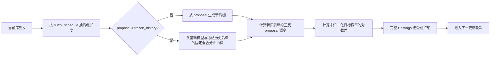

# 推理扩展算法：基础、原理与实现

本文档集中说明仓库中全部推理算法及其执行实现。第 2.1 节给出统一入口 `python -m inference_scaling` 的执行规则，
以及 MH 与 IS 的完整数据流；后续各节分别展开目标分布、有限预算算法、关键代码、统计性质和成本来源。批处理、
KV 复用、vLLM 和计算量统计统一列在第 11 节。[设置说明](../SETTINGS.md)逐项说明 `settings/inference.json` 的字段；
[预算控制](BUDGET.md)集中说明候选数、补全数与块长的联合调度。
[算法质量报告](../reports/GSM8K_3090_ALIGNED_RESULTS.md)与
[执行成本报告](../reports/RTX3090_ROLLOUT_INFRA.md)分别汇总准确率与执行开销。

## 1. 统一记号与实现边界

给定 token 化提示 $`x`$，记基础模型的完整生成分布为

```math
p(y\mid x)=\prod_{t=1}^{|y|}p(y_t\mid x,y_{\lt t}).
```

在已经生成前缀 $`g`$ 时，下一段候选记为 $`z`$，候选后的补全记为 $`u`$。奖励写作
$`r(g,z,u)`$，奖励温度写作 $`\tau\gt 0`$。仓库中最常用的显式奖励目标是

```math
\pi_r(y\mid x)
=\frac{p(y\mid x)\exp\{r(y)/\tau\}}
       {\sum_{y'}p(y'\mid x)\exp\{r(y')/\tau\}}.

```

<p align="right">式 (1)</p>

另一类目标是幂分布

```math
\pi_\alpha(y\mid x)
=\frac{p(y\mid x)^\alpha}{\sum_{y'}p(y'\mid x)^\alpha},
\qquad \alpha\gt 0.

```

<p align="right">式 (2)</p>

本文使用三类性质：

- **目标分布保持不变**：若当前状态服从指定目标，执行一次 MH 更新或一次保留完整序列的条件 IS 步后仍服从该目标；
  有限更新轮次仍有链的收敛误差。
- **估计量无偏**：未截断的普通 IS 对条件奖励权重给出无偏估计；有限候选数下的归一化重采样仍是近似。
- **执行等价**：批处理与连续批处理只改变物理执行顺序，随机请求与统计量保持固定。

下文中，MH 指 Metropolis--Hastings，IS 指重要性采样（Importance Sampling），SIR 指
采样—重要性加权—重采样（Sampling-Importance-Resampling），SMC 指序贯蒙特卡洛
（Sequential Monte Carlo），GRPO 指组相对策略优化（Group Relative Policy Optimization），ESS 指
有效样本量（effective sample size）。边缘分布指只保留一部分随机变量、对其余随机变量的概率求和后得到的
分布；细致平衡指任意两个状态之间按目标概率加权后的正向与反向转移概率相等，因此一次更新保持目标分布不变。

为与代码和设置字段对应，文档保留少量英文标识。rollout 指从当前候选继续生成到终止位置的补全；proposal
指产生候选的提议分布；`history` 指冻结历史 proposal 在链开始前生成并冻结的样本。转移核指“给定当前状态时，
下一状态的条件分布”。代码字段名继续写在反引号内，说明文字使用上述中文含义。设置键写作点分路径，
例如 `ar.algorithms.is.planning` 表示 `settings/inference.json` 中 `ar` → `algorithms` → `is` → `planning` 字段。

重要性修正要求 $`p(y)\gt 0\Rightarrow q(y)\gt 0`$。把部分概率直接截为零的 top-k/top-p 可能破坏该条件，统一入口
因此要求 `mh`、`mh_power` 与 `is` 使用 `ar.sampling.top_p = 1` 和 `ar.sampling.top_k = null`；权重截断以偏差换取
有限权重范围。

### 1.1 模型无关算法层与生成适配层

AR-LLM 与 dLLM 的生成状态不同：前者追加 token 后缀，后者更新掩码块或完整反向轨迹。算法层仅依赖
候选、目标值和 proposal 概率，不直接调用具体模型。实现边界如下。

| 共享对象 | 算法层操作 | AR-LLM 适配 | dLLM 适配 |
| --- | --- | --- | --- |
| `normalize_log_weights`、`categorical_index_from_uniform` | 归一化候选权重并按显式均匀数重采样 | 保留完整序列的条件 IS | 逐块 IS |
| `decide_metropolis_hastings` | 根据未归一化目标概率与正反 proposal 概率执行接受或拒绝 | 随机后缀 proposal | 分块轨迹或整段 proposal |
| `choose_joint_budget` 与两种规划器 | 按初始样本矩和成本估计选择候选数、补全数与块长 | 联合预算 IS | 未接入 |

对任意逐步生成模型，MH 适配层为当前状态 $`y`$ 和 proposal $`y'`$ 提供四个标量：
$`\log\widetilde\pi(y)`$、$`\log\widetilde\pi(y')`$、$`\log q(y'\mid y)`$ 与
$`\log q(y\mid y')`$。共享核计算

```math
\log A=\min\left\{0,
\log\widetilde\pi(y')-\log\widetilde\pi(y)
+\log q(y\mid y')-\log q(y'\mid y)
\right\},
```

再以 $`\log U\leq\log A`$ 接受 proposal，其中 $`U`$ 为 $`[0,1)`$ 上的均匀随机数。后缀切点、扩散
生成块和批处理属于 proposal 的执行方式，不改变该接受核。

<a id="alg-overview"></a>
## 2. 方法总览

统一入口用 `--algorithm` 选择七种算法，用 `--model` 选择模型族。两族共用目标分布与公共核，生成适配不同。

| 算法 | 采样或估计对象 | 有限预算下的性质 | AR-LLM 实现 | dLLM 实现 |
| --- | --- | --- | --- | --- |
| `sample` | 基础模型分布 $`p`$ | 基线分布 | 按 `ar.sampling` 抽样一次 | 按 `dllm.sampling` 分块解码一次 |
| `greedy` | 逐位置最大概率项 | 确定性基线 | 原生贪心解码 | 温度 0 的分块解码 |
| `beam` | 累计对数概率最高的前缀 | 确定性搜索 | token 级 beam search | 按轨迹概率保留的分块 beam |
| `best_of_n` | 式 (3) 或答案投票 | 随 $`N`$ 增大趋向奖励最大化 | 独立样本后按奖励或投票选择 | 同左 |
| `mh` | 式 (1) | 目标分布保持不变；每次 proposal 需要一次奖励 | 后缀 MH（第 5 节），可选冻结历史 proposal（第 8 节） | 整段独立 proposal MH，可选冻结历史轨迹混合 |
| `mh_power` | 式 (2) | 目标分布保持不变；有限更新存在收敛误差 | 后缀 MH（第 4 节） | 反向轨迹幂 MH |
| `is` | 式 (1) | AR：首步为整序列 SIR，此后每步保持目标不变；dLLM：$`K,M\to\infty`$ 时趋近目标 | 保留完整序列的条件 IS（第 6 节），固定配置或联合预算规划 | 逐块 IS（第 7 节），候选与补全都来自基础模型 |
| GRPO / VRPO | 参数化策略的训练近似 | 受模型族、优化轮次与采样预算影响 | `python -m training` 的 `grpo` 阶段 | `vrpo_preferences` 与 `vrpo` 阶段 |

`--reward` 只作用于 `best_of_n`、`mh` 和 `is`，可选 `verifier`、`vote`、`logprob`、`consilience`（第 9 节），
dLLM 只支持前两种。默认运行 `--algorithm is --model ar --reward vote --dataset gsm8k`；AR 的 `is` 默认采用联合预算
规划（`ar.algorithms.is.planning = "full_horizon"`，见[预算控制](BUDGET.md#budget-joint)）。第 6.1 节的可枚举候选
logit adjustment 只作理论参考，未接入统一入口。源码路径均位于 [`src/inference_scaling`](../../src/inference_scaling/)。

<a id="alg-execution"></a>
### 2.1 统一入口的执行规则

```bash
python -m inference_scaling --algorithm is --model ar --reward vote --dataset gsm8k --output results
```

命令行只选择算法、模型族、奖励和数据集；其余参数全部位于 `settings/inference.json`，缺失、未知或类型不符的
字段在加载模型前报错。每个（题目，重复）按以下顺序执行：

1. **提示与长度**：数据集按 `datasets.<name>.selection` 固定抽题，并用 `prompt_template` 生成提示；AR 再套用
   chat template（`ar.prompt`）。生成上限取 `datasets.<name>.max_new_tokens` 与模型剩余上下文（含可选的
   `ar.engine.context_window`）的较小值；dLLM 先与 `dllm.max_new_tokens` 取较小值，再取不超过它的
   `dllm.sampling.block_length` 最大整数倍。
2. **采样范围**（AR）：`ar.output.sampling_scope = "thinking"` 时，`mh`、`mh_power` 与 `is` 只对思考段采样，
   最终内容随后由基础模型生成。`vote`、`verifier` 与全序列 Consilience 需要完整输出，`mh` 与 `is` 因而回退到
   `full` 并记录原因 `reward_uses_full_sequence`。
3. **奖励阶段**：按 `--reward` 构造逐序列奖励。`vote` 用于 `is` 或 `mh` 时，先从基础模型独立生成
   `rewards.vote.pool_size` 条样本并冻结为投票池；池的随机种子与算法无关，同一重复下各算法共用同一池。
4. **搜索阶段**：运行所选算法，得到一条完整输出。
5. **收尾与评测**：思考范围下补生成最终内容。数据集评分器只评测答案文本（完整思考段之后的内容；
   `ar.output.thinking_mode = "enabled"` 时，未结束的思考没有最终答案），给出 `answer`、`parseable` 与 `correct`。
6. **记录**：结果目录为 `<output>/<dataset>/<model>/<algorithm>[-<reward>]/<指纹前 16 位>`，包含 `manifest.json`、
   每个（题目，重复）一行的 `records.jsonl` 与 `summary.json`（准确率、Wilson 区间、`run.draws` 大于 1 时的 pass@k、
   计算量与失败统计）。指纹覆盖命令行选择、所读设置、模型与数据身份和源码哈希；同一指纹再次运行只补齐缺失记录。
   `run.draws` 不进入指纹，因此可以在原目录追加重复次数。

随机数由 `run.seed` 按重复序号、算法和题目逐层派生。`ar.engine.continuous_batching.workers` 大于 1 时，多个题目
并发并共享[连续批处理](#infra-prefix-kv)后端；后端计数器因而由多个题目共用，记录不再给出逐题计算量。

<a id="alg-qwen-default-mh"></a>
#### 2.1.1 后缀 MH

同一执行流程支持幂目标式 (2)（`mh_power`）和奖励目标式 (1)（`mh`）。幂目标使用
$`\log\widetilde\pi(y)=\alpha\log p(y\mid x)`$；奖励目标使用
$`\log\widetilde\pi(y)=\log p(y\mid x)+r(y)/\tau`$。后缀长度分布由 `suffix_schedule` 指定；`mh` 可用
`proposal = "frozen_history"` 改用冻结历史混合 proposal。



固定当前阶段的长度上限 $`T`$ 后，一次更新执行：

1. 从与当前序列无关、对 $`1,\ldots,T`$ 全支持的 $`\rho(\ell)`$ 抽取后缀长度 $`\ell`$，令切点
   $`c=T-\ell`$；输出已在切点之前停止时，重生成的后缀为空，这次更新不改变状态，直接跳过，不生成也不调用奖励；
2. `mh_power` 从温度 proposal 抽取新后缀；`mh` 从基础模型抽取，选择冻结历史 proposal 时改从基础模型与冻结
   历史后缀组成的固定混合分布抽取（第 8 节）；新后缀在停止处或总长度达到 $`T`$ 时结束；
3. 对旧后缀和新后缀计算同一个 proposal 的概率。历史分量命中时仍需计算完整混合分布概率；单独使用
   历史记录的频率不满足 MH 接受率的要求；
4. 计算幂目标或奖励目标的未归一化对数概率差，调用共享 MH 核；
5. 用请求局部的均匀随机数接受或拒绝，随后进入下一次更新；
6. 当前阶段完成 `steps_per_block` 次更新后扩展到下一阶段：未停止的输出续写到新的上限，已停止的输出保持不变，
   直到上限 $`L`$；设置 `iterations` 时改为先生成一条完整输出，再在上限 $`L`$ 上执行给定次数的更新。

单链单次更新的逻辑工作量如下。

| proposal 路径 | 新后缀生成 | 概率计算 | 奖励调用 |
| --- | --- | --- | --- |
| 基础模型或温度 proposal | 1 条至多 $`\ell`$ 个 token 的后缀 | 生成时保存新后缀概率；旧状态概率缓存 | 奖励目标对新完整序列调用一次；幂目标无需奖励 |
| 冻结历史命中 | 0 条新后缀生成 | 对给定的历史后缀做并行概率评分，随后计算新旧完整混合概率 | 奖励目标对新完整序列调用一次 |

`multiscale` 只改变各个后缀长度的固定混合比例；冻结历史只改变给定前缀下的 proposal。每个分量都在
Hastings 比中使用完整正反概率，因此两项可以组合。直观上，短后缀降低生成成本，完整后缀的正概率提供
全局移动；增加更新轮次会继续减小有限链误差，但实际速度取决于 proposal 与目标的重叠程度。

主要入口为
[`run_power_mh_chain`](../../src/inference_scaling/arllm/algorithms/mh.py)、
[`run_reward_mh_chain`](../../src/inference_scaling/arllm/algorithms/mh.py)和
[`run_reward_mh_chain_replay_proposal`](../../src/inference_scaling/arllm/algorithms/mh_acceleration.py)，
统一入口的调用位于 [`app/ar.py`](../../src/inference_scaling/app/ar.py)。

<a id="alg-qwen-default-is"></a>
#### 2.1.2 条件 IS

`is` 从基础模型生成候选和补全，并保留一条完整序列（第 6 节）。`ar.algorithms.is.planning = "fixed"` 时，每步使用
`ar.algorithms.is.fixed` 中的候选数 $`M`$、补全数 $`K`$ 与块长 $`B`$；`full_horizon` 与 `chunk_adaptive` 在每个块边界
由[联合预算](BUDGET.md#budget-joint)重新选择这三个量：先用独立的初始样本估计方差，再生成正式样本。


假设本步的 $`M`$ 个候选均未终止，一步的逻辑工作量为：

| 步骤 | 完整输出（候选及其第一条补全） | 另行生成的补全 | 奖励评分 |
| --- | ---: | ---: | ---: |
| 第一步 | $`M`$ | $`M(K-1)`$ | $`MK`$ |
| 后续每步 | $`M-1`$ | $`M(K-1)`$ | $`MK-1`$ |

补全在生成时已返回基础模型概率，不需要重评分。`verifier` 与 `vote` 只读取答案文本；`logprob` 的评分策略与采样
策略相同时直接取这些概率，否则与 `consilience` 一样对每条完整序列需一次评分前向。候选与补全按异构请求展平为批次；连续批处理把逻辑请求合并为较少的批量模型调用，
主要降低墙钟时间，请求随机种子与候选选择随机数保持不变，填充可能使实际参与前向计算的 token 位置数略有增加。

主要入口为
[`conditional_is_step`](../../src/inference_scaling/arllm/algorithms/conditional_is.py)、
[`run_conditional_is`](../../src/inference_scaling/arllm/algorithms/conditional_is.py)和
[`run_joint_budget_is`](../../src/inference_scaling/arllm/algorithms/joint_budget_is.py)。

### 2.2 核心符号、设置字段与成本影响

具体数值由 `settings/inference.json` 给出；下表说明参数的算法含义与计算成本，`<name>` 指数据集或奖励名。

| 符号 | 设置键 | 作用 | 增大后的主要影响 |
| --- | --- | --- | --- |
| $`L`$ | `datasets.<name>.max_new_tokens` | 最大生成长度，受模型上下文限制 | 增加生成、评分和 KV 成本 |
| $`B`$ | `ar.algorithms.mh_power.block_size`、`ar.algorithms.mh.block_size`、`ar.algorithms.is.fixed.block_size`；dLLM `beam`、`mh_power`、`is` 的 `decision_block_size` | 每个阶段提交的生成块长度 | 选择步骤减少，每次候选或后缀更长 |
| $`n`$ | `ar.algorithms.mh_power.steps_per_block` / `iterations`（`mh` 同名）；`dllm.algorithms.mh_power.updates_per_stage`、`dllm.algorithms.mh.updates` | MH 更新数 | 减小有限链误差，增加 proposal 与奖励调用 |
| $`\alpha`$ | `ar.algorithms.mh_power.alpha`、`dllm.algorithms.mh_power.alpha` | 幂目标指数 | 更偏向高基础概率序列，可能降低接受率 |
| $`\tau`$ | `rewards.<name>.temperature` | 奖励相对基础概率的尺度 | 减弱奖励差异对权重和接受率的影响 |
| $`M`$ | `ar.algorithms.is.fixed.candidate_count`、`dllm.algorithms.is.candidate_count`；联合预算网格 `ar.algorithms.is.joint.candidate_counts` | 每步基础模型候选数 | 改善候选覆盖，增加候选和 rollout 成本 |
| $`K`$ | `ar.algorithms.is.fixed.rollout_count`、`dllm.algorithms.is.rollout_count`；联合预算网格 `ar.algorithms.is.joint.rollout_counts` | 每个候选的 rollout 数 | 减少条件权重噪声，增加补全成本 |
| $`N`$ | `ar.algorithms.best_of_n.samples`、`dllm.algorithms.best_of_n.samples` | Best-of-$`N`$ 的独立样本数 | 更接近奖励最大化，生成成本线性增加 |
| $`\lambda`$ | `ar.algorithms.mh.frozen_history.mixture`、`dllm.algorithms.mh.frozen_history.mixture` | 冻结历史分量的比例 | 提高历史命中率，仍需完整混合概率 |
| — | `rewards.vote.pool_size` | `vote` 奖励的冻结样本池大小 | 一致比例更稳定，奖励阶段生成成本增加 |
| — | `ar.algorithms.mh_power.proposal_temperature` | 幂目标 MH 的 proposal 温度 | 改变接受率与多样性 |
| — | `ar.sampling.temperature` | 基础分布的温度 | 改变多样性、接受率和目标本身 |
| — | `ar.engine.continuous_batching.max_batch_size` / `max_batch_tokens`、`ar.engine.transformers.max_score_batch_size` | 生成与评分批量 | 提高 GPU 利用率，也可能增加填充与峰值显存 |

后缀长度分布与冻结历史样本数分别见第 4 节和第 8 节；运行目录的 `manifest.json` 保存本次运行的完整设置。

<a id="alg-sources"></a>
### 2.3 方法来源

| 方法族 | 主要文献 | 本仓库中的关系 |
| --- | --- | --- |
| beam search | [Freitag and Al-Onaizan (2017)](https://aclanthology.org/W17-3207/) | 作为确定性搜索基线 |
| 自一致性（self-consistency） | [Wang et al. (2023)](https://openreview.net/pdf?id=1PL1NIMMrw) | `vote` 奖励：Best-of-$`N`$ 的答案投票，以及与冻结样本池的一致比例 |
| Consilience 置信度轨迹 | [Kong et al. (2026)](https://arxiv.org/abs/2608.09898)；[代码](https://github.com/LechengKong/consilience) | 由同一模型的 top-$`K`$ token 概率构造固定逐序列奖励，不使用外部 verifier |
| Metropolis--Hastings | [Hastings (1970)](https://doi.org/10.1093/biomet/57.1.97) | 用于幂分布和显式奖励目标的后缀转移 |
| 重要性采样与全支持混合分布 | [Hesterberg (1995)](https://doi.org/10.1080/00401706.1995.10484303) | 用于条件奖励权重和覆盖完整支持集的冻结历史 proposal |
| 迭代 SIR（iterated SIR） | [Samsonov et al. (2022)](https://papers.neurips.cc/paper_files/paper/2022/file/21c86d5b10cdc28664ccdadf0a29065a-Paper-Conference.pdf) | 条件 IS 每步保持目标不变的有限池论证 |
| 可枚举候选 logit adjustment | [Just-In-Time Reinforcement Learning，Li et al. (2026)](https://arxiv.org/abs/2601.18510) | 原文在有限动作集合上加入估计优势；第 6.1 节将其改写为序列奖励下的条件权重接口 |
| GRPO | [Shao et al. (2024)](https://arxiv.org/abs/2402.03300) | 使用同一基础模型训练的参数更新基线 |
| 连续批处理与 KV 分块 | [Orca，Yu et al. (2022)](https://www.usenix.org/conference/osdi22/presentation/yu)、[PagedAttention，Kwon et al. (2023)](https://doi.org/10.1145/3600006.3613165) | 跨题调度、共同前缀预填充和 vLLM APC |

<a id="alg-baselines"></a>
## 3. 生成与训练基线

### 3.1 sample、greedy、beam 与 Best-of-$`N`$

`sample` 按 `ar.sampling` 的温度从基础模型抽样；`greedy` 逐 token 取最大概率项；`beam` 保留累计对数概率最高的
`ar.algorithms.beam.num_beams` 个前缀。dLLM 的 `greedy` 以温度 0 分块解码；`beam` 在每个决策块边界按
`dllm.exact_sampling` 下的轨迹对数概率保留 `width` 个假设，每个假设再抽 `branching_factor` 个后续块。

Best-of-$`N`$ 先独立生成 $`y_1,\ldots,y_N\sim p`$，再按奖励选择一个序列：

```math
\widehat y=\arg\max_{1\le i\le N}\widehat r(y_i).

```

<p align="right">式 (3)</p>

式 (3) 随 $`N`$ 增大趋向奖励最大化。`--reward vote` 时不计算式 (3)，而按数据集的答案规则投票，选择得票最多的答案；
无法解析的答案不投票。最高奖励或最高票出现平票时，按固定种子在并列候选中均匀选取。`logprob` 的评分策略
与采样策略相同时，直接复用生成时保存的逐 token 对数概率，不增加前向计算。

### 3.2 GRPO 与 VRPO 对照

GRPO 对照使用同一基础模型和 GSM8K 训练集，奖励为 `settings/training.json` 中的 `grpo.verifier`，来源与推理的
`rewards.verifier` 相同（第 9 节），默认按参考答案判定数值正确性。若忽略参数化限制，一个带 KL 正则的理想策略
优化问题具有式 (1) 的形式；实际 GRPO 只通过有限 rollout、组内相对优势和有限梯度更新去近似该目标。训练
FLOPs 与训练后采样 FLOPs 分别统计；单次推理成本指训练完成后的生成成本。

训练得到固定策略 $`p_{\theta_{\mathrm{GRPO}}}`$ 的 LoRA 适配器。把它填入 `ar.model.adapter` 后，分别以
`--algorithm sample`（温度 1 随机采样）和 `--algorithm greedy`（逐 token 取最大概率项）评测。dLLM 的 VRPO 对照由
`vrpo_preferences` 阶段构造 verifier 偏好对、`vrpo` 阶段训练适配器，填入 `dllm.model.adapter` 后同样评测。

训练入口为 `python -m training`，按 `settings/training.json` 的 `stages` 依次运行。GRPO 位于
[`training/grpo.py`](../../training/grpo.py)，VRPO 位于 [`training/vrpo.py`](../../training/vrpo.py) 与
[`dllm/training/`](../../src/inference_scaling/dllm/training/)。

<a id="alg-power-mh"></a>
## 4. 幂分布后缀 MH

生成长度上限为 $`L`$。当前状态是一条完整输出 $`y=(y_1,\ldots,y_n)`$：在 EOS 处停止时 $`n\le L`$ 且末 token
为 EOS，否则 $`n=L`$。一次更新先按固定分布 $`\rho(\ell)`$ 选择 $`\ell\in\{1,\ldots,L\}`$，令切点
$`c=L-\ell`$。若 $`c\ge n`$，切点之后没有 token，这次更新是恒等转移，实现直接跳过。否则保留 $`y_{1:c}`$，
再从 proposal $`q_c(\cdot\mid x,y_{1:c})`$ 生成新后缀 $`v`$，直到停止或总长度达到 $`L`$。约定 $`c=0`$ 时
保留前缀为空。接受概率为

```math
A(y\to y')=
\min\left\{1,
\exp\left[
\alpha\bigl(\log p(v\mid x,y_{1:c})-\log p(y_{c+1:n}\mid x,y_{1:c})\bigr)
+\log q_c(y_{c+1:n}\mid x,y_{1:c})-\log q_c(v\mid x,y_{1:c})
\right]\right\}.

```

<p align="right">式 (4)</p>

对固定 $`\ell`$，候选前缀相同；新后缀非空，$`y'`$ 在同一切点也能移回 $`y`$，正向和反向转移都含同一因子
$`\rho(\ell)`$，该因子在 Hastings 比中抵消，因此式 (4) 是该切点对应的完整接受率；长度不超过 $`c`$ 的状态在该
切点下不动。记其转移核为 $`K_\ell`$，则

```math
K_\rho=\sum_{\ell=1}^{L}\rho(\ell)K_\ell,
\qquad
\pi_\alpha K_\rho
=\sum_{\ell=1}^{L}\rho(\ell)\pi_\alpha K_\ell
=\pi_\alpha.
```

所以任何与当前序列无关的固定 $`\rho`$ 都保持同一目标分布。实现要求每个 $`\rho(\ell)\gt 0`$，从而既能
执行局部更新，也保留整段重生成。温度 proposal 的逐前缀归一化常数进入 $`q_c`$ 的正反概率。`mh_power` 的 proposal
温度为 `ar.algorithms.mh_power.proposal_temperature` 乘以 `ar.sampling.temperature`，目标中的 $`p`$ 是
`ar.sampling.temperature` 下的基础分布。

实现提供三种分布：`uniform` 对所有长度等概率；`inverse_length` 取
$`\rho(\ell)\propto 1/\ell`$；`multiscale` 将 10% 概率均匀分给全部长度，其余 90% 均匀分给
$`1,2,4,\ldots,L`$ 中的不同长度。后两者减少平均 proposal token 数；`multiscale` 同时提高 2 的幂长度和
完整后缀的采样频率。分布由 `ar.algorithms.mh_power.suffix_schedule`（奖励目标为 `ar.algorithms.mh.suffix_schedule`）
选择，`settings/inference.json` 中两者当前都取 `uniform`。

实现按 `block_size` 逐步扩展到 $`L`$，并在每个长度执行 `steps_per_block` 次后缀更新。设置
`ar.algorithms.mh_power.iterations` 时，先生成完整长度的初始序列，再在该长度上执行给定次数的后缀更新；两种初始化和
预算安排在有限计算量下可产生不同结果，应分别记录。最终长度上的有限更新结果仍含 MCMC 误差。由于切点
$`c=0`$ 能以正概率重生成整段，且未截断 softmax proposal 在有限词表、长度不超过 $`L`$ 的完整输出上处处为正，转移矩阵任意两行
都有正重叠。写

```math
\delta(K)=1-\min_{y,y'}\sum_v\min\{K(y,v),K(y',v)\}\lt 1,
```

则最终长度的核满足

```math
\left\|\mu K^n-\pi_\alpha\right\|_{\mathrm{TV}}
\le \delta(K)^n.

```

<p align="right">式 (5)</p>

式 (5) 的直观含义是：两条从不同序列出发的链，每轮都有一部分共同的下一状态概率；整段 proposal 保证
这部分重叠不为零。每增加一次更新，尚未消除的最坏情形差异至多再乘一个 $`\delta(K)`$。真实 LLM 状态空间
过大，$`\delta(K)`$ 无法在当前实验中直接计算；要得到式 (5) 中的具体几何收敛系数，需要显式转移矩阵 $`K`$。
运行记录给出实际执行的更新轮次（`trace.updates`）、跳过的恒等更新数（`trace.skipped_updates`）、接受率、平均 proposal 长度和接受后实际改变的 token 数。

代码中的接受率由模型无关的共享核计算；AR 适配层只提供式 (4) 的四个概率项：

```python
decision = decide_metropolis_hastings(
    current_target_log_density=alpha * old_base_logprob,
    proposed_target_log_density=alpha * new_base_logprob,
    forward_proposal_log_probability=new_proposal_logprob,
    reverse_proposal_log_probability=old_proposal_logprob,
    uniform=uniform,
)
accepted = decision.accepted
```

proposal 与目标使用同一 EOS，思考段范围内再加上思考段结束标记；停止 token 的概率计入 $`p`$ 与 $`q_c`$。
切点、proposal 与接受判定的随机数都按链与更新序号派生，跳过一次更新不改变其余更新的随机数。

dLLM 的 `mh_power` 以反向扩散轨迹概率的幂 $`p(\mathrm{trace}\mid x)^\alpha`$ 为目标：最终 token 序列的边缘概率一般不可计算，
而 `dllm.exact_sampling` 的随机重掩码轨迹概率可以精确计算。切点落在原生扩散块边界，阶段按
`dllm.algorithms.mh_power.decision_block_size` 延长；每个阶段执行 `updates_per_stage` 次更新。proposal 逐个原生块
生成，每块的画布只到该块为止，基础概率与 proposal 概率取自同一次前向的 logits（温度分别为基础温度与其 $`1/lpha`$），
因此不需要再次评分，且某块记录的正反概率在以后任何切点下都仍然有效。实现位于 [`search.py`](../../src/inference_scaling/dllm/algorithms/search.py)。

<a id="alg-reward-mh"></a>
## 5. 奖励目标后缀 MH

对式 (1)，相同后缀 proposal 的接受率为

```math
A_r(y\to y')=\min\left\{1,
\exp\left[
\log\frac{p(y'_{c+1:n'}\mid x,y_{1:c})}{p(y_{c+1:n}\mid x,y_{1:c})}
+\frac{r(y')-r(y)}{\tau}
+\log\frac{q_c(y_{c+1:n}\mid x,y_{1:c})}{q_c(y'_{c+1:n'}\mid x,y_{1:c})}
\right]\right\}.

```

<p align="right">式 (6)</p>

当 $`q_c=p(\cdot\mid x,y_{1:c})`$ 时，基础模型与 proposal 项抵消，只剩
$`\min\{1,e^{(r(y')-r(y))/\tau}\}`$。`mh` 默认使用这一基础模型 proposal；代码仍保留展开后的四项，因而同样
支持任意可精确评分、具有完整支持集的 proposal，例如第 8 节的冻结历史混合分布。在固定最大长度、有限词表、
有限奖励、全支持 proposal 且 $`\rho(L)\gt 0`$ 时，整段重生成使任意两个出发状态具有共同可达的下一状态，因而得到
与式 (5) 相同的几何收敛直观解释。

dLLM 的整段奖励 MH 从基础模型独立生成 `dllm.algorithms.mh.updates` 个完整 proposal。基础轨迹概率在目标与
proposal 中抵消，因此共享核只接收 $`r(y)/\tau`$ 与 $`r(y')/\tau`$，无需额外计算轨迹 likelihood；proposal 与当前
状态无关，初始样本和后续 proposal 可在一次批处理中生成。dLLM 的幂目标轨迹 MH 不发生该抵消，适配层将旧、新
轨迹的基础概率及 proposal 概率交给同一接受核。

奖励在实现中是完整生成序列的函数。数值正确性、外部 verifier 等只能在完整 proposal 后得到时，每次 MH 更新都要
完成整段后缀并调用一次奖励。多尺度后缀分布缩短平均 proposal 长度，[冻结历史混合 proposal](#alg-replay-mh)
以并行评分替代部分后缀生成。

<a id="alg-conditional-is"></a>
## 6. 条件 IS

在已生成前缀 $`g`$ 之后，式 (1) 对下一个生成块 $`z`$ 的条件分布可写为

```math
\pi_r(z\mid x,g)\propto p(z\mid x,g)h(g,z),
\qquad
h(g,z)=\mathbb E_{u\sim p(\cdot\mid x,g,z)}
\left[e^{r(g,z,u)/\tau}\right].

```

<p align="right">式 (7)</p>

AR 的条件 IS 始终保留一条完整序列 $`y`$，每一步在它的下一个块边界处切开：

1. 设切点之前的前缀为 $`g`$；第一步时 $`y`$ 与 $`g`$ 都为空。0 号候选是 $`y`$ 在 $`g`$ 之后的下一块，$`y`$ 的
   剩余部分算作它的一条补全；
2. 其余候选各从一条完整输出切出：$`z_m\sim p(\cdot\mid x,g)`$ 是它的前 $`B`$ 个 token，剩余部分就是第一条
   on-policy 补全 $`u_{m1}\sim p(\cdot\mid x,g,z_m)`$；每个候选（含 0 号）再生成 $`K-1`$ 条补全；所有补全都生成到
   EOS 或长度上限；
3. 计算式 (8)：

```math
\widehat h_m=\frac1K\sum_{k=1}^K e^{r(g,z_m,u_{mk})/\tau};

```

<p align="right">式 (8)</p>

4. 以 $`\widehat h_m/\sum_j\widehat h_j`$ 的概率选择候选，再在它的补全中按 $`e^{r(g,z_m,u_{mk})/\tau}`$
   选一条，保留 $`y=(g,z_m,u_{mk})`$，进入下一个块边界。保留补全的奖励直接复用，不再评分。

`ar.algorithms.is.planning = "fixed"` 时 $`M,K,B`$ 取自 `ar.algorithms.is.fixed`；其余两种规划在每个块边界重新选择
这三个量，见[联合动态调度](BUDGET.md#budget-joint)。

第 3、4 步合起来，就是在全部 $`MK`$ 条完整后缀中按 $`e^{r/\tau}`$ 选一条，所以第一步是 $`MK`$ 条共享首块的
完整序列上的整序列 SIR。之后每一步把当前后缀放在候选树的固定位置，其余节点按提议分布重新生成，再按权重
选择叶子，即 conditional SMC 的单步转移。记候选树为 $`T=(z_m,u_{mk})_{m,k}`$，叶子 $`i=(m,k)`$ 的权重为
$`w_i=e^{r(g,z_m,u_{mk})/\tau}`$，定义候选树与选中叶子的联合分布

```math
\overline\pi(T,I=i)\propto\lambda(T)\,w_i,
\qquad
\lambda(T)=\prod_{m=1}^{M}p(z_m\mid x,g)\prod_{k=1}^{K}p(u_{mk}\mid x,g,z_m).

```

<p align="right">式 (8a)</p>

各叶子在 $`\lambda`$ 下边缘同分布，因此 $`\overline\pi(I=i)`$ 对所有叶子相同；给定 $`I=i`$ 与该叶子，其余节点的
条件分布正是“其余候选及其补全、所选候选的其余补全均按提议分布独立生成”。由候选编号与补全编号的对称性，
把当前后缀固定放在 0 号候选的第一条补全处，不改变选中结果的分布。给定整棵树，$`I`$ 的条件概率正比于
$`w_i`$，这一步是 Gibbs 更新，保持式 (8a) 不变；对其余节点求和，选中叶子的边缘分布正比于
$`p(z,u\mid x,g)e^{r(g,z,u)/\tau}`$，即式 (1) 给定前缀 $`g`$ 的条件分布。由此：

- 从目标分布出发，一轮扫描后仍是目标分布；`test_conditional_is.py` 在可枚举模型上核对这一点；
- 第一步之后，每一步都不增大输出分布到目标的 KL 散度，且每一步结束时都有一条可直接输出的完整序列。

这要求奖励只依赖被评分的序列，因为保留补全的奖励会被后续步骤复用。第 9 节的四种奖励都满足这一条件；
`vote` 的样本池在算法运行前冻结，不随当前候选变化。

$`K`$ 在这里既估计块的价值，也提供候选答案：增大 $`K`$ 只是增加同一块下的完整后缀，因此宜取 1 或 2，
把预算用在 $`M`$ 上。它相对整序列 SIR 是否更省，取决于前缀计算是否复用：后续步骤的新后缀共享已固定的
前缀，复用前缀 KV 时每条新后缀只需生成切点之后的 token；每个请求都重新计算整个前缀时，一条新后缀的
前向成本与一条新的完整序列相同。联合预算规划把“生成至 EOS 的整序列 SIR”作为一个候选配置，按预测误差与成本
和分块方案比较。

关键实现先按候选的平均权重选择候选，再在所选候选内按权重保留一条补全：

```python
candidate_log_weights = [
    logmeanexp(rollout.log_weight for rollout in candidate.rollouts)
    for candidate in candidates
]
m = rng.choice(len(candidates), p=softmax(candidate_log_weights))
rollouts = candidates[m].rollouts
k = rng.choice(len(rollouts), p=softmax([rollout.log_weight for rollout in rollouts]))
kept = prefix + candidates[m].token_ids + rollouts[k].token_ids
```

AR 条件 IS 位于 [`conditional_is.py`](../../src/inference_scaling/arllm/algorithms/conditional_is.py)，候选与所有
补全都按异构请求展平为批次；执行细节见[重复前缀 KV 复用](#infra-prefix-kv)。dLLM 的条件 IS 是分块版本：
选择候选后只提交该块，见第 7 节。

<a id="alg-logit-adjustment"></a>
### 6.1 可枚举候选的 logit adjustment

条件 IS 从很大的候选空间抽取 $`M`$ 个候选，再在这 $`M`$ 个候选之间重采样。若下一步所有合法且互斥的候选
组成较小集合 $`\mathcal Z(x,g)`$，可以全部列出并直接归一化。对单 token 候选，基础模型一次前向已经给出
全部 token logits；对固定生成块或结构化动作，需要先计算各候选的基础对数概率，并在该有限集合内
归一化。

记基础候选 logits 为 $`\ell_{\mathrm{base}}(z)`$，使得

```math
p(z\mid x,g)=\mathrm{softmax}
\bigl(\ell_{\mathrm{base}}\bigr)_z,
\qquad z\in\mathcal Z(x,g).
```

<p align="right">式 (8-L1)</p>

对每个候选用式 (8) 得到条件权重估计 $`\widehat h(z)`$，再调整 logits：

```math
\ell_{\mathrm{adj}}(z)
=\ell_{\mathrm{base}}(z)+\log\widehat h(z),
\qquad
\widehat P(z\mid x,g)
=\mathrm{softmax}\bigl(\ell_{\mathrm{adj}}\bigr)_z.
```

<p align="right">式 (8-L2)</p>

展开 Softmax 可见

```math
\widehat P(z\mid x,g)
=\frac{p(z\mid x,g)\widehat h(z)}
       {\sum_{v\in\mathcal Z(x,g)}p(v\mid x,g)\widehat h(v)}.
```

<p align="right">式 (8-L3)</p>

JitRL 原文从相似历史轨迹估计每个有限动作的相对回报，将其乘更新强度后直接加到基础 logits。本节保留
“基础 logits 加一个候选评分”的实现结构，但面向完整序列奖励，把该评分写成 $`\log\widehat h(z)`$。奖励
只能在补全结束后获得时，$`\widehat h`$ 由式 (8) 计算。这里的 rollout 连接是针对本仓库
序列目标的适配；JitRL 原文使用的是历史轨迹检索与回报估计。

式 (8-L2) 是候选可全部枚举时的对数空间实现。若 $`\widehat h=h`$，式 (8-L3) 给出式 (7) 的精确下一候选
条件分布。使用 $`K`$ 条独立的新补全时，在条件权重方差有限且归一化分母不趋近于零的情况下，
$`\widehat h`$ 的典型波动按 $`K^{-1/2}`$ 缩小，输出概率随之稳定。

有限候选算法为：

1. 枚举 $`z\in\mathcal Z(x,g)`$，读取或计算 $`\ell_{\mathrm{base}}(z)`$；
2. 对每个 $`z`$ 生成新的补全，再计算 $`\widehat h(z)`$；
3. 计算式 (8-L2)，从调整后的 Softmax 抽取一个候选；
4. 提交该候选，进入下一生成位置并重复。

完整枚举省去有限 $`M`$ 候选池的覆盖误差，但需要为每个候选估计条件权重。若 $`\mathcal Z`$ 只是从完整
合法集合中截取的 top-k 或检索子集，式 (8-L3) 表示目标在该子集上的条件分布，额外存在集合截断误差。当
$`|\mathcal Z|`$ 很大时，rollout 数约为 $`|\mathcal Z|K`$，可能远高于抽样候选 IS。该方法当前属于理论
参考：CLI、实现和实验结果均未包含这一项。本节只说明它与现有条件权重的关系。原始有限动作
logit 更新见 [Just-In-Time Reinforcement Learning，Li et al. (2026)](https://arxiv.org/abs/2601.18510)。

<a id="alg-dllm-is"></a>
## 7. dLLM 逐块 IS

dLLM 的 `is` 对式 (7) 执行逐块 SIR。每一步从基础模型按 `dllm.sampling` 生成 $`M`$ 个决策块候选，块长
`dllm.algorithms.is.decision_block_size` 须为原生扩散块长 `dllm.sampling.block_length` 的整数倍；每个候选用同一策略
生成 $`K`$ 条完整补全，用式 (8) 估计 $`h`$，按 $`\widehat h_m/\sum_j\widehat h_j`$ 选择候选后只提交该块并丢弃补全。
候选与补全来自同一基础策略，对数权重即 $`r/\tau`$，不需要轨迹概率。与 AR 不同，它不保留完整序列；有限
$`M,K`$ 下是逐块 SIR 近似，$`K,M\to\infty`$ 时趋近目标。生成在整块 EOS 后停止；最后一块的候选与以整块 EOS
结束的候选已是完整输出，只有一条空补全，选中它即结束。

<a id="alg-replay-mh"></a>
## 8. 冻结历史混合 proposal 的 MH

`ar.algorithms.mh.proposal = "frozen_history"` 时，链开始前先从基础模型独立生成
`frozen_history.samples` 条完整序列，把它们在各切点处的后缀经验分布 $`h_{\mathrm{emp}}`$ 冻结，并与基础模型组成
混合 proposal

```math
q_c(v\mid x,y_{1:c})=(1-\lambda)p(v\mid x,y_{1:c})
+\lambda h_{\mathrm{emp}}(v\mid x,y_{1:c}),
\qquad 0\le\lambda\lt 1,

```

<p align="right">式 (9)</p>

其中 $`\lambda`$ 为 `frozen_history.mixture`。对切点 $`c`$，经验分量只包含前 $`c`$ 个 token 与当前序列一致的历史后缀；
历史序列与链使用同一长度上限和停止规则，因此这些后缀都是合法的完整后缀。没有这样的历史后缀时，proposal
就是基础模型。抽到历史分量时直接读取现成后缀；历史序列带有生成时的逐 token 基础对数概率，共享前缀之后
它们就是 $`p(v)`$，无需评分。无论来源如何，式 (6) 都使用旧后缀与新后缀在式 (9) 的混合分布下的精确概率。
基础分量保证完整支持集，经验库在链开始前冻结，因而该 proposal 仍定义普通 MH 转移核。

```python
old_q = replay_proposal.logprob(kept, old_suffix, base_logprob=old_p)
draw = replay_proposal.draw(kept, total_length - cut, seed=seed)
log_acceptance = min(
    0.0,
    new_p - old_p + reward_delta / tau + old_q - draw.proposal_logprob,
)
```

冻结历史 proposal 可与式 (4) 的多尺度后缀分布组合。对每个长度 $`\ell`$，式 (9) 定义保持目标分布不变的
Hastings 核 $`K_\ell^{\mathrm{replay}}`$；长度分布 $`\rho(\ell)`$ 在链开始前固定且与当前序列无关，因此

```math
K_{\rho}^{\mathrm{replay}}
=\sum_{\ell=1}^{L}\rho(\ell)K_\ell^{\mathrm{replay}},
\qquad
\pi K_{\rho}^{\mathrm{replay}}=\pi.
```

实现对实际抽到的切点计算新旧后缀在完整混合分布下的概率。切点选择概率在正向和反向提议中相同，仍在
Hastings 比中抵消。历史命中时不调用模型；历史样本的
生成计入搜索阶段的成本，记录中的 `trace.proposal_sources` 给出基础分量与历史分量的抽样次数。

dLLM 的对应实现是回放混合 MH（`dllm.algorithms.mh.proposal = "frozen_history"`）：整段独立 proposal 为基础
轨迹分布与 `frozen_history.samples` 条冻结轨迹经验分布的混合，混合比例为 `frozen_history.mixture`。正反混合概率
需要精确的轨迹概率，因此历史轨迹与基础分量都使用 `dllm.exact_sampling`，目标中的基础分布也随之取该策略；
proposal 与当前状态无关，全部 proposal 在一次批量调用中生成。实现位于
[`dllm/algorithms/mh_acceleration.py`](../../src/inference_scaling/dllm/algorithms/mh_acceleration.py)。

<a id="alg-rewards"></a>
## 9. 奖励信号

`--reward` 选择四种奖励之一，只作用于 `best_of_n`、`mh` 和 `is`；`rewards.<name>.temperature` 是式 (1) 的
$`\tau`$。算法层的奖励是批量函数 `reward(prompt_tokens, sequences)`，AR 算法另传入各序列在生成策略下的逐 token
对数概率；它对每个序列计算同一个函数，按输入顺序返回结果，并按题目记忆：重复的完整序列只评分一次。四种奖励都是逐序列的固定函数，不依赖同批其他候选，因此条件 IS 可以复用保留补全的
奖励，MH 的接受率只含奖励差。`verifier` 与 `vote` 读取答案文本，由
[`app/rewards.py`](../../src/inference_scaling/app/rewards.py) 为两个模型族构造；`logprob` 与 `consilience` 读取模型
自身的 token 概率，只用于 AR，由 [`app/ar.py`](../../src/inference_scaling/app/ar.py) 构造。

| 奖励 | 定义 | 设置 | 模型族与成本 |
| --- | --- | --- | --- |
| `verifier` | 外部来源：数据集评分器对照参考答案、Python 工厂 $`r=f(x,y)`$ 或常数 | `rewards.verifier.source` 及同名子表 | AR 与 dLLM；按文本计算，不计模型前向 |
| `vote` | `best_of_n`：候选按答案投票；`is`、`mh`：与冻结样本池答案一致的比例 | `rewards.vote.pool_size` | AR 与 dLLM；样本池在奖励阶段生成并单独计量 |
| `logprob` | 有效 completion 上的 token 平均对数概率 | `rewards.logprob.score_temperature` | AR；评分策略与采样策略相同时复用生成概率，否则每条序列一次评分前向 |
| `consilience` | top-$`K`$ token 置信度的末段均值减去加权首段均值 | `rewards.consilience.*` | AR；每条序列一次评分前向，需要逐 token 的 top-$`K`$ 概率 |

### verifier

[`shared/rewards/verifier.py`](../../src/inference_scaling/shared/rewards/verifier.py) 按 `rewards.verifier.source`
为每个提示构造一个 verifier，并检查每个输出都是有限实数：

- `dataset`：数据集评分器对照题目参考答案，按正确、错误、无法解析分别取
  `rewards.verifier.dataset.{correct,incorrect,unparseable}`；GSM8K 比较最终数值，MATH-500 使用 Math-Verify；
- `python`：`rewards.verifier.python.factory` 以 `package.module:function` 指向可信本地工厂，调用
  `factory(context=context, **options)`，返回可调用对象或带 `score`（可选 `score_batch`）的对象，例如外部评分模型；
  只有 `requires_reference = true` 时，`context` 才包含参考答案；
- `constant`：返回 `rewards.verifier.constant.value`，用于集成测试与无奖励对照。

MH、IS 和 dLLM 算法只接收构造后的统一奖励回调。训练沿用同一组来源（`settings/training.json` 的 `grpo.verifier` 与
`vrpo.verifier`，不含温度）：GRPO 把它包装为 TRL 的批量奖励，并记录奖励调用数、生成 token 数和奖励均值；VRPO
偏好构造对每条生成调用同一 verifier，选择最高分与最低分文本。公开训练集解答只有在
`vrpo.preferences.include_reference_completion = true` 时作为额外候选进入同一评分过程；关闭该字段后，偏好对只由
模型生成与 verifier 分数确定。

### vote

`best_of_n` 直接对候选投票（第 3.1 节）。用于 `is` 与 `mh` 时，奖励是与冻结样本池的一致比例：

```math
r_{\mathrm{vote}}(x,y)=\frac1P\sum_{j=1}^{P}
\mathbf 1\{a(y)\ne\varnothing,\ a(y)\equiv a(y^{(j)})\},
```

其中 $`P`$ 为 `rewards.vote.pool_size`，$`y^{(j)}`$ 是算法运行前从基础模型独立生成并冻结的样本，$`a(y)`$ 为答案文本中的
最终答案，$`\equiv`$ 为数据集的答案规则：GSM8K 比较最终数值；MATH-500 先把答案解析为规范形式，形式相同即等价，
否则用 Math-Verify 判断，结论按形式对缓存。无法解析的答案
得 0。样本池在运行期间固定，奖励因而是逐序列的固定函数；样本池的生成成本记入奖励阶段
（`cost.phases.reward`），不计入联合预算 IS 的 `forward_token_budget`。实现位于
[`shared/rewards/vote.py`](../../src/inference_scaling/shared/rewards/vote.py)。

### 长度归一化对数概率

`logprob` 使用有效 completion 上的均值。令

```math
r_{\log p}(x,y)=\frac{1}{L}\log p(y\mid x).
```

代入式 (1) 后，未归一化目标为

```math
p(y\mid x)\exp\{r_{\log p}(x,y)/\tau\}
=p(y\mid x)^{1+1/(\tau L)}.
```

这里 $`L`$ 是实际生成的 token 数，包含 EOS 或完整停止标记；空 completion
的奖励为 0。不同长度但平均 token logprob 相同的序列得到相同奖励，不做候选组内归一化。评分策略的温度为
`rewards.logprob.score_temperature`。评分策略与采样策略相同时，Best-of-$`N`$、MH 与 IS 直接取生成时保存的逐 token
对数概率，联合预算 IS 因而不计奖励前向；
其余情况通过 `SequenceLogProbabilityReward.batch` 调用 `score_batch`。vLLM 只在能够精确评分所选策略时直接评分，
否则交给精确评分后端（`ar.engine.vllm.exact_scoring = "transformers"`），缺失时报错。

变长序列的目标指数依赖 $`L`$，不等价于固定 $`p^\alpha`$；需要固定幂次目标时使用式 (2) 和
`ar.algorithms.mh_power.alpha`。只归一化 reward，重要性采样的 $`p/q`$、MH 概率项和 `SequenceSample.logprob` 均保留
真实序列 logprob 的求和语义。

<a id="alg-consilience"></a>
### Consilience

对第 $`t`$ 个生成位置取得概率最高的
$`K`$ 个 token $`v_{t,1},\ldots,v_{t,K}`$，定义

```math
c_t(x,y)=-\frac{1}{K}\sum_{j=1}^{K}
\log p\!\left(v_{t,j}\mid x,y_{\lt t}\right).
```

这里对 top-$`K`$ 项取等权平均，保留公式中的负号。计算该分数的模型和概率策略固定（评分温度为 `rewards.consilience.score_temperature`），
使同一条轨迹的奖励与其来源 proposal 无关。

若用于评分的思考序列长度为 $`L`$，跳过位置数为 $`P=\lfloor 0.05L\rfloor`$，窗口长度为
$`W=\max\{1,\lfloor 0.2L\rfloor\}`$，则默认奖励为

```math
r_{\mathrm{Cns}}(x,y)=
\frac{1}{W}\sum_{t=L-W+1}^{L}c_t(x,y)
-3\frac{1}{W}\sum_{t=P+1}^{P+W}c_t(x,y).
```

默认 $`K=5`$。短序列的窗口长度限制为不超过 $`L-P`$。`rewards.consilience` 中的 `top_k`、`window_fraction`、
`skip_fraction` 和 `initial_penalty` 分别控制 $`K`$、窗口比例、跳过比例和首段系数；`window_tokens` 可将比例窗口
替换为固定 token 数。比例窗口以思考 token 数为分母。边界标记计入生成概率，评分时排除标记及其后的最终内容。

[`ConsilienceReward`](../../src/inference_scaling/arllm/rewards/intrinsic.py) 默认（`scope = "thinking"`）优先对完整、非空的
思考段评分。关闭思考、缺少边界、思考未结束、思考段为空或结构解析失败时，同一统计公式应用于全序列。
零 token 的空序列取分数 0。`rewards.consilience.scope = "full"`
直接选择全序列模式。该回退规则在 rollout 评分时确定，作为逐序列奖励定义的一部分；最终输出的回退原因记入记录的
`fallbacks`（前缀 `consilience:`）。

评分请求按相同的因果前缀分组后批量提交。Transformers 后端从 logits 取得选中 token 概率、熵统计和
top-$`K`$ 轨迹；vLLM 后端使用精确 Transformers 评分后端。额外评分前向产生的 token 数与 FLOPs 计入运行统计。
Best-of-$`N`$ 选择原始 $`r_{\mathrm{Cns}}`$ 最大的序列。IS 与奖励 MH 的目标写为

```math
\pi_\beta(y\mid x)\propto p(y\mid x)\exp\{\beta r_{\mathrm{Cns}}(x,y)\},
\qquad \beta=\frac{1}{\tau}.
```

只有 $`\beta`$ 控制指数加权强度；首段系数 3 控制首尾窗口的相对贡献。`rewards.consilience.temperature = 2`
对应 $`\beta=0.5`$，原始分数差 1 对应约 1.65 倍权重差。奖励保留逐序列定义，模型、概率策略、分段规则和奖励参数
固定后，保留补全的奖励才能按相同目标复用。条件 IS 应对累计思考前缀、候选和补全构成的整段思考计分，
各生成块单独计分后相加会得到不同奖励。

### 思考段奖励与生成范围

对于成功分段的生成，记思考段为 $`h`$、最终内容为 $`a`$，边界的生成概率包含在 $`p(h\mid x)`$ 中。
固定分段规则、停止规则和长度预算，若该分支的奖励只依赖 $`h`$，则

```math
\pi_\beta(h,a\mid x)
=\frac{p(h\mid x)\exp\{\beta r_{\mathrm{Cns}}(x,h)\}}{Z_\beta(x)}
 p(a\mid x,h).
```

因此，可以对思考段执行 IS/MH，再从相同基模型条件分布生成最终内容。该分解保持理想目标分布；有限候选 IS
和有限轮次 MH 仍有各自的近似误差。最终内容使用贪心解码时，条件分布随之改变。对完整生成取 $`p^\alpha`$
的幂目标则依赖两段，限制为思考段的幂目标是另一种分布。

回退分支使用实际生成的全序列和相应奖励。停止规则选取第一个完整、非空的思考块，之后的标记归入最终内容，
使后续生成保持已有分段决定。若直到 EOS 或长度上限仍未找到该边界，采样与评分保留全序列。
[`StoppedSequenceBackend`](../../src/inference_scaling/arllm/backends/stopping.py) 把结束标记作为停止序列交给后端，
后端在解码中遇到标记即停（不支持停止序列的后端生成后截断）；停在不构成边界的标记（如空思考块）后继续生成，
在第一个停止处结束；越过停止处的续写概率为 0。IS 与 MH 共用这一生成和评分约定。成功分段
分支可对最终内容的概率求和；回退分支按完整序列计算。因此，固定的分段与回退规则共同定义目标，选择完成后
保持原奖励和概率不变。

<a id="alg-output-formats"></a>
### 输出格式与模式识别

输出解析与奖励计算分别位于 [`shared/model/output.py`](../../src/inference_scaling/shared/model/output.py) 和
[`arllm/rewards/intrinsic.py`](../../src/inference_scaling/arllm/rewards/intrinsic.py)。采样范围与评分范围独立设置，
字段均位于 `ar.output`。

| 格式 | 识别与切分 | `thinking` 采样范围 |
| --- | --- | --- |
| `<think>…</think>`、`<thinking>…</thinking>`、`[THINK]…[/THINK]`、`<reasoning>…</reasoning>` | 结合 tokenizer、chat template 与生成 token；支持提示中预填起始标记 | 在完整非空思考块结束处停止，再生成最终内容 |
| 自定义标记 | `thinking_start_text` / `thinking_end_text`；`starts_in_thinking` 声明生成是否从思考段内开始 | 使用相同停止与概率规则 |
| 非思考模式或解析失败 | 保留完整输出；Consilience 使用全序列统计 | `full`，并记录原因 |

`thinking_mode` 取 `auto`、`enabled` 或 `disabled`。自动模式结合 `ar.prompt.chat_template_kwargs.enable_thinking`、
提示末尾的空思考块和实际输出判断；模板预填的空思考块视为关闭思考。缺少已知格式时保留“格式未识别”状态，
使用全序列模式。模型名称不参与判断。`sampling_scope` 取 `full` 或 `thinking`，控制 `mh`、`mh_power` 与 `is`
的采样范围。

记录的 `output` 给出完整文本、思考段、最终内容、思考段状态和实际采样范围；`fallbacks` 列出采样范围的回退原因，
以及最终输出的 Consilience 评分回退，`summary.json` 的 `failures.fallbacks` 汇总各原因次数。最终内容单独进入任务
评测，原始完整生成同时保留。

### 信号与成本诊断

该分数衡量模型置信度随生成位置的变化，不构成正确性判定。增加候选数只加强对该分数的选择；任务准确率
是否提高仍需在目标模型与任务上验证。

该 top-$`K`$ 统计量同时受概率集中程度和 top-$`K`$ 总概率影响。令 $`m_t`$ 为这 $`K`$ 项的概率之和，
$`\widetilde p_t`$ 为它们除以 $`m_t`$ 后的分布，$`U_K`$ 为 $`K`$ 项上的均匀分布，直接展开可得

```math
c_t=\log K-\log m_t+D_{\mathrm{KL}}(U_K\Vert\widetilde p_t).
```

因而 $`c_t`$ 与全词表熵之间不存在通用的单调关系。除最终正确率外，评测应记录首尾分数、思考长度、截断率、
top-$`K`$ 总概率、IS 权重有效样本量和 MH 有效状态变化。若复用前缀统计量，应缓存逐 token 值；
后缀重采样改变思考长度后，需要按新长度重算窗口范围和窗口均值。

<a id="alg-correctness-matrix"></a>
## 10. 正确性与近似来源

| 设置 | 统计性质 | 诊断 |
| --- | --- | --- |
| 增加 MH 更新轮次 | 目标固定；有限链误差下降 | 更新数、接受率、链间结果 |
| 多尺度后缀或冻结历史 proposal | 目标固定；正反 proposal 概率完整进入 Hastings 比 | 后缀长度、各分量抽样次数、接受率 |
| 增加条件 IS 的 $`M,K`$ | 渐近目标固定；有限 SIR 误差下降 | 每候选 rollout、ESS、前向 token 位置数 |
| 联合预算规划 | 初始样本只用于调度，最终权重只使用独立的正式样本 | 每步 $`M,K,B`$、计划与实际前向 token |
| 可枚举候选 + logit adjustment | 精确 $`h`$ 时得到式 (7)；估计 $`h`$ 时只保留条件权重误差 | 候选集合完整性、每候选 rollout、调整前后 logits |
| 连续批处理 | 统计量固定，执行顺序变化 | 请求随机种子、token 与计算量 |

<a id="alg-runtime"></a>
## 11. 共同执行实现

算法层固定候选、rollout、proposal 概率和请求随机种子；执行层负责合批、KV、缓存和设备调度。该边界使同一
统计设计能够运行在 Transformers 或 vLLM 后端。

### 11.1 后端接口、随机数与计算量

算法只依赖两类请求：

```python
GenerationRequest(prefix, max_new_tokens, sampling, seed, request_id)
ScoreRequest(prefix, continuations, sampling)
```

每个生成请求保存独立随机种子和均匀随机数序列。Transformers 使用 FP64 累积概率执行逆累积分布函数采样；
同一次模型调用所包含的请求发生变化时，每个请求仍使用相同随机阈值。CUDA 批量形状引起的 logits 数值差异通过 token 完全一致率、
共同前缀长度和最终数值结果记录。

预填充、解码与完整序列评分分别计数；墙钟、显存和吞吐单独报告。统一入口按阶段记录后端计数器的差值：
`reward`（`vote` 样本池）、`search`（算法本身）与 `finish`（思考段之后的最终内容），写入记录的 `cost.phases`，并按模型
角色（AR 为 `base`，dLLM 另有 `proposal`）汇总前向 token 位置数与 FLOPs。多个题目并发共享后端时，计数器无法分到
单题，`cost` 为 `null`。前向 token/FLOPs 的定义、预算预留量与实际执行成本的区别，统一见
[BUDGET.md 第 4 节](BUDGET.md#budget-accounting)。

<a id="infra-prefix-kv"></a>
### 11.2 批处理、KV 与概率评分

| 机制 | 实现 | 收益与成本 |
| --- | --- | --- |
| 跨题连续批处理 | `ar.engine.continuous_batching.workers` 个题目并发；兼容的 `sample_batch` / `score_batch` 在 `batch_wait_seconds` 窗口内合并，受 `max_batch_size`、`max_batch_tokens` 限制 | 提高 GPU 利用率；可能增加填充 |
| rollout 请求合并 | 不同候选的异构请求组成同一次模型调用，结果按索引还原 | 省去每个候选完成后单独等待 |
| 重复前缀 KV | 唯一前缀只执行一次预填充，再把 KV 和末位置 logits 复制到重复它的各行（重复次数可以不同） | 增加 KV 复制；减少重复预填充 |
| 结束行移出 | 生成到 EOS、停止序列或长度上限的行立即移出批次；采样结果留在设备上，每步只同步一次 | 解码只计算仍在生成的行 |
| 生成时返回概率 | 从同一次 logits 计算中保存实际 proposal 与参考策略（请求给定的参考温度）的概率 | on-policy IS 和 MH 省去重复评分 |
| 评分小批量 | 长度相近的续写成批，每批至多 `ar.engine.transformers.max_score_batch_size` 行、同样多个分块的填充位置；配合 `logits_to_keep` | 限制全词表 logits 与 KV 的显存峰值 |
| 跨调用 KV | 单请求生成保留其 KV，下一条单请求（如 MH 的后缀 proposal）只预填充与之不同的前缀部分 | 省去 MH 反复预填充共同前缀 |

若第 $`i`$ 个唯一前缀长 $`L_i`$、重复 $`K_i`$ 次，省去的未计填充的预填充 token 位置数为：

```math
S_{\mathrm{saved}}=\sum_i(K_i-1)L_i.
```

关键实现位于
[`batching.py`](../../src/inference_scaling/arllm/backends/batching.py)和
[`transformers_backend.py`](../../src/inference_scaling/arllm/backends/transformers_backend.py)。

### 11.3 dLLM 的分块执行

dLLM 适配层把“一个反向扩散块”实现为公共算法层的一次状态转移。算法层只接收候选、奖励、目标轨迹
概率和实际生成轨迹概率；掩码更新计划、重新加掩码、并行去噪和模型调用留在 LLaDA 后端。

| 机制 | dLLM 实现 | 保持的统计对象 |
| --- | --- | --- |
| 分块批处理 | 同一步的候选与 rollout 合并为批量模型调用，每批不超过 `dllm.engine.max_batch_size`；模型读取整个画布，只对当前块取 logits 并批量选位 | 每个请求的随机种子、轨迹和对数概率 |
| 整块 EOS 停止 | 除 `beam` 与 `mh_power` 外，一行生成出整块 EOS 即结束并移出批次 | 已提交的块不再改变，停止前的输出分布不变 |
| 已提交块续跑 | 已确定 token 进入前缀，从该状态继续生成剩余块 | 与原请求相同的条件反向过程 |
| 轨迹记录 | 每一步提交的位置、token 与对数概率随样本返回；请求可同时要求基础温度下同一轨迹的对数概率 | MH 所需的完整正反 proposal 概率 |
| 独立 proposal 批量生成 | 奖励 MH 的 proposal 与当前状态无关，全部 proposal 一次批量生成 | 公共 Hastings 接受核 |

LLaDA 批量后端位于
[`llada.py`](../../src/inference_scaling/dllm/backends/llada.py)，上述 IS 与 MH 适配位于
[`algorithms/`](../../src/inference_scaling/dllm/algorithms/)；统一入口的组装与分角色计算量记录位于
[`app/dllm.py`](../../src/inference_scaling/app/dllm.py)。

<a id="infra-vllm"></a>
### 11.4 AR-LLM 的 Transformers 与 vLLM

AR-LLM 由 `ar.engine.backend` 选择引擎，vLLM 再由 `ar.engine.vllm.asynchronous` 选择接口：

| 设置 | 引擎 | 适用路径 |
| --- | --- | --- |
| `transformers` | 显式 KV、批处理和完整概率评分 | 参考实现、概率诊断、全词表与 top-$`K`$ 统计 |
| `vllm`，`asynchronous = true` | 长期运行的 `AsyncLLM` | 连续调度与 APC |
| `vllm`，`asynchronous = false` | 同步 `LLM` | MH 融合概率与原生 beam |

| 能力 | Transformers | vLLM |
| --- | --- | --- |
| 调度 | 显式组成批次与连续批处理封装 | 长期运行的 `AsyncLLM` 原生连续调度器 |
| 前缀复用 | 每批唯一前缀只执行一次预填充并复制 KV | 跨调用 APC（`enable_prefix_caching`） |
| 生成概率 | 实际采样分布与基础模型分布同时返回 | 默认返回 `processed_logprobs`；同步 MH 可在同一 logits 步返回两套概率 |
| 补全评分 | 任意可表示的采样策略 | 温度 1 由 vLLM 直接处理；其余交给精确 Transformers 后端 |

当前 vLLM 后端用于 AR-LLM。dLLM 需要返回反向扩散轨迹、每一步的转移对数概率与可提交的分块状态，因此
使用第 11.3 节的批量 Transformers 后端；公共算法接口和计算量统计不随执行引擎变化。

#### 11.4.1 同步 MH 的双概率记录

幂目标 MH 使用温度 proposal 时，每个新后缀同时需要实际 proposal 概率 $`q`$ 和基础模型概率 $`p`$。vLLM
的常规输出只含 $`q`$，因而原路径在生成后还要对完整后缀执行一次 $`p`$ 的前向评分。为消除这次重复前向，
本仓库在 vLLM 0.26 的同步 worker 中先从原始 logits 取出最终选中 token 的 $`\log p`$，再由原采样器产生
token 与 $`\log q`$。worker 只向主进程
传回每步一个标量，不复制全词表 logits，也不修改 MH 接受率。`SequenceSample` 携带这组基础模型概率后，
MH 的已有缓存分支会跳过整段重评分。

设当前前缀为 $`h`$，新后缀为 $`s=(s_1,\ldots,s_\ell)`$。一次解码返回的两组标量分别累加为

```math
\log p(s\mid h)=\sum_{t=1}^{\ell}\log p(s_t\mid h,s_{\lt t}),
\qquad
\log q(s\mid h)=\sum_{t=1}^{\ell}\log q(s_t\mid h,s_{\lt t}).
```

$`p`$ 来自采样处理前的 logits，$`q`$ 来自温度、top-k 和 top-p 等处理后的实际采样分布。MH 接受率继续使用
第 4 节的完整正反 proposal 比；融合只改变取得 $`\log p(s\mid h)`$ 的执行位置。

```python
raw_logprobs = logits.log_softmax(dim=-1, dtype=torch.float32)
sample = sampler(logits)
selected_reference = raw_logprobs.gather(-1, sample.sampled_token_ids)
```

| 概率记录路径 | proposal 解码 | 生成后的基础模型后缀评分 | 返回主进程的新增数据 |
| --- | ---: | ---: | ---: |
| 常规 vLLM | 1 次 | 1 次 | 无 |
| MH 融合路径 | 1 次 | 0 次 | 每个生成 token 一个 FP32 标量 |

该路径通过 `ar.engine.vllm.mh_fused_logprobs = true` 显式启用，当前约束为 `ar.engine.vllm.asynchronous = false`、
vLLM `0.26.x`、V1 model runner、无 speculative decoding。约束不满足时加载直接报错，不会回退到不完整的概率。
异步 vLLM、全词表熵统计和任意给定序列评分仍使用原实现。一次 MH 运行可在记录的 `cost.phases.search.base` 中核对
`fused_reference_sequences`、`fused_reference_tokens` 和 `score_calls`；与常规 vLLM 的比较对象是同一模型、
同一 proposal、同一随机种子及相同 MH 更新次数，差别仅为是否执行生成后的基础模型重评分。

#### 11.4.2 运行设置

24 GiB 单卡的 vLLM 设置对应 `settings/inference.json` 中 `ar.engine` 的以下字段（未列出的字段保持原值）：

```json
{
  "backend": "vllm",
  "device": "cuda",
  "dtype": "float32",
  "vllm": {
    "asynchronous": true,
    "gpu_memory_utilization": 0.62,
    "max_num_seqs": 48,
    "max_num_batched_tokens": 12288,
    "enable_prefix_caching": true,
    "exact_scoring": "none",
    "engine_kwargs": {"enable_chunked_prefill": true}
  }
}
```

同步幂目标 MH 的融合概率只需再设 `"asynchronous": false` 与 `"mh_fused_logprobs": true`，然后运行：

```bash
python -m inference_scaling --algorithm mh_power --model ar --dataset gsm8k
```

Consilience 的 top-$`K`$ 统计、非单位温度采样分布和把部分概率截为零的 top-k/top-p 所需精确评分交给
Transformers 后端，即设 `"exact_scoring": "transformers"`。精确评分后端按 `ar.engine.device` 与 `ar.engine.dtype`
加载同一份已解析的权重和 tokenizer；与 vLLM 共用 GPU 时，需要相应降低 `gpu_memory_utilization`。后端计数器分别
记录 vLLM 直接评分的序列数（`native_score_sequences`）和交给 Transformers 的序列数、前向 token 位置数与 FLOPs
（`delegated_*`）。vLLM `0.25.x`--`0.26.x` 的 Linux/WSL2 安装见仓库 [README](../../README.md#安装)。

<a id="alg-model-loading"></a>

### 11.5 模型加载与长序列执行

[`shared/model/loading.py`](../../src/inference_scaling/shared/model/loading.py) 负责解析检查点路径、列出权重文件和
版本标识；[`arllm/backends/loader.py`](../../src/inference_scaling/arllm/backends/loader.py) 的 `load_backend` 按
`ar.engine.backend` 构造 Transformers 或 vLLM 后端，dLLM 由
[`dllm/backends/loader.py`](../../src/inference_scaling/dllm/backends/loader.py) 加载。AR 模型由 `ar.model` 指定：
`path` 为本地目录或 Hub ID，`revision`、`tokenizer`、`tokenizer_revision` 固定版本，`adapter` 为可选的 LoRA 适配器；
`weight_sha256` 非空时强制校验权重哈希。单文件权重、索引分片权重及适配器分别校验；Hub 路径先解析为本地快照，
再交给生成与评分端。独立 tokenizer 的文件也进入运行指纹。`trust_remote_code` 默认关闭，
`local_files_only = true` 时不下载。dLLM 的 `dllm.model` 固定每个权重文件的大小与 SHA-256。

```python
backend = load_backend(settings["ar"]["model"], settings["ar"]["engine"], seed=settings["run"]["seed"], logprobs=0)
try:
    samples = backend.sample_batch(requests)
finally:
    close_backend(backend)
```

Transformers 的注意力实现、设备映射与模型加载附加参数位于 `ar.engine.transformers`；vLLM 的显存、并行、量化
选项位于 `ar.engine.vllm`。模型须满足所选后端的因果生成及 KV 缓存接口。概率校正所需的 tokenizer 词表、概率
支持集与采样策略检查仍然生效。

最大生成长度由 `datasets.<name>.max_new_tokens` 给出，思考与最终内容共享该上限；EOS 可提前结束。
`generation_budget` 根据提示长度、模型的上下文限制和可选的 `ar.engine.context_window` 计算实际上限，
记录中的 `trace.generation_budget` 保存请求与实际上限。

长序列使用 `causal_scoring.py` 分块预填充与评分。设分块长度为 $`C`$，每块通过 KV 缓存读取全部先前上下文，
只保留当前块所需的词表 logits。单条长序列的 logits 存储从 $`O(T|\mathcal V|)`$ 降至
$`O(C|\mathcal V|)`$；KV 缓存仍随上下文长度增长。分块长度由 `ar.engine.transformers.score_chunk_size` 设定，
当前为 256。评分把长度相近的续写成批逐块推进，每批的行数与填充位置数受上表限制，很长的序列因而单独成批。
评分 token、前缀预填充和 FLOPs 继续按实际前向计算计数。

数值测试将两种微型因果模型的分块结果与整段结果对比，覆盖逐 token 对数概率、置信度统计、带填充的批量生成，
以及独立 tokenizer 与分片权重的本地加载。浮点精度、不同后端和批形状可能造成数值偏差；这些测试验证实现的一致性，
模型与后端组合的正式质量和吞吐结果由独立实验记录。

`shared/model/output.py` 负责分段，`arllm/scope.py` 负责采样范围及最终内容
生成，`shared/rewards/consilience.py` 计算置信度窗口分数。算法层只接受概率后端与奖励接口；数据集提示、答案规则
和评分器位于 [`datasets/`](../../src/inference_scaling/datasets/)，统一入口的组装位于
[`app/`](../../src/inference_scaling/app/)：`app/ar.py` 与 `app/dllm.py` 把算法名映射到算法配置、奖励与调用，
`app/rewards.py` 构造文本奖励，`app/run.py` 与 `app/records.py` 负责结果目录、续跑和汇总。

### 11.6 公平比较

| 优化 | 比较基准 |
| --- | --- |
| 连续批处理 | 同方法逐题处理（`workers = 1`） |
| 多尺度后缀 | 相同更新次数的均匀后缀 |
| 冻结历史 proposal | 相同更新次数、使用基础模型 proposal 的奖励 MH |
| MH 同步双概率 | 相同 vLLM、proposal、随机种子与更新次数，但在生成后单独执行基础模型后缀评分 |
| vLLM | 使用同一模型、dtype、GPU 数与请求集合的 Transformers |

每组对照只改动一个设置字段；运行指纹随之改变，两次运行写入不同目录，比较时读取各自的记录与 `summary.json`。

<a id="alg-code-index"></a>
## 12. 代码与验证入口

下表把数学步骤直接对应到函数、设置和运行记录。完整的文件索引列在后一张表。

| 数学或执行步骤 | 主要函数 | 关键设置 | 必须核对的诊断 |
| --- | --- | --- | --- |
| 式 (4)、(6) 的后缀 MH | `run_power_mh_chain`、`run_reward_mh_chain`、`decide_metropolis_hastings` | `ar.algorithms.mh_power.*`、`ar.algorithms.mh.*`、`rewards.<name>.temperature` | 生效的后缀分布、更新数、接受率、提议/接受后改变的 token 数 |
| 式 (9) 的冻结历史 proposal | `FrozenReplaySuffixProposal`、`run_reward_mh_chain_replay_proposal` | `ar.algorithms.mh.proposal`、`frozen_history.{samples,mixture}` | `trace.proposal_sources`、新旧混合分布对数概率、搜索阶段成本 |
| 式 (7)、(8) 的条件 IS | `conditional_is_step`、`run_conditional_is` | `ar.algorithms.is.planning = "fixed"`、`ar.algorithms.is.fixed.*` | 候选对数权重、所选索引、`trace.rollout_evaluations`、`trace.mean_rollout_ess`、前向 token 位置数 |
| 联合预算 | `run_joint_budget_is`、`choose_joint_budget` | `ar.algorithms.is.joint.*`、`ar.algorithms.is.chunk_adaptive.*` | `trace.steps[].plan`、计划与实际前向 token（见 [BUDGET.md](BUDGET.md#budget-usage)） |
| 第 7 节的 dLLM 逐块 IS | `run_conditional_diffusion_is` | `dllm.algorithms.is.{candidate_count,rollout_count,decision_block_size}` | 候选对数权重、所选索引、`trace.rollout_evaluations`、`trace.mean_rollout_ess` |
| 连续批处理 | `ContinuousBatchingBackend` | `ar.engine.continuous_batching.*` | 顺序/批处理输出一致性、实际批量大小、填充 token 位置数、墙钟和峰值显存 |

logit adjustment 当前只有第 6.1 节的算法定义，没有对应函数、CLI 或结果字段。增加实现后，至少需要记录
候选集合构造、$`|\mathcal Z|`$、每候选 rollout 数、调整前后 logits、归一化概率和总补全成本。

| 层 | 公共实现 | AR-LLM 适配 | dLLM 适配 | 主要测试 |
| --- | --- | --- | --- | --- |
| 统一入口 | [`cli.py`](../../src/inference_scaling/app/cli.py)、[`settings.py`](../../src/inference_scaling/app/settings.py)、[`run.py`](../../src/inference_scaling/app/run.py)、[`records.py`](../../src/inference_scaling/app/records.py)、[`rewards.py`](../../src/inference_scaling/app/rewards.py) | [`app/ar.py`](../../src/inference_scaling/app/ar.py) | [`app/dllm.py`](../../src/inference_scaling/app/dllm.py) | `test_app.py`、`dllm/test_dllm_app.py` |
| 数据集 | [`datasets/`](../../src/inference_scaling/datasets/) | — | — | `test_datasets.py` |
| 逐步候选与 IS 权重 | [`importance.py`](../../src/inference_scaling/shared/sampling/importance.py) | [`conditional_is.py`](../../src/inference_scaling/arllm/algorithms/conditional_is.py)、[`candidates.py`](../../src/inference_scaling/arllm/algorithms/candidates.py) | [`is_sampling.py`](../../src/inference_scaling/dllm/algorithms/is_sampling.py) | `test_conditional_is.py`、`dllm/test_algorithms.py` |
| 联合预算 | [`budget/joint.py`](../../src/inference_scaling/shared/budget/joint.py)、[`budget/planners.py`](../../src/inference_scaling/shared/budget/planners.py)、[`budget/costs.py`](../../src/inference_scaling/shared/budget/costs.py) | [`joint_budget_is.py`](../../src/inference_scaling/arllm/algorithms/joint_budget_is.py) | — | `test_joint_budget.py`、`test_joint_budget_is.py`、`test_joint_budget_adaptive.py`、`test_joint_budget_cost_policy.py` |
| MH | [`mh.py`](../../src/inference_scaling/shared/sampling/mh.py) | [`mh.py`](../../src/inference_scaling/arllm/algorithms/mh.py)、[`mh_acceleration.py`](../../src/inference_scaling/arllm/algorithms/mh_acceleration.py) | [`mh.py`](../../src/inference_scaling/dllm/algorithms/mh.py)、[`search.py`](../../src/inference_scaling/dllm/algorithms/search.py)、[`mh_acceleration.py`](../../src/inference_scaling/dllm/algorithms/mh_acceleration.py) | `test_shared_mh.py`、`test_mh.py`、`test_mh_acceleration.py`、`dllm/test_search.py`、`dllm/test_dllm_mh_acceleration.py` |
| 奖励 | verifier、投票与 Consilience 算术位于 [`shared/rewards/`](../../src/inference_scaling/shared/rewards/) | 模型自身奖励位于 [`arllm/rewards/`](../../src/inference_scaling/arllm/rewards/) | 只用文本奖励 | `test_verifier.py`、`test_rewards.py` |
| 生成后端 | 公共请求、随机数和计算量记录位于 [`shared/`](../../src/inference_scaling/shared/) | [`backends/`](../../src/inference_scaling/arllm/backends/) | [`llada.py`](../../src/inference_scaling/dllm/backends/llada.py) | `test_transformers_backend.py`、`test_vllm_backend.py`、`test_batching_backend.py`、`dllm/test_llada_backend.py` |
| 输出与范围 | 分段、提示与生成上限位于 [`shared/model/`](../../src/inference_scaling/shared/model/) | [`output.py`](../../src/inference_scaling/arllm/output.py)、[`scope.py`](../../src/inference_scaling/arllm/scope.py) | — | `test_output_segments.py`、`test_sampling_scope.py`、`test_long_scoring.py` |
| 训练对照 | 设置与校验位于 [`training/settings.py`](../../training/settings.py) | [`training/grpo.py`](../../training/grpo.py) | [`training/vrpo.py`](../../training/vrpo.py)、[`dllm/training/`](../../src/inference_scaling/dllm/training/) | `test_training.py`、`dllm/test_vrpo.py`、`dllm/test_preferences.py` |
| 设置 | [`settings/inference.json`](../../settings/inference.json) 由 [`app/settings.py`](../../src/inference_scaling/app/settings.py) 严格校验；数值校验工具位于 [`config.py`](../../src/inference_scaling/shared/config.py) | 采样策略 [`arllm/config.py`](../../src/inference_scaling/arllm/config.py)；算法配置 [`algorithms/config.py`](../../src/inference_scaling/arllm/algorithms/config.py) | 采样策略 [`dllm/config.py`](../../src/inference_scaling/dllm/config.py)；算法配置 [`algorithms/config.py`](../../src/inference_scaling/dllm/algorithms/config.py) | `test_app.py`、`test_config.py`、`dllm/test_dllm_config.py` |

有限状态测试核对转移概率、权重恒等式和批处理随机数序列；真实模型实验核对模型概率、token
轨迹、分模型 FLOPs 和墙钟。
