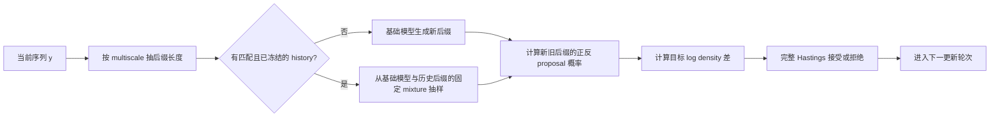
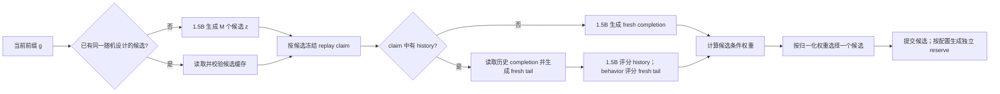

# 推理扩展算法：基础、原理与实现

本文档集中说明仓库中全部推理算法及其执行实现。第 2.1 节先给出当前 Qwen2.5-1.5B 默认 MH 与 IS 路径的
完整数据流；后续各节再分别展开目标分布、有限预算算法、关键代码、统计性质和成本来源。批处理、KV 复用、
异步奖励、vLLM 和计算账本统一列在第 17 节。实验数值见
[GSM8K 方法质量与计算量](../reports/GSM8K_3090_ALIGNED_RESULTS.md)和
[推理执行与 rollout 复用](../reports/RTX3090_ROLLOUT_INFRA.md)。

## 1. 统一记号与实现边界

给定 token 化提示 $`x`$，记基础模型的完整生成分布为

```math
p(y\mid x)=\prod_{t=1}^{|y|}p(y_t\mid x,y_{\lt t}).
```

在已经生成前缀 $`g`$ 时，下一段候选记为 $`z`$，候选后的补全记为 $`u`$。奖励写作
$`r(g,z,u)`$，奖励温度写作 $`\tau\gt 0`$。仓库中最常用的显式奖励目标是

```math
\pi_r(y\mid x)
=\frac{p(y\mid x)\exp\{r(y)/\tau\}}
       {\sum_{y'}p(y'\mid x)\exp\{r(y')/\tau\}}.

```

<p align="right">式 (1)</p>

另一类目标是幂分布

```math
\pi_\alpha(y\mid x)
=\frac{p(y\mid x)^\alpha}{\sum_{y'}p(y'\mid x)^\alpha},
\qquad \alpha\gt 0.

```

<p align="right">式 (2)</p>

本文使用三类性质：

- **平稳分布精确**：MH 转移核保持指定目标不变；有限更新轮次仍有链的收敛误差。
- **估计量无偏**：普通 IS 或 replay 恒等式对条件奖励权重给出无偏估计；有限候选数下的归一化重采样仍是近似。
- **执行等价**：批处理、流式完成和预取保持随机请求与统计量固定。

下文中，MH 指 Metropolis--Hastings，IS 指 Importance Sampling（重要性采样），SIR 指
Sampling-Importance-Resampling（采样--重要性加权--重采样），SMC 指 Sequential Monte Carlo
（序贯蒙特卡洛），GRPO 指 Group Relative Policy Optimization（组相对策略优化）。

重要性修正要求 $`p(y)\gt 0\Rightarrow q(y)\gt 0`$。硬 top-k/top-p 可能破坏该条件；权重截断以偏差换取
有限权重范围。

### 1.1 模型无关算法层与生成适配层

AR-LLM 与 dLLM 的生成状态不同：前者追加 token 后缀，后者更新掩码 block 或完整反向轨迹。算法层仅依赖
候选、目标值和 proposal 概率，不直接调用具体模型。实现边界如下。

| 共享对象 | 算法层操作 | AR-LLM 适配 | dLLM 适配 |
| --- | --- | --- | --- |
| `StepwiseGenerationBackend` | 生成候选、估计条件奖励权重、归一化、重采样、提交候选 | token block 与自回归补全 | 掩码 block 与扩散补全 |
| `MonteCarloRolloutWeightProvider` | 汇总 on-policy、off-policy 或不校正的 rollout 权重 | token 条件概率比 | 轨迹或 block 条件概率比 |
| `IteratedSIRTransition` | 保留完整当前状态、加入独立 proposal、按权重重采样 | 候选 token block 与其 completion | 可由其他逐步生成适配层复用 |
| `TruncatedReplayRolloutWeightProvider` | 合并历史样本与独立 fresh tail | 历史 token 补全 | 历史扩散轨迹 |
| `MetropolisHastingsProposal` | 根据目标密度与正反 proposal 概率执行接受或拒绝 | 随机后缀 proposal | block、轨迹或整段 proposal |
| `allocate_variance_cost_budget` | 按方差与单样本成本冻结 evaluation 配额 | token rollout 配额 | 扩散 trajectory 配额 |
| SMC 公共核 | 归一化 log-weight、systematic resampling、拆分条件 reservoir | token 后缀粒子 | block 轨迹粒子 |

对任意逐步生成模型，MH 适配层为当前状态 $`y`$ 和 proposal $`y'`$ 提供四个标量：
$`\log\widetilde\pi(y)`$、$`\log\widetilde\pi(y')`$、$`\log q(y'\mid y)`$ 与
$`\log q(y\mid y')`$。共享核计算

```math
\log A=\min\left\{0,
\log\widetilde\pi(y')-\log\widetilde\pi(y)
+\log q(y\mid y')-\log q(y'\mid y)
\right\},
```

再以 $`\log U\leq\log A`$ 接受 proposal，其中 $`U`$ 为 $`[0,1)`$ 上的均匀随机数。后缀切点、扩散
block、批处理和异步预取属于 proposal 的执行方式，不改变该接受核。

<a id="alg-overview"></a>
## 2. 方法总览

| 方法 | 采样或估计对象 | 有限预算下的性质 | 主要实现 |
| --- | --- | --- | --- |
| Base / greedy / beam / Best-of-$`N`$ | 基础模型采样或确定性搜索 | 基线分布或奖励最大化 | `experiments/run_reproduction.py` |
| 幂分布 MH | 式 (2) | 转移核精确；有限更新存在收敛误差 | `shared/mh.py` + 两侧 proposal 适配 |
| 奖励目标 MH | 式 (1) | 转移核精确；每次 proposal 通常需完整奖励 | `shared/mh.py` + 两侧目标评分 |
| 条件 IS | 式 (1) 的逐 block SIR | $`K,M\to\infty`$ 时趋近目标 | `shared/stepwise.py` + 两侧生成适配 |
| 迭代条件 IS | 式 (1) 的逐 block i-SIR | 固定非负权重下，有限候选池的转移核保持扩展目标不变 | `experimental/shared/iterated_sir.py` + AR completion 适配 |
| off-policy 条件 IS | 同上，补全来自其他 proposal | 未截断普通 IS 对条件奖励权重无偏 | `shared/importance.py` + 两侧轨迹评分 |
| 未校正 rollout 加权 | $`p(z)\,\mathbb E_q[e^{r/\tau}\mid z]`$ | 有意改变目标的消融 | 同上，`apply_importance_correction=False` |
| base 候选 rollout replay | 式 (1) 的逐 block SIR | history + fresh-tail 条件权重估计无偏 | `shared/importance.py` + 两侧 replay store |
| 可枚举候选 logit adjustment | 式 (1) 的下一步条件分布 | 枚举候选后直接归一化；误差只来自条件权重估计 | 理论参考，当前未接入执行入口 |
| 动态候选 IS | 辅助候选、外层 IS、replay | 使用实际候选 proposal 的 $`p/q_c`$ | `shared/budget.py` + 两侧候选适配 |
| progressive IS | pilot 分配预算，独立 evaluation 估计 | 最终估计仅使用 evaluation | `shared/budget.py` + 两侧 rollout 适配 |
| frozen streaming IS | 固定设计的异步到达版本 | 固定样本集合上的顺序不变性 | `experimental/arllm/streaming_is.py` |
| SMC rollout forest | block 级粒子近似 | 有限粒子、有限 lookahead 的 SMC 近似 | `shared/smc.py` + 两侧粒子状态 |
| delayed-acceptance MH | 式 (1) | 两阶段接受率保持目标不变 | 公共接受核 + 两侧 surrogate/exact 评分 |
| replay-mixture MH | 式 (1) | 冻结混合 proposal 的正反概率均进入 Hastings 比 | 公共接受核 + 两侧历史 proposal |
| GRPO / VRPO | 参数化策略的训练近似 | 受模型族、优化轮次与采样预算影响 | AR token likelihood / dLLM masked ELBO |

表中的相对源码路径均位于 [`src/inference_scaling`](../../src/inference_scaling/)。
生产默认入口仅调度 Qwen2.5-1.5B 消融中确认产生正收益的路径。表中位于 `experimental/` 的实现以及动态
候选、progressive IS、SMC、delayed acceptance 和草稿模型专项实验均需显式选择，不会随 `full` 自动运行。

### 2.1 当前 Qwen2.5-1.5B 默认执行规则

当前默认设置区分算法设计与执行调度。算法设计决定候选、概率、权重、接受随机数和 replay 数据；执行调度
只合并已经确定的生成与评分请求。统一入口将 `multiscale` 传给 MH，并默认调度 `replay` 与 `async` 组件；
专用组合入口 `run_qwen15b_is_stack.py` 验证 replay、候选复用和连续批处理的联合路径。根级复现入口当前将
这些组件作为独立实验调度，不承担常驻服务的请求级自动路由。冻结 history 只有在 prompt、模型、sampling
policy、奖励版本和生成位置全部匹配时才进入 replay 路径；其他请求执行 fresh 路径。在线成本只把已经存在
的匹配 history 视为 warm 资源，临时建库成本单列。

<a id="alg-qwen-default-mh"></a>
#### 2.1.1 默认后缀 MH

同一执行流程支持幂目标式 (2) 和奖励目标式 (1)。幂目标使用
$`\log\widetilde\pi(y)=\alpha\log p(y\mid x)`$；奖励目标使用
$`\log\widetilde\pi(y)=\log p(y\mid x)+r(y)/\tau`$。当前 Qwen 生产入口采用 `multiscale`
后缀长度分布；冻结 replay proposal 是有匹配 history 时的墙钟优先路径，FLOPs 优先或无匹配 history 时
使用基础模型 proposal。



固定当前阶段长度 $`T`$ 后，一次更新执行：

1. 从与当前序列无关、对 $`1,\ldots,T`$ 全支持的 $`\rho(\ell)`$ 抽取后缀长度 $`\ell`$，令切点
   $`c=T-\ell`$；
2. 若调用方提供匹配且在链开始前冻结的后缀库，从基础模型与历史经验分布的固定 mixture 抽取新后缀；
   否则从基础模型抽取；
3. 对旧后缀和新后缀计算同一个 proposal 的概率。replay 命中仍需计算完整 mixture 概率，不能只使用
   历史记录的频率；
4. 计算幂目标或奖励目标的 log density 差，调用共享 MH 核；
5. 用请求局部的均匀随机数接受或拒绝，随后进入下一次更新；
6. 当前阶段完成 `steps_per_block` 次更新后扩展到下一阶段，直到长度 $`L`$。

单链单次更新的逻辑工作量如下；多链批处理减少物理提交次数，不改变每条链的逻辑请求。

| proposal 路径 | 新后缀 decode | 概率计算 | 奖励调用 |
| --- | --- | --- | --- |
| 基础模型 | 1 条长度 $`\ell`$ 的后缀 | 生成时保存新后缀概率；旧状态概率缓存 | 奖励目标对新完整序列调用一次；幂目标无需外部奖励 |
| replay 命中 | 0 条新后缀 decode | 读取已缓存的基础概率，缺失时对历史后缀做 teacher-forced 评分；随后计算新旧完整 mixture 概率 | 奖励目标对新完整序列调用一次 |
| replay 未命中 | 与基础模型路径相同 | 与基础模型路径相同 | 与基础模型路径相同 |

`multiscale` 只改变各个后缀长度的固定混合比例；replay 只改变给定长度下的 proposal。每个分量都在
Hastings 比中使用完整正反概率，因此两项可以组合。直观上，短后缀降低生成成本，完整后缀的正概率提供
全局移动；增加更新轮次会继续减小有限链误差，但实际速度取决于 proposal 与目标的重叠程度。

主要入口为
[`run_mh_chain`](../../src/inference_scaling/arllm/algorithms/mh.py)、
[`run_mh_chains_batched`](../../src/inference_scaling/arllm/algorithms/mh.py)和
[`run_reward_mh_chain_replay_proposal`](../../src/inference_scaling/arllm/algorithms/mh_acceleration.py)；组合消融入口为
[`run_qwen15b_mh_stack.py`](../../experiments/arllm/run_qwen15b_mh_stack.py)。

<a id="alg-qwen-default-is"></a>
#### 2.1.2 默认条件 IS 与 warm replay

普通 `conditional_is` 从基础模型生成候选和 fresh rollout。`replay` 组件在已有匹配且尚未消费的
evaluation history 时使用式 (14)，并复用建库阶段已经生成的同一组候选；连续批处理只改变这些请求的
物理执行顺序。调用入口和 replay inventory 明确选择 fresh 或 replay，专用组合入口负责对两条路径进行
成对验证。



一次 guidance step 的完整顺序为：

1. 生成 $`M`$ 个 $`z_m\sim p(\cdot\mid x,g)`$。若 replay key 构建阶段已经用同一 seed 生成并返回这组
   `SequenceSample`，在线阶段先逐项校验，再直接复用；
2. 对每个非终止候选冻结最多 $`H`$ 条 evaluation history。冻结操作只暴露数量和 behavior id，不暴露
   completion、奖励或概率；
3. claim 为空时，生成 $`F`$ 条 fresh base completion 并计算普通样本均值。受控 fresh-only 对照可显式
   使用 $`H+F`$ 条 fresh rollout，使最大 rollout 数与 replay 臂相同；
4. claim 非空时，一次性读取并消费 history，生成 $`F`$ 条独立 fresh completion，重新校验 history 的
   behavior 概率，用 1.5B 对 history 计算目标概率，并用 behavior 模型对 fresh completion 计算式 (14)
   所需的 $`b(v)`$；
5. 使用式 (14) 合并截断 history 项和 fresh-tail 项，得到每个候选的 $`\widehat h_m`$；
6. 按 $`\widehat h_m/\sum_j\widehat h_j`$ 选择候选并追加到 $`g`$；
7. 当前 fresh rollout 只进入 `design`。候选选择完成后另行生成的 reserve 才能写入未来 `evaluation`，从而
   避免当前奖励反过来影响本轮数据选择；
8. 不同 prompt 的候选生成、completion、1.5B 重评分和奖励任务可以连续批处理，但 request id、seed、
   proposal 概率和候选选择随机数保持不变。

模型职责如下。表中的 0.5B 只是一种 behavior policy；history 也可以来自其他可精确评分且满足支持条件的
proposal。

| 操作 | Qwen2.5-1.5B | Qwen2.5-0.5B / 其他 behavior | CPU 或 verifier |
| --- | --- | --- | --- |
| 生成候选 $`z_m`$ | 必须；候选保持来自基础模型 | 不参与默认 base-candidate 路径 | 不参与 |
| fresh completion | 生成并保存 $`\log p`$ | replay fresh-tail 需要对它批量评分，得到 $`\log b`$；普通 fresh IS 无此调用 | 计算奖励 |
| history completion | 对已有 completion 批量评分，得到 $`\log p`$ | 可在建库阶段生成，并保存实际 $`\log b`$ | 可在使用时重算奖励 |
| 保存概率复核 | 复核目标策略标识与当前评分上下文 | 按保存的 behavior id 复核 $`\log b`$ | 不参与 |
| IS/replay 权重 | 提供 $`\log p`$ | 提供 $`\log b`$ | 在 log 域组合并归一化 |
| 候选选择 | 不新增模型前向 | 不新增模型前向 | 使用固定随机数重采样 |

假设本步的 $`M`$ 个候选均未终止，逻辑模型工作量的上界为：

| 路径 | 1.5B 候选 decode | completion decode | teacher-forced 评分 |
| --- | ---: | ---: | ---: |
| 标准 fresh IS | $`M`$ | 1.5B：$`MK`$ | 生成已返回基础概率时为 0 |
| 普通 off-policy IS | $`M`$ | behavior：$`MK`$ | 1.5B：$`MK`$ |
| warm replay | 缓存命中为 0，否则 $`M`$ | 1.5B fresh：$`MF`$ | 1.5B history：至多 $`MH`$；behavior fresh-tail：$`MF`$ |

候选缓存和 history 建库成本在 `cache_build` 中单列。连续批处理把上述逻辑请求合并为较少的物理 batch，
因此主要降低墙钟时间；padding 可能使实际 forward token slots 略有增加。

“1.5B 重评分”只计算已有 completion 在 1.5B 下的条件 log-probability，不重新生成 completion。删除这一
评分和 $`p/q`$ 后得到的是式 (12) 的未校正 rollout 加权，其目标一般不同于式 (7)。

主要入口为
[`conditional_is_step`](../../src/inference_scaling/arllm/algorithms/conditional_is.py)、
[`base_replay_step`](../../src/inference_scaling/arllm/algorithms/base_replay.py)和
[`TruncatedReplayRolloutWeightProvider`](../../src/inference_scaling/shared/importance.py)；组合消融入口为
[`run_qwen15b_is_stack.py`](../../experiments/arllm/run_qwen15b_is_stack.py)。

### 2.2 核心符号、配置字段与成本影响

“质量配置”指 `configs/gsm8k_3090_aligned.toml`；“组合消融”指本轮 Qwen 执行栈的受控实验。组合消融的
较短长度只用于比较执行成本，不替代质量配置。

| 符号 | 配置或参数 | 作用 | 增大后的主要影响 | 当前 Qwen 设置 |
| --- | --- | --- | --- | --- |
| $`L`$ | `generation.max_new_tokens` / `total_length` | 最大生成长度 | 扩大可生成范围，同时增加 decode、评分和 KV 成本 | 质量配置 192；MH 组合消融 32；IS 组合消融 64 |
| $`B`$ | `mh.block_size` / `conditional_is.block_size` | 每个生成阶段提交的 block 长度 | guidance 次数减少，但每次候选或后缀更长 | 质量配置：MH 12、IS 48；IS 组合消融 32 |
| $`n`$ | `mh.steps_per_block` / `--steps` | 每个阶段的 MH 更新数 | 有限链误差通常下降，proposal 与奖励调用线性增加 | 质量配置 3；MH 组合消融 8 |
| $`C_{\rm chain}`$ | `mh.chains` / `--chains` | 独立 MH 链数 | 增加独立样本与并行度，计算近似线性增加 | 质量路径 1；MH 组合消融 4 |
| $`\alpha`$ | `mh.alpha` | 幂目标指数 | 更偏向高基础概率序列，可能降低 MH 接受率 | 质量配置 4 |
| $`\tau`$ | `reward_temperature` | 奖励相对基础概率的尺度 | 减小后奖励差异在权重或接受率中更强 | 条件 IS 0.1；matched target 0.04；MH 组合消融 0.3 |
| $`M`$ | `conditional_is.candidate_count` | 每步基础模型候选数 | 候选覆盖改善，候选和 rollout 成本增加 | 质量配置 8；IS 组合消融 4 |
| $`K`$ | `conditional_is.rollout_count` | 每个候选的普通 rollout 数 | 条件权重噪声通常下降，completion 成本线性增加 | 质量配置 3；组合消融 fresh 对照使用 $`H+F=2`$ |
| $`H`$ | `replay.history_rollouts` / `max_history_per_candidate` | 每个候选最多消费的 history 数 | warm 复用增加；目标评分、库存和匹配约束增加 | 质量配置 2；IS 组合消融 1 |
| $`F`$ | `replay.fresh_rollouts` | fresh-tail 数 | 截断 replay 校正更稳定，同时增加 1.5B rollout | 质量配置与 IS 组合消融均为 1 |
| $`R`$ | `reserve_rollouts` | 候选提交后写入未来 evaluation 的独立记录数 | 增加未来库存和当前建库成本；不参与本轮权重 | 当前正式配置 0 |
| $`c`$ | `replay.truncation` | 式 (14) 的 history 截断常数 | history 项更接近完整比值，fresh-tail 贡献下降；方差可能增大 | 8 |
| $`\lambda`$ | `auxiliary_mixture` 或 `history_mixture` | mixture 中辅助或历史 proposal 的质量 | 命中率可能上升，但完整 mixture 概率仍必须计算 | 动态候选默认 0.25；MH 组合消融 0.7 |
| — | `sampling.temperature` | 定义实际生成 proposal $`q`$ | 改变候选多样性、接受率和 importance ratio | 1.0 |
| — | `sampling.top_p` / `top_k` | 限制 proposal 支持集 | 硬截断可能破坏 MH 与 IS 的支持条件 | 1.0 / `None` |
| — | `importance_log_ratio_clip` | 普通 off-policy IS 的 log-ratio 截断 | 方差下降但改变目标 | 质量配置 10；精确目标诊断应关闭 |
| — | `reward_version` 与 replay key | 标识奖励、prompt、前缀和候选的匹配关系 | 版本变化使旧 evaluation 记录失配 | 运行入口固定并写入产物 |
| — | `runtime.max_batch_size`、`max_batch_tokens`、`max_score_batch_size` | 生成和评分的物理批量 | GPU 利用率提高；padding 与峰值显存可能增加 | 3090 配置为 24、12288、12 |

统一生产 CLI 的 `--ar-mh-suffix-schedule` 与 AR 套件的 `--mh-suffix-schedule` 默认值均为
`multiscale`。底层 `MHConfig`、`RewardMHConfig` 和历史 TOML 保留 `uniform`，用于独立调用时维持旧基线；
统一入口会显式覆盖这些历史配置。实验报告必须记录最终生效值，不能只引用 TOML。

<a id="alg-sources"></a>
### 2.3 方法来源

| 方法族 | 主要文献 | 本仓库中的关系 |
| --- | --- | --- |
| beam search | [Freitag and Al-Onaizan (2017)](https://aclanthology.org/W17-3207/) | 作为确定性搜索基线 |
| self-consistency | [Wang et al. (2023)](https://openreview.net/pdf?id=1PL1NIMMrw) | 作为并行采样基线与可部署奖励信号 |
| Metropolis--Hastings | [Hastings (1970)](https://doi.org/10.1093/biomet/57.1.97) | 用于幂分布和显式奖励目标的后缀转移 |
| 重要性采样与 defensive mixture | [Hesterberg (1995)](https://doi.org/10.1080/00401706.1995.10484303) | 用于条件奖励权重、外层候选修正和完整支持集 proposal |
| iterated SIR | [Samsonov et al. (2022)](https://papers.neurips.cc/paper_files/paper/2022/file/21c86d5b10cdc28664ccdadf0a29065a-Paper-Conference.pdf) | 将一次性有限 SIR 变为按迭代轮次收敛的有限池转移 |
| off-policy 修正 | [Precup, Sutton, and Singh (2000)](https://web.eecs.umich.edu/~baveja/Papers/OffPolicy.pdf) | 用真实 behavior 概率修正异分布 rollout |
| 经验回放 | [Lin (1992)](https://doi.org/10.1007/BF00992699) | 历史 completion 经式 (13) 校正后进入条件奖励权重估计 |
| 可枚举候选 logit adjustment | [Just-In-Time Reinforcement Learning，Li et al. (2026)](https://arxiv.org/abs/2601.18510) | 原文在有限动作集合上加入估计优势；第 6.4 节将其改写为序列奖励下的条件权重接口 |
| GRPO | [Shao et al. (2024)](https://arxiv.org/abs/2402.03300) | 使用同一基础模型训练的参数更新基线 |
| 最优分层分配 | [Neyman (1934)](https://doi.org/10.1111/j.2397-2335.1934.tb04184.x)、[Étoré and Jourdain (2010)](https://doi.org/10.1007/s11009-008-9108-0) | 推导式 (19) 的方差--成本预算规则 |
| SMC | [Del Moral, Doucet, and Jasra (2006)](https://doi.org/10.1111/j.1467-9868.2006.00553.x)、[Lew et al. (2023)](https://arxiv.org/abs/2306.03081) | 用于逐 block 粒子传播和条件后缀 reservoir |
| delayed-acceptance MCMC | [Christen and Fox (2005)](https://doi.org/10.1198/106186005X76983) | 通过两阶段接受率减少精确奖励调用 |
| 连续批处理与 KV block | [Orca，Yu et al. (2022)](https://www.usenix.org/conference/osdi22/presentation/yu)、[PagedAttention，Kwon et al. (2023)](https://doi.org/10.1145/3600006.3613165) | 跨 prompt 调度、共同前缀 prefill 和 vLLM APC |
| speculative decoding | [Leviathan, Kalman, and Matias (2023)](https://proceedings.mlr.press/v202/leviathan23a.html)、[REST，He et al. (2024)](https://aclanthology.org/2024.naacl-long.88/) | 历史 token tree、target verification 和残差抽样 |
| 异步生成与消费 | [IMPALA，Espeholt et al. (2018)](https://proceedings.mlr.press/v80/espeholt18a.html)、[SAO，Hou et al. (2026)](https://arxiv.org/abs/2607.07508) | completion callback、部分 rollout 和低优先级 run-ahead |
| MCMC prefetch | [Brockwell (2006)](https://doi.org/10.1198/106186006X100579) | 奖励等待期间预取接受和拒绝分支 |

下文给出分块条件 IS、fresh-tail replay、动态候选和冻结 evaluation 的公式与实现。

<a id="alg-baselines"></a>
## 3. 生成与训练基线

### 3.1 Base、greedy、beam 与 Best-of-$`N`$

`base` 按配置温度从基础模型抽样；`greedy` 逐 token 取最大概率项；beam search 保留累计对数概率最高的
若干前缀。

Best-of-$`N`$ 先独立生成 $`y_1,\ldots,y_N\sim p`$，再按奖励或 self-consistency 规则选择一个序列：

```math
\widehat y=\arg\max_{1\le i\le N}\widehat r(y_i).

```

<p align="right">式 (3)</p>

式 (3) 随 $`N`$ 增大趋向奖励最大化。数值答案众数相同时，实验按模型 log-probability 确定性破同票。

### 3.2 GRPO 对照

本仓库中的 GRPO 使用同一基础模型和 GSM8K 数值正确性奖励进行参数训练。若忽略参数化限制，一个带 KL
正则的理想策略优化问题具有式 (1) 的形式；实际 GRPO 只通过有限 rollout、组内相对优势和有限梯度更新去近似
该目标。报告分别列出训练 FLOPs 与训练后采样 FLOPs；单次推理成本指训练完成后的生成成本。

训练得到固定策略 $`p_{\theta_{\mathrm{GRPO}}}`$。实验分别采用温度 1 随机采样和逐 token argmax 解码。

训练入口为 [`experiments/arllm/train_gsm8k_grpo.py`](../../experiments/arllm/train_gsm8k_grpo.py)，精确数值奖励实现为
[`shared/evaluation/grpo_reward.py`](../../src/inference_scaling/shared/evaluation/grpo_reward.py)。

<a id="alg-power-mh"></a>
## 4. 幂分布后缀 MH

固定生成长度为 $`L`$。当前状态为 $`y=(y_1,\ldots,y_L)`$。一次更新先按固定分布
$`\rho(\ell)`$ 选择后缀长度 $`\ell\in\{1,\ldots,L\}`$，令切点 $`c=L-\ell`$，保留
$`y_{1:c}`$，再从 proposal $`q_c(\cdot\mid x,y_{1:c})`$ 生成长度为 $`\ell`$ 的新后缀 $`v`$。
约定 $`c=0`$ 时保留前缀为空。接受概率为

```math
A(y\to y')=
\min\left\{1,
\exp\left[
\alpha\bigl(\log p(v\mid x,y_{1:c})-\log p(y_{c+1:L}\mid x,y_{1:c})\bigr)
+\log q_c(y_{c+1:L}\mid x,y_{1:c})-\log q_c(v\mid x,y_{1:c})
\right]\right\}.

```

<p align="right">式 (4)</p>

对固定 $`\ell`$，候选前缀相同，正向和反向转移都含同一因子 $`\rho(\ell)`$，该因子在 Hastings
比中抵消，因此式 (4) 是该后缀长度对应的完整接受率。记其转移核为 $`K_\ell`$，则

```math
K_\rho=\sum_{\ell=1}^{L}\rho(\ell)K_\ell,
\qquad
\pi_\alpha K_\rho
=\sum_{\ell=1}^{L}\rho(\ell)\pi_\alpha K_\ell
=\pi_\alpha.
```

所以任何与当前序列无关的固定 $`\rho`$ 都保持同一目标分布。实现要求每个 $`\rho(\ell)>0`$，从而既能
执行局部更新，也保留整段重生成。温度 proposal 的逐前缀归一化常数进入 $`q_c`$ 的正反概率。

实现提供三种分布：`uniform` 对所有长度等概率；`inverse_length` 取
$`\rho(\ell)\propto 1/\ell`$；`multiscale` 将 10% 概率均匀分给全部长度，其余 90% 均匀分给
$`1,2,4,\ldots,L`$ 中的不同长度。后两者减少平均 proposal token 数；`multiscale` 同时提高二进制尺度和
完整后缀的采样频率。统一生产 CLI 默认选择 `multiscale`；底层配置类和历史 TOML 的默认值仍为
`uniform`，用于维持基线结果指纹。

Qwen2.5-1.5B 的优化组合采用经 32 题、4 个 draw 确认的 `multiscale`。确认结果与速度优先的
`inverse_length` 配置见
[Qwen2.5-1.5B 优化研究](../reports/QWEN15B_OPTIMIZATION_STUDY.md#mh-后缀长度-proposal)。

实现按 `block_size` 逐步扩展到 $`L`$，并在每个长度执行 `steps_per_block` 次后缀更新。最终长度上的有限更新
结果仍含 MCMC 误差。由于切点 $`c=0`$ 能以正概率重生成整段，且未截断 softmax proposal 在有限词表、
固定长度空间上处处为正，转移矩阵任意两行都有正重叠。写

```math
\delta(K)=1-\min_{y,y'}\sum_v\min\{K(y,v),K(y',v)\}\lt 1,
```

则最终长度的核满足

```math
\left\|\mu K^n-\pi_\alpha\right\|_{\mathrm{TV}}
\le \delta(K)^n.

```

<p align="right">式 (5)</p>

式 (5) 的直观含义是：两条从不同序列出发的链，每轮都有一部分共同的下一状态概率；整段 proposal 保证
这部分重叠不为零。每增加一次更新，尚未消除的最坏情形差异至多再乘一个 $`\delta(K)`$。真实 LLM 状态空间
过大，文档不把 $`\delta(K)`$ 当作可直接计算的调参量；实验改为报告更新数、接受率和实际改变的 token 数。

真实模型实验报告更新轮次、接受率、平均 proposal 长度、proposal 改变的 token 数和接受后实际改变的
token 数；收缩常数需要显式转移矩阵 $`K`$。

代码中的接受率由模型无关的共享核计算；AR 适配层只提供式 (4) 的四个概率项：

```python
decision = decide_metropolis_hastings(
    current_target_log_density=alpha * old_base_logprob,
    proposed_target_log_density=alpha * new_base_logprob,
    forward_proposal_log_probability=new_proposal_logprob,
    reverse_proposal_log_probability=old_proposal_logprob,
    uniform=uniform,
)
accepted = decision.accepted
```

EOS 由 [`AbsorbingEOSBackend`](../../src/inference_scaling/arllm/backends/absorbing.py) 转换为固定长度吸收状态；
终止判断作用于生成区间，EOS 后占位 token 的条件概率为 1。

<a id="alg-reward-mh"></a>
## 5. 奖励目标后缀 MH

对式 (1)，相同后缀 proposal 的接受率为

```math
A_r(y\to y')=\min\left\{1,
\exp\left[
\log\frac{p(y'_{c+1:L}\mid x,y_{1:c})}{p(y_{c+1:L}\mid x,y_{1:c})}
+\frac{r(y')-r(y)}{\tau}
+\log\frac{q_c(y_{c+1:L}\mid x,y_{1:c})}{q_c(y'_{c+1:L}\mid x,y_{1:c})}
\right]\right\}.

```

<p align="right">式 (6)</p>

当 $`q_c=p(\cdot\mid x,y_{1:c})`$ 时，基础模型与 proposal 项抵消，只剩
$`\min\{1,e^{(r(y')-r(y))/\tau}\}`$。代码仍保留展开后的四项，因而同样支持任意可精确评分、具有完整
support 的温度 proposal。在固定最大长度、有限词表、有限奖励、全支持 proposal 且 $`\rho(L)>0`$ 时，
整段重生成使任意两个出发状态具有共同可达的下一状态，因而得到与式 (5) 相同的几何收敛直观解释。

dLLM 的整段奖励 MH 从基础模型独立生成完整 proposal。基础轨迹概率在目标与 proposal 中抵消，因此共享核
只接收 $`r(y)/\tau`$ 与 $`r(y')/\tau`$，无需额外计算轨迹 likelihood；初始样本和后续 proposal 可在一次
批处理中生成。dLLM 的幂目标轨迹 MH 不发生该抵消，适配层将旧、新轨迹的基础概率及 proposal 概率交给同一
接受核。

奖励在实现中是完整生成序列的函数。数值正确性、外部 verifier 等只能在完整 proposal 后得到时，每次普通
MH 更新都要完成整段后缀并调用奖励；降低这部分成本的方法见
[两阶段 MH](#alg-delayed-mh)与[proposal-tree 预取](#infra-mh-prefetch)。

<a id="alg-conditional-is"></a>
## 6. 条件 IS

在已生成前缀 $`g`$ 之后，式 (1) 对下一 block $`z`$ 的条件分布可写为

```math
\pi_r(z\mid x,g)\propto p(z\mid x,g)h(g,z),
\qquad
h(g,z)=\mathbb E_{u\sim p(\cdot\mid x,g,z)}
\left[e^{r(g,z,u)/\tau}\right].

```

<p align="right">式 (7)</p>

标准条件 IS 的一次 guidance step 为：

1. 生成 $`M`$ 个候选 $`z_m\sim p(\cdot\mid x,g)`$；
2. 对每个候选生成 $`K`$ 条 on-policy 补全 $`u_{mk}\sim p(\cdot\mid x,g,z_m)`$；
3. 计算式 (8)：

```math
\widehat h_m=\frac1K\sum_{k=1}^K e^{r(g,z_m,u_{mk})/\tau};

```

<p align="right">式 (8)</p>

4. 以 $`\widehat h_m/\sum_j\widehat h_j`$ 的概率选择候选并追加到 $`g`$，随后进入下一 block。

候选来自 $`p`$，因此 SIR 直接使用条件奖励权重 $`\widehat h_m`$。当
$`K\to\infty`$ 时式 (8) 收敛到 $`h`$；当候选数 $`M\to\infty`$ 时，sampling-importance-resampling
输出趋近式 (7)。有限 $`K,M`$ 以及逐 block 重复选择共同构成实际近似误差。

直观上，$`K`$ 控制“每个候选的后续表现估计得多稳定”，$`M`$ 控制“本轮看到了多少种下一段”。在条件
权重具有有限方差时，普通样本均值的典型波动按 $`K^{-1/2}`$ 缩小；候选抽样带来的覆盖波动通常按
$`M^{-1/2}`$ 缩小。具体常数取决于奖励尺度、importance ratio 和候选概率，多个 block 的局部误差还会沿
生成过程累积。因此仓库同时报告 $`M`$、$`K`$、ESS、截断次数和最终质量，而不只报告一个渐近阶。

关键实现直接在 log 域求均值并重采样：

```python
log_candidate_weights = [
    logmeanexp(rollout.log_weight for rollout in evaluations)
    for evaluations in candidate_rollouts
]
probabilities = softmax(log_candidate_weights)
selected_index = rng.choice(len(candidates), p=probabilities)
```

AR 条件 IS 适配位于 [`conditional_is.py`](../../src/inference_scaling/arllm/algorithms/conditional_is.py)，候选与所有 rollout
都按异构请求展平为批次；执行细节见[重复前缀 KV 复用](#infra-prefix-kv)。

<a id="alg-rqmc-rollouts"></a>
### 6.1 随机化 QMC rollout

普通条件 IS 为每个候选独立生成 $`K`$ 条 rollout。仓库实现两种 randomized quasi-Monte Carlo（RQMC）
设计；两者都保持每条 rollout 的 proposal 边缘分布，只改变同一候选下 $`K`$ 条 rollout 的联合分布。

`scrambled_sobol` 为长度 $`L`$ 的补全生成经过数字扰动的 Sobol 点
$`v_{m1},\ldots,v_{mK}\in[0,1)^L`$，并在每个 token 位置执行 proposal 条件分布的逆 CDF：

```math
u_{mk,t}=F^{-1}_{q,t}
\left(v_{mk,t}\mid x,g,z_m,u_{mk,<t}\right).
```

<p align="right">式 (8-R1)</p>

`arithmetic_lattice` 先抽取一个共享随机平移 $`\Delta_m\sim\operatorname{Unif}[0,1)`$，再构造一维格点

```math
a_{mk,1}=\left(\Delta_m+\frac{k}{K}\right)\bmod 1,
\qquad k=0,\ldots,K-1.
```

<p align="right">式 (8-R2)</p>

在第 $`t`$ 个 token 位置，将 proposal 概率按固定规则排列。若 $`a_{mk,t}`$ 落在 token $`u_{mk,t}`$
对应的区间 $`[\ell_{mk,t},\ell_{mk,t}+q_{mk,t})`$，则选择该 token，并把区间重新缩放到 $`[0,1)`$：

```math
a_{mk,t+1}=
\frac{a_{mk,t}-\ell_{mk,t}}{q_{mk,t}}.
```

<p align="right">式 (8-R3)</p>

随机平移使每个带编号的 $`a_{mk,1}`$ 都服从 $`\operatorname{Unif}[0,1)`$。算术逆 CDF 将任一序列
$`u`$ 对应到长度恰为 $`q(u\mid x,g,z_m)`$ 的区间，因此每条 $`u_{mk}`$ 的边缘分布严格等于 rollout
proposal。格点之间的距离固定为 $`1/K`$，其覆盖约束强于逐 token Sobol 在高维空间中的有限点集约束。

令

```math
G_m(u)=
\exp\{r(g,z_m,u)/\tau\}
\frac{p(u\mid x,g,z_m)}{q(u\mid x,g,z_m)}.
```

两种 RQMC 设计都满足

```math
\mathbb E\!\left[\frac1K\sum_{k=1}^K G_m(u_{mk})\right]
=\frac1K\sum_{k=1}^K\mathbb E[G_m(u_{mk})]
=h(g,z_m).
```

<p align="right">式 (8-R4)</p>

该等式只使用期望的线性性和每条 rollout 的正确边缘分布，因此同时覆盖 on-policy 与 off-policy rollout，
原有 $`p/q`$ 权重无需改变。有限候选 SIR 的归一化误差仍然存在。RQMC 点集内部不独立，普通独立样本 ESS
只能描述当前权重的离散程度；估计量方差需要用多个独立随机平移或数字扰动测量，有限 $`K`$ 下也没有统一的
方差下降保证。

实现为每个候选构造独立点集。算术格点只向每条请求传递一个初始随机数，后端在生成过程中更新局部坐标：

```python
latents = randomized_lattice_uniforms(
    rollout_count,
    seed=candidate_shift_seed,
)
requests = [
    GenerationRequest(..., arithmetic_uniform=latents[k])
    for k in range(rollout_count)
]
```

Transformers 与表格后端使用 float64 累积概率执行两种逆 CDF。RQMC 只接受逐序列固定奖励；批内自一致性
奖励会随 rollout 的联合分布改变，入口拒绝该组合。vLLM 当前不开放请求级采样随机数注入，因此两种 RQMC
模式均在 vLLM 后端显式报错，`iid` 路径不受影响。实现位于
[`rqmc.py`](../../src/inference_scaling/experimental/shared/rqmc.py)、
[`conditional_is.py`](../../src/inference_scaling/arllm/algorithms/conditional_is.py)和
[`transformers_backend.py`](../../src/inference_scaling/arllm/backends/transformers_backend.py)。方法依据见
[Arithmetic Sampling](https://proceedings.mlr.press/v202/vilnis23a.html)、
[QuasiMoTTo](https://arxiv.org/abs/2607.01179)以及 RQMC 与重要性采样组合的
[Buchholz and Chopin (2018)](https://proceedings.mlr.press/v80/buchholz18a/buchholz18a.pdf)。逐 token Sobol
在 Qwen2.5-1.5B 的首轮筛选中未通过收益门槛；算术格点使用同一入口单独登记并筛选，数值见
[Qwen2.5-1.5B 优化研究](../reports/QWEN15B_OPTIMIZATION_STUDY.md#rollout-方差与提前停止)。

<a id="alg-bounded-is"></a>
### 6.2 有界权重下的精确提前停止

当每条 rollout 的非归一化权重具有已知确定性界 $`a\leq w_{mk}\leq b`$ 时，可以分批评估 rollout，并在
候选选择已经不可能改变时停止。该规则固定完整条件 IS 原本使用的同一个均匀数 $`\eta\in[0,1)`$，不使用
置信区间或近似 margin。

候选 $`m`$ 已评估 $`k_m`$ 条 rollout 后，其最终平均权重位于

```math
L_m=\frac{\sum_{k=1}^{k_m}w_{mk}+(K-k_m)a}{K},
\qquad
U_m=\frac{\sum_{k=1}^{k_m}w_{mk}+(K-k_m)b}{K}.
```

<p align="right">式 (8-E1)</p>

若完整权重为 $`H_m\in[L_m,U_m]`$，固定 $`\eta`$ 时选择候选 $`j`$ 等价于

```math
\sum_{i<j}H_i\leq\eta\sum_iH_i
<\sum_{i\leq j}H_i.
```

<p align="right">式 (8-E2)</p>

式 (8-E2) 对所有合法 $`H_i`$ 都成立，当且仅当

```math
(1-\eta)\sum_{i<j}U_i-\eta\sum_{i\geq j}L_i\leq0,
\qquad
(1-\eta)\sum_{i\leq j}L_i-\eta\sum_{i>j}U_i>0.
```

<p align="right">式 (8-E3)</p>

第一项是式 (8-E2) 左侧不等式在区间盒上的最大值，第二项是右侧严格不等式在区间盒上的最小值；线性函数
的极值分别在对应端点取得。因此式 (8-E3) 成立时，任何尚未生成的 rollout 都会得到同一个 selected index，
可以直接提交候选 $`j`$。若不成立，则继续评估下一批。最迟在 $`K`$ 条 rollout 全部完成后，所有区间退化
为单点，算法必然终止。故提前停止路径与完整有限 $`K,M`$ 算法逐步选择相同候选，不引入新的分布误差。

实现接受 rollout **log-weight** 的确定性界。on-policy、二值奖励 $`r\in[0,1]`$ 时可取
$`[0,1/\tau]`$；若 off-policy log-ratio 被算法本身截断到 $`[-c,c]`$，可取
$`[-c,1/\tau+c]`$。未截断的 $`p/q`$ 通常没有有限统一上界，不能使用该优化。实测权重一旦超出声明区间，
运行立即失败。批内自一致性奖励依赖尚未完成的其他 rollout，也不满足逐条固定权重条件。

```python
decision = invariant_categorical_index(
    lower_candidate_weights,
    upper_candidate_weights,
    uniform=selection_uniform,
)
if decision is not None:
    break
```

公共判定位于 [`bounded_selection.py`](../../src/inference_scaling/experimental/shared/bounded_selection.py)，AR staged rollout
位于 [`conditional_is.py`](../../src/inference_scaling/arllm/algorithms/conditional_is.py)。分批执行可能重复 prefix
prefill；因此实际收益由跳过的 rollout 比例、批次数、forward token slots、FLOPs 和墙钟共同决定。
Qwen2.5-1.5B 筛选保持 16/16 成对输出一致并跳过 8.27% rollout，但重复 prefill 使 FLOPs 增加 16.4%，
故默认关闭；完整数值见
[Qwen2.5-1.5B 优化研究](../reports/QWEN15B_OPTIMIZATION_STUDY.md#rollout-方差与提前停止)。

<a id="alg-iterated-is"></a>
### 6.3 迭代条件 IS

一次性 SIR 在有限候选数 $`M`$ 下仍有归一化重采样误差。iterated SIR（i-SIR）把一次候选定义为完整
扩展状态

```math
\xi=(z,u_{1:K}),
\qquad
\lambda(\xi)=p(z\mid x,g)\prod_{k=1}^K q(u_k\mid x,g,z),

```

<p align="right">式 (8a)</p>

并使用未截断的非负权重

```math
w(\xi)=\frac1K\sum_{k=1}^K
\exp\{r(g,z,u_k)/\tau\}
\frac{p(u_k\mid x,g,z)}{q(u_k\mid x,g,z)}.

```

<p align="right">式 (8b)</p>

on-policy rollout 令 $`q=p`$ 即可。第 0 个扩展状态从 $`\lambda`$ 初始化；每轮更新执行：

1. 将当前 $`\xi^{(n)}`$ 放入大小为 $`N`$ 的候选池第一个位置；
2. 独立生成 $`N-1`$ 个新状态 $`\xi_2,\ldots,\xi_N\sim\lambda`$；
3. 以 $`w(\xi_i)/\sum_jw(\xi_j)`$ 选择 $`\xi^{(n+1)}`$；
4. 保留选中状态中的候选 block、rollout token、$`p/q`$ 和奖励，不重新估计其权重。

最后提交 $`\xi^{(n)}`$ 的 $`z`$。候选 block 始终来自 1.5B 基础模型；其他模型或 replay 只可通过式
(8b) 影响权重。

该算法的有限池正确性可直接从一个增广联合分布得到。令候选池为 $`\xi_{1:N}`$，选中位置为 $`I`$，定义

```math
\overline\pi(\xi_{1:N},I=i)
\propto
\lambda(\xi_i)w(\xi_i)
\prod_{j\ne i}\lambda(\xi_j).

```

<p align="right">式 (8c)</p>

给定 $`I=i`$ 和 $`\xi_i`$，其余 $`N-1`$ 个状态独立服从 $`\lambda`$；给定整个候选池，$`I`$ 的条件
概率正比于 $`w(\xi_i)`$。上述两步正是 Gibbs 更新，因此保持式 (8c) 不变。选中扩展状态的边缘分布为
$`\widetilde\pi(\xi)\propto\lambda(\xi)w(\xi)`$。再对 rollout 求和：

```math
\sum_{u_{1:K}}\lambda(z,u_{1:K})w(z,u_{1:K})
=p(z\mid x,g)h(g,z),

```

故任意 $`N\geq 2`$ 下，候选 $`z`$ 的平稳边缘分布均为式 (7)。若
$`\kappa=\sup_\xi w(\xi)/\mathbb E_\lambda[w(\xi)]`$ 有限，则更新 $`n`$ 轮后的总变差距离满足

```math
\left\|\mathcal L(\xi^{(n)})-\widetilde\pi\right\|_{\mathrm{TV}}
\le
\left(1-\frac{N-1}{2\kappa+N-2}\right)^n.

```

<p align="right">式 (8d)</p>

候选 $`z`$ 是 $`\xi`$ 的函数，其总变差距离不超过式 (8d)。权重截断会改变式 (8b) 的目标；依赖当前
候选池或历次调用而变化的奖励也不满足上述固定目标证明。Qwen 实验因此用独立 pilot completion 确定一个
众数数值，并在整个 i-SIR 运行中冻结“是否匹配该数值”的逐序列奖励。pilot 不读取测试集标准答案，且其
计算计入方法总成本。

式 (8d) 表示每轮保留当前状态并加入 $`N-1`$ 个独立新状态后，剩余差异按固定比例缩小。增大 $`N`$ 通常
改善单轮混合，但每轮需要评估更多候选；增大 $`n`$ 则增加复用轮次。$`\kappa`$ 越大，说明少量极大权重
状态越难由 proposal 覆盖，收敛越慢。该关系用于解释 pool size 与更新数的消融，不作为运行时可直接估计的
停止条件。

实现一次生成全部 $`1+n(N-1)`$ 个不同扩展状态，再顺序执行轻量重采样；每轮池中的当前状态复用已有
rollout。相对每轮重新生成完整 $`N`$ 个状态，减少 $`n-1`$ 次候选及其 rollout 评估。

```python
current = evaluated[0]
for update in range(updates):
    fresh = evaluated[next_offset : next_offset + pool_size - 1]
    current = iterated_sir_transition(current, fresh, rng=rng).selected
```

公共转移位于 [`iterated_sir.py`](../../src/inference_scaling/experimental/shared/iterated_sir.py)，Qwen block 与 rollout
适配位于 [`iterated_is.py`](../../src/inference_scaling/experimental/arllm/iterated_is.py)。

<a id="alg-logit-adjustment"></a>
### 6.4 可枚举候选的 logit adjustment

条件 IS 从很大的候选空间抽取 $`M`$ 个候选，再在这 $`M`$ 个候选之间重采样。若下一步所有合法且互斥的候选
组成较小集合 $`\mathcal Z(x,g)`$，可以全部列出并直接归一化。对单 token 候选，基础模型一次前向已经给出
全部 token logits；对固定 block 或结构化动作，需要先计算各候选的基础 log-probability，并在该有限集合内
归一化。

记基础候选 logits 为 $`\ell_{\mathrm{base}}(z)`$，使得

```math
p(z\mid x,g)=\operatorname{Softmax}
\bigl(\ell_{\mathrm{base}}\bigr)_z,
\qquad z\in\mathcal Z(x,g).
```

<p align="right">式 (8-L1)</p>

对每个候选用式 (8)、(10) 或 (14) 得到同一个条件权重估计 $`\widehat h(z)`$，再调整 logits：

```math
\ell_{\mathrm{adj}}(z)
=\ell_{\mathrm{base}}(z)+\log\widehat h(z),
\qquad
\widehat P(z\mid x,g)
=\operatorname{Softmax}\bigl(\ell_{\mathrm{adj}}\bigr)_z.
```

<p align="right">式 (8-L2)</p>

展开 Softmax 可见

```math
\widehat P(z\mid x,g)
=\frac{p(z\mid x,g)\widehat h(z)}
       {\sum_{v\in\mathcal Z(x,g)}p(v\mid x,g)\widehat h(v)}.
```

<p align="right">式 (8-L3)</p>

JitRL 原文从相似历史轨迹估计每个有限动作的相对回报，将其乘更新强度后直接加到基础 logits。本节保留
“基础 logits 加一个候选评分”的实现结构，但面向完整序列奖励，把该评分写成 $`\log\widehat h(z)`$。奖励
只能在 completion 结束后获得时，$`\widehat h`$ 由式 (8)、(10) 或 (14) 计算。这里的 rollout、off-policy
和 replay 连接是针对本仓库序列目标的适配；JitRL 原文使用的是历史轨迹检索与回报估计。

式 (8-L2) 是候选可全部枚举时的对数空间实现。若 $`\widehat h=h`$，式 (8-L3) 给出式 (7) 的精确下一候选
条件分布。使用 $`K`$ 条独立 fresh completion 时，在条件权重方差有限且归一化分母不退化的情况下，
$`\widehat h`$ 的典型波动按 $`K^{-1/2}`$ 缩小，输出概率随之稳定；off-policy 或 replay 分别把式 (10) 或
式 (14) 产生的估计放入同一位置。

有限候选算法为：

1. 枚举 $`z\in\mathcal Z(x,g)`$，读取或计算 $`\ell_{\mathrm{base}}(z)`$；
2. 对每个 $`z`$ 生成 fresh completion，或领取匹配的 replay completion，并计算 $`\widehat h(z)`$；
3. 计算式 (8-L2)，从调整后的 Softmax 抽取一个候选；
4. 提交该候选，进入下一生成位置并重复。

完整枚举省去有限 $`M`$ 候选池的覆盖误差，但需要为每个候选估计条件权重。若 $`\mathcal Z`$ 只是从完整
合法集合中截取的 top-k 或检索子集，式 (8-L3) 表示目标在该子集上的条件分布，额外存在集合截断误差。当
$`|\mathcal Z|`$ 很大时，rollout 数约为 $`|\mathcal Z|K`$，可能远高于抽样候选 IS。该方法当前属于理论
参考：方法注册表、CLI、Qwen 实现和实验结果均未包含这一项。本节只说明它与现有条件权重、off-policy 和
replay 公式的关系。原始有限动作 logit 更新见
[Just-In-Time Reinforcement Learning，Li et al. (2026)](https://arxiv.org/abs/2601.18510)。

<a id="alg-offpolicy-is"></a>
## 7. off-policy 补全与主模型重评分

若补全由 proposal $`q(u\mid x,g,z)`$ 生成，则式 (7) 改写为

```math
h(g,z)=\mathbb E_{u\sim q}
\left[
e^{r(g,z,u)/\tau}
\frac{p(u\mid x,g,z)}{q(u\mid x,g,z)}
\right].

```

<p align="right">式 (9)</p>

对应普通 IS 估计量为

```math
\widehat h_m=\frac1K\sum_{k=1}^K
\exp\left\{
\frac{r_{mk}}{\tau}
+\log p(u_{mk}\mid x,g,z_m)
-\log q(u_{mk}\mid x,g,z_m)
\right\}.

```

<p align="right">式 (10)</p>

式 (10) 未截断时对 $`h(g,z_m)`$ 无偏。实践中 proposal 可以是 0.5B 模型，候选 $`z_m`$ 仍完全由
1.5B 基础模型生成；“1.5B 重评分”只是在小模型补全完成后，用基础模型一次批量前向计算式 (10) 中的
$`\log p(u_{mk}\mid x,g,z_m)`$。生成时已保存的 $`\log q`$ 不需要再次计算。

| 路径 | 候选来源 | completion 来源 | 权重中的概率修正 | 1.5B completion 重评分 | 对应对象 |
| --- | --- | --- | --- | --- | --- |
| 标准条件 IS | 1.5B | 1.5B | $`p/q=1`$ | 不需要额外评分 | 式 (7) |
| off-policy 条件 IS | 1.5B | 0.5B 或其他 behavior | 未截断 $`p/q`$ | 需要 | 式 (7) |
| 未校正 rollout 加权 | 1.5B | 0.5B 或其他 behavior | 删除 | 不需要 | 式 (12) |
| warm replay IS | 1.5B | history + fresh 1.5B | 式 (14) | history 需要 | 式 (7) |

```python
raw_log_ratio = base_logprob - proposal_logprob
applied_log_ratio = raw_log_ratio
if importance_log_ratio_clip is not None:
    applied_log_ratio = clip(raw_log_ratio, -clip_value, clip_value)
log_weight = reward / reward_temperature + applied_log_ratio
```

截断 $`\mathrm{clip}(\log p/q,-c,c)`$ 将式 (9) 改为有偏估计。报告记录 raw ratio、applied ratio、
截断次数和 effective sample size（ESS）。

<a id="alg-uncorrected-rollout"></a>
### 7.1 未校正 rollout 加权

设置 `apply_importance_correction=False` 时，权重仅为 $`e^{r/\tau}`$：

```math
\widehat h^{(q)}(g,z)=\frac1K\sum_{k=1}^K e^{r(g,z,u_k)/\tau},
\qquad u_k\sim q(\cdot\mid x,g,z).

```

<p align="right">式 (11)</p>

此时逐 block 目标为

```math
p(z\mid x,g)\,
\mathbb E_{u\sim q(\cdot\mid x,g,z)}[e^{r(g,z,u)/\tau}],

```

<p align="right">式 (12)</p>

式 (12) 使用 1.5B 候选、0.5B 补全和奖励权重，主模型重评分成本为 0。该路径记为“未校正 rollout
加权”。两种路径的质量与
分模型 FLOPs 见[1.5B 重评分消融](../reports/GSM8K_3090_ALIGNED_RESULTS.md#15b-rescoring-ablation)。

<a id="alg-base-replay"></a>
## 8. base 候选上的 rollout replay

历史 completion 来自一个可精确评分的 behavior mixture $`b(u\mid x,g,z)`$。令

```math
w(u)=\frac{p(u\mid x,g,z)}{b(u\mid x,g,z)},
\qquad A(u)=e^{r(g,z,u)/\tau},
```

并取截断常数 $`c\gt 0`$。实现使用恒等式

```math
\mathbb E_b[\min\{c,w(u)\}A(u)]
+\mathbb E_p\left[\left(1-\frac{c}{w(u)}\right)_+A(u)\right]
=\mathbb E_p[A(u)].

```

<p align="right">式 (13)</p>

逐点验证式 (13)：当 $`w\le c`$ 时，左边第一项在同一离散样本空间上贡献 $`pA`$，第二项为 0；当
$`w\gt c`$ 时，两项分别贡献 $`cbA`$ 与 $`(p-cb)A`$。因此，使用 $`H`$ 条 history 与 $`F`$ 条独立 fresh
base rollout 的估计量

```math
\widehat h=
\frac1H\sum_{i=1}^H\min\left\{c,\frac{p(u_i)}{b(u_i)}\right\}A(u_i)
+\frac1F\sum_{j=1}^F
\left(1-c\frac{b(v_j)}{p(v_j)}\right)_+A(v_j)

```

<p align="right">式 (14)</p>

对式 (7) 的条件奖励权重无偏。实现先在 log 域分别计算两项均值，再执行 `logaddexp`：

```python
history_term = min(log(c), log_p - log_b) + reward / tau
if log_p - log_b <= log(c):
    fresh_term = float("-inf")
else:
    fresh_term = log1p(-exp(log(c) + log_b - log_p)) + reward / tau
log_candidate_weight = logaddexp(logmeanexp(history_terms), logmeanexp(fresh_terms))
```

当 $`H=0`$ 时，算法使用 fresh base rollout 的式 (8)。历史中存在多个 behavior 版本时，$`b`$
按本轮冻结 claim 中各 behavior 的条数构成显式 mixture；每条保存概率还会重新评分校验。

<a id="alg-replay-lifecycle"></a>
### 8.1 replay 数据生命周期

实现将记录分为三个集合：

1. `design`：已经消费的记录，用于估计方差和成本；
2. `evaluation`：仅暴露 key、behavior id 和数量；在设计冻结后最多消费一次；
3. `reserved`：已从 evaluation 中原子取出、数值保持隐藏的 claim。

当前选择所用的 fresh rollout 在本轮结束后进入 `design`。只有候选选择完成后，针对新前缀独立生成的
reserve rollout 才写入未来的 `evaluation`。关键代码约束如下：

```python
claim = store.freeze_claims([key], history_count)[0]  # 只返回数量与 behavior
history = store.reveal_and_consume(claim)             # 一次性揭示并转入 design
for record in current_fresh:
    store.add_design(record)
# 选择完成后，独立 reserve 才进入 evaluation：
store.add_evaluation(independent_reserve_record)
```

该生命周期同时用于 `base-replay` 和 `dynamic-is`。存储实现见
[`arllm/replay.py`](../../src/inference_scaling/arllm/replay.py)。

构建某个 replay key 时已经按本轮随机流生成了相应的 base 候选。在线选择若再次调用同一候选生成请求，
会重复执行一次完全相同的自回归计算。AR 实现可将构建阶段返回的 `SequenceSample` 直接传给
`base_replay_step(..., candidate_samples=...)`。该入口逐项校验候选数量、完整前缀、模型标识、采样策略、
步号、候选序号和最大长度；校验通过后只省略重复生成，候选 token、候选 log probability、replay claim、
式 (14) 的权重和重采样随机数均不变。该缓存仅覆盖同一轮已经冻结的候选，不把随机生成透明地缓存为全局
后端行为。

多请求执行时，缓存构建和在线选择按 guidance step 分成两个阶段。每个阶段内部可合并不同 prompt 的兼容
生成与评分请求；阶段边界保证 cache build、在线 1.5B 计算和在线 0.5B 辅助计算可以分别计账。正式 replay
概率实验使用 FP32；低精度 logits 可能随 batch 形状出现足以影响保存概率复核的数值差异。
Qwen2.5-1.5B 的候选缓存与连续批处理组合消融见
[IS replay 执行组合](../reports/QWEN15B_OPTIMIZATION_STUDY.md#qwen15b-is-stack)。
统一复现入口的 `replay` 组件已经传入建库候选，并分别记录在线主模型、在线辅助模型、建库主模型和建库
辅助模型 FLOPs。无匹配 history 时，`base_replay_step` 的 claim 为空，算法自然退化为 fresh-only。

<a id="alg-dynamic-is"></a>
## 9. 动态候选 proposal 与外层 IS

动态版本从含基础模型分量的混合 proposal（defensive mixture）抽取候选：

```math
q_c(z\mid x,g)=(1-\lambda)p(z\mid x,g)+\lambda a(z\mid x,g),
\qquad 0\le\lambda\lt 1,

```

<p align="right">式 (15)</p>

其中 $`a`$ 可以是辅助模型或依赖先前候选的 proposal。基础分量给出
$`p(z)\gt 0\Rightarrow q_c(z)\gt 0`$。每个候选使用其实际 proposal 计算外层比值

```math
\rho(z)=\frac{p(z\mid x,g)}{q_c(z\mid x,g)}.

```

<p align="right">式 (16)</p>

候选最终 log weight 为

```math
\log W_m=\log\rho(z_m)+\log\widehat h(g,z_m),

```

<p align="right">式 (17)</p>

其中 $`\widehat h`$ 可由 fresh rollout 或式 (14) 的 replay 估计得到。静态辅助 proposal 会按真实 sampling
policy 分组批量生成，并在 base 与 auxiliary 下分别批量评分；依赖先前候选的 factory 则保留必要的串行依赖。

```python
proposal_logprob = logaddexp(
    log(1.0 - mixture) + base_logprob,
    log(mixture) + auxiliary_logprob,
)
outer_log_ratio = base_logprob - proposal_logprob
candidate_log_weight = outer_log_ratio + replay_log_weight
```

有限候选下仍是 self-normalized SIR 近似。外层比值只修正候选来源；补全层仍需单独执行
off-policy/replay 修正。

<a id="alg-budget-allocation"></a>
### 9.1 方差—成本最优预算分配

对候选 $`i`$ 和来源 $`s\in\{\text{history},\text{fresh}\}`$，记单样本标准差为
$`\sigma_{i,s}`$、成本为 $`c_{i,s}`$、外层比值为 $`\rho_i`$、分配数量为 $`n_{i,s}`$。忽略整数与容量约束时，
实现近似最小化

```math
\sum_{i,s}\frac{\rho_i^2\sigma_{i,s}^2}{n_{i,s}}
\quad\text{s.t.}\quad
\sum_{i,s}c_{i,s}n_{i,s}\le C.

```

<p align="right">式 (18)</p>

拉格朗日一阶条件给出

```math
n_{i,s}\propto \frac{\rho_i\sigma_{i,s}}{\sqrt{c_{i,s}}}.

```

<p align="right">式 (19)</p>

代码先按式 (19) 求连续解，再施加逐候选 history 上限、相同 replay key 的共享容量、每个非终止候选的
最少 fresh 数量，最后执行确定性的 floor + largest-remainder 舍入。方差与成本只能来自 `design`；
`rollout_budget_provider` 的输入为候选、终止标记、库存数量和 design 统计量。

<a id="alg-progressive-is"></a>
## 10. progressive pilot / evaluation IS

当不同候选的补全长度、模型成本或权重方差差异较大时，固定 $`K`$ 可能浪费预算。progressive 版本先为每个
候选生成少量 pilot rollout，估计

```math
\widehat\sigma_i=\mathrm{Std}
\left[\exp\{\ell_{ik}-\max_{j,k}\ell_{jk}\}\right],
\qquad
\ell_{ik}=r_{ik}/\tau+\log p(u_{ik})-\log q(u_{ik}),

```

<p align="right">式 (20)</p>

并用生成 token 数乘 proposal/base 参数量估计相对成本。随后按式 (19) 冻结 evaluation 数量，再独立生成
新的 evaluation rollout。最终条件权重只使用 evaluation：

```math
\widehat h_i^{\mathrm{final}}
=\frac1{K_i^{\mathrm{eval}}}
\sum_{k=1}^{K_i^{\mathrm{eval}}}e^{\ell_{ik}^{\mathrm{eval}}}.

```

<p align="right">式 (21)</p>

pilot 可作为 speculative draft 的历史材料；式 (21) 仅使用独立 evaluation。终止候选的条件权重为确定值，
复用一次奖励计算。

<a id="alg-streaming-is"></a>
## 11. frozen-design streaming IS

streaming IS 使用式 (10)、(14) 或 (21)，并允许已冻结的 fresh 样本按任意完成顺序到达。状态机为：

1. 冻结前加入允许的 history contribution；
2. `freeze` 一次性声明每个候选的 fresh sample id；
3. `consume_fresh` 可按任意顺序提交，但拒绝未知 id、重复 id 和候选错配；
4. 所有声明样本到齐后，`select` 返回最终选择。

每个候选在固定 multiset 上计算 `logmeanexp`，因此结果与到达顺序无关。GPU 完成回调可立即启动 CPU
verifier。实现见
[`streaming_is.py`](../../src/inference_scaling/experimental/arllm/streaming_is.py)，墙钟重叠见
[流式奖励计算](#infra-streaming-reward)。

<a id="alg-smc-forest"></a>
## 12. SMC rollout forest

Sequential Monte Carlo（SMC，序贯蒙特卡洛）版本维护 $`P`$ 个前缀粒子。定义理想 lookahead

```math
h(s)=\mathbb E_{u\sim p(\cdot\mid x,s)}[e^{r(s,u)/\tau}].

```

<p align="right">式 (22)</p>

从父粒子 $`s`$ 按基础模型生成下一 block $`z`$ 后，中间目标
$`p(s,z\mid x)h(s,z)`$ 相对 proposal 的增量权重为

```math
\Delta(s\to sz)=\frac{h(sz)}{h(s)},
\qquad
\log\Delta=\log h(sz)-\log h(s).

```

<p align="right">式 (23)</p>

实现用有限 rollout reservoir 的 `logmeanexp` 估计 $`h`$，按式 (23) 计算 branch 权重，再执行 systematic
resampling。增量在路径上望远镜相消；在精确 lookahead、足够粒子与完整长度下对应式 (1) 的序贯构造。

若父粒子的某条历史完整补全以新 block $`z`$ 开头，删掉该 block 后的剩余后缀仍是 $`p(\cdot\mid x,s,z)`$
下的有效条件 rollout，可以继承到子 branch。一个 branch 对应多个粒子时，reservoir 在粒子间分桶，
随后用 fresh rollout 补足。

有限粒子数、有限 branch factor 和有限 rollout reservoir 产生 SMC 近似误差。实现同时报告 ESS、fresh
与 reused rollout 数。

<a id="alg-delayed-mh"></a>
## 13. 两阶段 delayed-acceptance MH

设便宜 surrogate 奖励为 $`\widetilde r(y)`$。第一阶段用
$`p(y)e^{\widetilde r(y)/\tau}`$ 的完整 Hastings 比接受 proposal；只有通过时才计算精确奖励。第二阶段接受率为

```math
A_2(y\to y')=
\min\left\{1,
\exp\left[
\frac{r(y')-r(y)-\widetilde r(y')+\widetilde r(y)}{\tau}
\right]\right\}.

```

<p align="right">式 (24)</p>

两阶段乘积满足式 (1) 的详细平衡。surrogate 在链运行期间固定；自适应 surrogate 需要扩展状态或额外校正。

```python
stage_one = min(0.0, proposal_and_base_terms + surrogate_delta / tau)
if log(u1) <= stage_one:
    exact_proposed = reward(proposal)
    stage_two = min(0.0, (exact_delta - surrogate_delta) / tau)
    accepted = log(u2) <= stage_two
```

该路径减少精确奖励调用，proposal 生成 FLOPs 保持不变；对应消融见
[Delayed acceptance](../reports/RTX3090_ROLLOUT_INFRA.md#infra-report-delayed-acceptance)。

<a id="alg-replay-mh"></a>
## 14. replay-mixture MH proposal

冻结历史后缀经验分布 $`h_{\mathrm{emp}}`$，并与基础模型组成混合 proposal

```math
q_c(v\mid x,y_{1:c})=(1-\lambda)p(v\mid x,y_{1:c})
+\lambda h_{\mathrm{emp}}(v\mid x,y_{1:c}),
\qquad 0\le\lambda\lt 1.

```

<p align="right">式 (25)</p>

历史命中时可读取现成 suffix，并通过一次并行评分获得 $`p(v)`$；未命中时从基础模型生成。无论来源如何，
式 (6) 都使用旧后缀与新后缀在混合分布 (25) 下的精确概率。基础分量保证完整支持集，经验库在链开始前
冻结，因而该 proposal 仍定义普通 MH 转移核。

```python
old_q = replay_proposal.logprob(prefix, old_suffix, base_logprob=old_p)
draw = replay_proposal.draw(prefix, suffix_length, seed=seed)
log_acceptance = min(
    0.0,
    new_p - old_p + reward_delta / tau + old_q - draw.proposal_logprob,
)
```

这里的 replay 改变 proposal、再由 Hastings 比校正；它与式 (14) 中直接复用 rollout 估计条件奖励权重是两种
不同机制。

replay proposal 可与式 (4) 的多尺度后缀分布组合。对每个长度 $`\ell`$，式 (25) 定义保持目标分布不变的
Hastings 核 $`K_\ell^{\mathrm{replay}}`$；长度分布 $`\rho(\ell)`$ 在链开始前固定且与当前序列无关，因此

```math
K_{\rho}^{\mathrm{replay}}
=\sum_{\ell=1}^{L}\rho(\ell)K_\ell^{\mathrm{replay}},
\qquad
\pi K_{\rho}^{\mathrm{replay}}=\pi.
```

实现对实际抽到的长度计算新旧后缀在完整 mixture 下的概率。长度选择概率在同一次正反移动中相同，仍在
Hastings 比中抵消。Qwen2.5-1.5B 的三 seed 组合消融中，`multiscale + frozen replay` 相对
`uniform + base` 的在线墙钟因子为 `0.357×`；主模型 FLOPs 因子为 `1.002×`。历史库的构建成本单列，
没有匹配历史时退回基础模型 proposal。完整设置见
[多尺度后缀与冻结 replay 的组合](../reports/QWEN15B_OPTIMIZATION_STUDY.md#qwen15b-mh-stack)。

<a id="alg-rewards"></a>
## 15. 已实现的奖励信号

条件 IS 与奖励 MH 接受任意有限序列奖励。GSM8K 实验提供下列实现：

| 奖励 | 定义或实现 | 作用范围 |
| --- | --- | --- |
| 数值正确性 verifier | 解析最终数值，与标准答案比较，取 0/1 | 共享目标诊断；会读取标准答案 |
| cumulative self-consistency | 按已经评估的数值结果累计众数，匹配众数取 1 | 部署质量实验；奖励来源为生成结果 |
| 平均 token log-probability | 选中 token 的平均 log-probability | 置信度消融 |
| 平均负熵 | $`\lvert y\rvert^{-1}\sum_t\sum_v p_t(v)\log p_t(v)`$ | 置信度消融 |
| self-certainty | $`-\lvert y\rvert^{-1}\sum_t \lvert V\rvert^{-1}\sum_v[\log\lvert V\rvert+\log p_t(v)]`$ | 置信度消融 |

后三类在每个 guidance step 内对全部 candidate rollout 做 min-max 归一化。熵类奖励需要全词表概率，
由精确 Transformers scoring backend 计算。self-consistency
实现见 [`shared/evaluation/consensus.py`](../../src/inference_scaling/shared/evaluation/consensus.py)。

<a id="alg-correctness-matrix"></a>
## 16. 正确性与近似来源

| 设置 | 统计性质 | 诊断 |
| --- | --- | --- |
| 增加 MH 更新轮次 | 目标固定；有限链误差下降 | 更新数、接受率、链间结果 |
| 增加条件 IS 的 $`M,K`$ | 渐近目标固定；有限 SIR 误差下降 | 每候选 rollout、ESS、FLOPs |
| 有界权重精确提前停止 | 与完整有限 $`M,K`$ 选择逐步一致 | 声明/实测权重界、selected index、跳过率、FLOPs |
| i-SIR 增加更新轮次 $`n`$ | 固定点逐序列奖励下，式 (8d) 按 $`n`$ 几何下降 | pool size、更新数、复用状态数、FLOPs |
| off-policy 补全 + 未截断 $`p/q`$ | 式 (7) 的条件奖励权重无偏 | 两侧 log-probability、ESS、support |
| 截断 log importance ratio | 有偏稳定化估计 | raw/applied ratio、截断次数 |
| 未校正 rollout 加权 | 目标为式 (12) | `score_calls=0`、分模型 FLOPs |
| replay 恒等式 + 独立 fresh tail | 式 (7) 的条件奖励权重无偏 | behavior 版本、claim、fresh/history 数 |
| 可枚举候选 + logit adjustment | 精确 $`h`$ 时得到式 (7)；估计 $`h`$ 时只保留条件权重误差 | 候选集合完整性、每候选 rollout、调整前后 logits |
| 动态候选 + 外层 $`p/q_c`$ | 候选来源已校正；保留有限 SIR 误差 | 候选来源、outer ratio、共享容量 |
| pilot 决定 evaluation 数量 | 最终估计仅使用独立 evaluation | pilot/evaluation 分离、冻结预算 |
| 流式到达、连续批处理、预取 | 统计量固定，执行顺序变化 | 请求 id、seed、token/FLOPs、废弃工作 |

<a id="alg-runtime"></a>
## 17. 共同执行实现

算法层固定候选、rollout、proposal 概率、请求 seed 和样本 multiplicity；执行层负责合批、KV、缓存、
异步回调和设备调度。该边界使同一统计设计能够运行在 Transformers 或 vLLM 后端。

### 17.1 后端接口、随机数与计算量

算法只依赖两类请求：

```python
GenerationRequest(prefix, max_new_tokens, sampling, seed, request_id)
ScoreRequest(prefix, continuations, sampling)
```

每个生成请求保存独立 seed 和 uniform stream。Transformers 使用 FP64 cumulative probability 执行
inverse-CDF；物理 batch 改变时，请求仍使用相同随机阈值。CUDA batch 形状引起的 logits 数值差异通过
exact-token match、共同前缀和最终数值结果记录。

模型 $`j`$ 的稠密前向主干计算量估计为：

```math
\widehat F_{\mathrm{forward}}=2\sum_j N_jS_j,
```

其中 $`N_j`$ 为参数量，$`S_j`$ 为实际 forward token slots。prefill、decode、完整序列评分和 target
speculative verification 分别计数；墙钟、显存和吞吐单独报告。

<a id="infra-prefix-kv"></a>
### 17.2 批处理、KV 与概率评分

| 机制 | 实现 | 收益与成本 |
| --- | --- | --- |
| 跨 prompt 连续批处理 | 兼容的 `sample_batch` / `score_batch` 在等待窗口内合并 | 提高 GPU 利用率；可能增加 padding |
| rollout 展平 | 不同候选的异构请求组成一个物理 batch，结果按索引还原 | 删除逐候选同步点 |
| 向量化 MH | 独立链按 stage/update 锁步，只合并同一步 proposal | 保留每条链的 cut、seed 和 uniform |
| 重复前缀 KV | 唯一前缀只 prefill 一次，再复制 KV 和末位置 logits | 增加 KV 复制；减少重复 prefill |
| 生成概率直返 | 同一 logits 保存实际 proposal 与基础 policy 概率 | on-policy IS 和 MH 省去重复评分 |
| 评分缓存 | `(policy, prefix, continuation)` 作为有界 LRU key | 将确定性重复评分变为查表 |
| 评分 microbatch | `max_score_batch_size` 与 `logits_to_keep` | 限制长序列全词表 logits 的显存峰值 |

若第 $`i`$ 个唯一前缀长 $`L_i`$、重复 $`K_i`$ 次，省去的非 padding prefill slots 为：

```math
S_{\mathrm{saved}}=\sum_i(K_i-1)L_i.
```

关键实现位于
[`batching.py`](../../src/inference_scaling/arllm/backends/batching.py)、
[`cache.py`](../../src/inference_scaling/arllm/backends/cache.py)和
[`transformers_backend.py`](../../src/inference_scaling/arllm/backends/transformers_backend.py)。

### 17.3 精确草稿验证与部分 rollout

`RolloutTokenTree` 保存“后缀 context → 下一 token 计数”。确定性模式提出最高频 token；随机模式从经验
proposal $`q_t`$ 抽取草稿 $`a`$，按下式接受：

```math
\Pr(\mathrm{accept}\ a)=\min\left\{1,\frac{p_t(a)}{q_t(a)}\right\}.
```

拒绝后从归一化残差抽取替代 token：

```math
\frac{(p_t(v)-q_t(v))_+}{\sum_w(p_t(w)-q_t(w))_+}.
```

接受路径贡献 $`\min(p_t,q_t)`$，拒绝路径贡献 $`p_t-\min(p_t,q_t)`$，总概率为 target $`p_t`$。
Transformers 一次验证 `prefix + drafts`，并在拒绝点裁剪 `DynamicCache`。草稿长度由 active batch
$`b`$ 的分段函数 $`K(b)`$ 控制，避免大 batch 下的低接受率验证开销。

草稿分布 $`q_t`$ 可以来自历史 token tree，也可以来自共享 tokenizer 的小型自回归模型。后者由
`DraftModelSpeculativeBackend` 实现：小模型自回归提出至多 $`K`$ 个 token，目标模型一次计算整个草稿块的
logits，再逐 token 执行上述接受与残差抽样。每个请求使用独立随机流；拒绝后将 assistant 的 KV cache
裁剪到已接受前缀，避免后续请求读取被拒绝位置。目标模型与草稿模型的 forward slots、FLOPs 和峰值显存
分别记录。

Transformers 的 assisted generation 目前只支持 batch 1；批量请求由普通 target batching 执行。RTX 3090
上的 Qwen2.5-0.5B 草稿模型消融中，最短草稿 $`K=2`$ 的墙钟因子为 `1.058×`，1.5B FLOPs 因子为
`1.055×`，合计 FLOPs 因子为 `1.439×`，因此该后端默认关闭。实现位于
[`draft_model_speculation.py`](../../src/inference_scaling/experimental/arllm/draft_model_speculation.py)。

`AsyncRolloutBroker` 将长生成拆成固定 token chunk。达到所需完整轨迹数后，过量提交产生的部分轨迹保存
token、behavior/reference 概率、continuation seed 和剩余长度；下一次从
`original prefix + saved tokens` 继续。Transformers 恢复时重新 prefill，vLLM 可命中 Automatic
Prefix Caching（APC）。

<a id="infra-streaming-reward"></a>
### 17.4 流式奖励与 run-ahead

支持完成回调的后端在每条序列结束时立即提交 CPU/verifier 任务：

```python
def completed(index, sample):
    futures[index] = executor.submit(reward, prompts[index], sample.token_ids)

samples = sample_batch_with_callback(backend, requests, completed)
rewards = tuple(future.result() for future in futures)
```

`FrozenStreamingISEstimator` 在生成前冻结 request id；样本可按任意顺序到达，最终权重只取决于固定样本
multiset。`LowPriorityRunAheadBackend` 在奖励等待空泡中按有界 chunk 生成未来草稿，前台请求在当前 chunk
结束后取得调度权；后台 token、前台等待和最终 drain 分列计量。

<a id="infra-mh-prefetch"></a>
### 17.5 MH 的执行优化

| 路径 | 执行方式 | 统计校正 |
| --- | --- | --- |
| proposal-tree 预取 | 奖励等待期间分别从接受状态和拒绝状态生成下一 proposal | Hastings 判断只消费实际分支 |
| delayed acceptance | surrogate 第一阶段早拒绝，精确奖励执行第二阶段 | 式 (24) 补回 exact-surrogate 差 |
| replay-mixture proposal | base 与冻结历史后缀组成 mixture | 新旧后缀的混合概率都进入式 (6) |

预取用额外 proposal 隐藏奖励延迟；delayed acceptance 减少精确奖励调用；replay-mixture 将历史命中的
自回归生成替换为 teacher-forced 批量评分。报告同时列出作废分支、精确调用、cache build、FLOPs 和墙钟。

### 17.6 dLLM 的 block 执行

dLLM 适配层把“一个反向扩散 block”实现为公共算法层的一次状态转移。算法层只接收候选、奖励、目标轨迹
概率和 behavior 轨迹概率；掩码日程、remasking、并行去噪和模型调用留在 LLaDA 后端。

| 机制 | dLLM 实现 | 保持的统计对象 |
| --- | --- | --- |
| block 批处理 | 同一步的候选与 rollout 合并为一个模型 batch | 每个 request 的 seed、轨迹和 log-probability |
| 已提交 block 续跑 | 保存已确定 token 与剩余掩码，从该状态继续 | 与原请求相同的条件反向过程 |
| 轨迹缓存 | 保存 prefix、扩散日程、policy 标识和逐步概率 | replay 与 MH 所需的完整正反 proposal 密度 |
| progressive IS | pilot 只决定 fresh evaluation 数；最终权重来自独立 evaluation | 公共方差--成本分配规则 |
| SMC rollout forest | block 传播后使用公共 systematic resampling | 粒子权重与一次性条件 reservoir |
| MH 批量预取 | 并行产生候选；delayed acceptance 与冻结 replay mixture 分别减少奖励调用或新轨迹生成 | 公共 Hastings 接受核 |

LLaDA 批量后端位于
[`llada.py`](../../src/inference_scaling/dllm/backends/llada.py)，上述 IS、SMC 与 MH 适配分别位于
[`algorithms/`](../../src/inference_scaling/dllm/algorithms/)；实验执行与统一计算快照位于
[`benchmark_infra.py`](../../experiments/dllm/benchmark_infra.py)和
[`runtime.py`](../../experiments/dllm/runtime.py)。

<a id="infra-vllm"></a>
### 17.7 AR-LLM 的 Transformers 与 vLLM

AR-LLM 的 `runtime.backend` 和命令行 `--backend` 使用同一组标识：

| 标识 | 引擎 | 适用路径 |
| --- | --- | --- |
| `transformers` | 显式 KV、批处理和完整概率评分 | 参考实现、概率诊断、全词表奖励 |
| `vllm` | 常驻 `AsyncLLM` | 连续调度、APC 和异步完成回调 |
| `vllm-sync` | 离线 `LLM` | 同步接口和原生 beam |

| 能力 | Transformers | vLLM |
| --- | --- | --- |
| 调度 | 显式 batch 与连续批处理 wrapper | 常驻 `AsyncLLM` 原生 continuous scheduler |
| 前缀复用 | 单批唯一前缀 prefill + KV repeat | 跨调用 APC |
| 生成概率 | 实际 policy 与基础 policy 同时返回 | `processed_logprobs` |
| continuation 评分 | 任意可表示 sampling policy | 温度 1 原生；其余委托 exact Transformers backend |
| 历史草稿 | 确定性或随机 token tree | global suffix proposer |
| broker 恢复 | token 状态 + prefill | token 状态 + APC |

当前 vLLM 后端用于 AR-LLM。dLLM 需要暴露反向扩散轨迹、每一步 transition log-probability 与可提交
block 状态，因此使用第 17.6 节的批量 Transformers 后端；公共算法接口和计算账本不随执行引擎变化。

24 GiB 单卡同时驻留 1.5B base 和 0.5B rollout proposal 的配置为：

```toml
[runtime]
backend = "vllm"
device = "cuda"
dtype = "float32"

[vllm]
asynchronous = true
enable_prefix_caching = true
exact_scoring_backend = "none"
tensor_parallel_size = 1
data_parallel_size = 1

[vllm.base]
gpu_memory_utilization = 0.62
max_num_seqs = 48
max_num_batched_tokens = 12288

[vllm.proposal]
gpu_memory_utilization = 0.28
max_num_seqs = 24
max_num_batched_tokens = 6144

[vllm.engine_kwargs]
enable_chunked_prefill = true
```

entropy、self-certainty、非单位温度 behavior 和硬 top-k/top-p 的精确重评分通过
Transformers 后端委托：

```toml
[vllm]
exact_scoring_backend = "transformers"
exact_scoring_device = "cpu"
exact_scoring_dtype = "float32"
```

CPU 委托不占用 vLLM 的 GPU 显存；GPU 委托需要相应降低各引擎的 `gpu_memory_utilization`。快照分别记录
native/delegated sequences、token slots 与 FLOPs。单方法和成对后端测速入口为：

```bash
python -m experiments.arllm.gsm8k_reproduction \
  --config configs/gsm8k_3090_aligned.toml \
  --backend vllm --method conditional_is --tag vllm-smoke --limit 8

python -m experiments.arllm.run_vllm_backend_benchmark \
  --config configs/gsm8k_3090_aligned.toml \
  --limit 32 --workers 8 --tag rtx3090
```

成对测速固定数据、模型、算法、dtype、worker、GPU 数和代码版本，分别记录逐提示与并发墙钟、forward
slots、token 一致率和数值结果一致率。vLLM `0.25.x` 的 Linux/WSL2 安装命令见仓库
[README](../../README.md#安装)。

### 17.8 公平比较与复现

| 优化 | 固定分母 |
| --- | --- |
| 连续批处理 | 同方法逐 prompt 执行 |
| token tree | 相同 workload 的普通自回归解码 |
| broker | 丢弃 partial 后重生成 |
| streaming reward | 整批生成后提交相同 reward |
| MH prefetch | 同更新数普通 reward MH |
| delayed acceptance | 同 proposal 的普通精确 MH |
| warm replay | fresh-only；cache build 分列 |
| SMC reuse | 相同 SMC 的 fresh-only 路径 |
| vLLM | 同模型、dtype、GPU 数与 workload 的 Transformers |

成对复现命令、组件名与报告标签集中列在
[GSM8K 统一实验设计](../experiments/GSM8K_EXPERIMENT_DESIGN.md#复现)；本节只定义机制及其公平比较分母。

<a id="alg-code-index"></a>
## 18. 代码与验证入口

下表把默认 Qwen 路径中的数学步骤直接对应到函数、配置和运行产物。研究性方法的完整文件索引列在后一张表。

| 数学或执行步骤 | 主要函数 | 关键配置 | 必须核对的诊断 |
| --- | --- | --- | --- |
| 式 (4)、(6) 的后缀 MH | `run_mh_chain`、`run_reward_mh_chain`、`decide_metropolis_hastings` | `alpha`、`reward_temperature`、`block_size`、`steps_per_block`、`suffix_schedule` | 生效的 schedule、attempts、acceptance rate、proposal/accepted token changes |
| 式 (25) 的冻结 replay proposal | `FrozenReplaySuffixProposal`、`run_reward_mh_chain_replay_proposal` | `history_mixture`、冻结后缀库、sampling policy | base/history draw 数、新旧 mixture log-probability、cache build 与在线成本 |
| 式 (7)、(8) 的 fresh 条件 IS | `conditional_is_step`、`run_conditional_is` | `candidate_count`、`rollout_count`、`block_size`、`reward_temperature` | 候选与 rollout 数、ESS、selected index、forward slots |
| 式 (10) 的 off-policy completion | `estimate_conditional_weights`、`MonteCarloRolloutWeightProvider` | `apply_importance_correction`、`importance_log_ratio_clip` | behavior/target log-probability、raw/applied ratio、截断次数、1.5B/0.5B FLOPs |
| 式 (14) 的 warm replay | `freeze_claims`、`base_replay_step`、`TruncatedReplayRolloutWeightProvider.estimate` | `max_history_per_candidate`、`fresh_rollouts`、`truncation` | behavior counts、history/fresh ESS、record id 单次消费、fresh-tail 数 |
| replay 候选复用 | `base_replay_step(..., candidate_samples=...)` | 候选 seed、request id、模型和 policy 标识 | `candidate_draws_reused`、候选逐 token 一致性、在线与 cache-build 分账 |
| 连续批处理 | `ContinuousBatchingBackend` | `max_batch_size`、`max_batch_tokens`、等待窗口 | 顺序/批处理输出一致性、batch size、padding slots、墙钟和峰值显存 |
| 确定性重复评分缓存 | `ScoreCachingBackend` | cache capacity、policy/prefix/continuation key | hits、misses、evictions、被省略的 score token slots |

logit adjustment 当前只有第 6.4 节的算法定义，没有对应函数、CLI 或结果字段。增加实现后，至少需要记录
候选集合构造、$`|\mathcal Z|`$、每候选 rollout 数、调整前后 logits、归一化概率和总 completion 成本。

| 层 | 公共实现 | AR-LLM 适配 | dLLM 适配 | 主要测试 |
| --- | --- | --- | --- | --- |
| 逐步候选与 IS 权重 | [`stepwise.py`](../../src/inference_scaling/shared/stepwise.py)、[`importance.py`](../../src/inference_scaling/shared/importance.py)、[`rqmc.py`](../../src/inference_scaling/experimental/shared/rqmc.py)、[`bounded_selection.py`](../../src/inference_scaling/experimental/shared/bounded_selection.py) | [`arllm/algorithms/`](../../src/inference_scaling/arllm/algorithms/) | [`is_sampling.py`](../../src/inference_scaling/dllm/algorithms/is_sampling.py) | `test_stepwise.py`、`test_rqmc.py`、`test_bounded_selection.py`、`dllm/test_algorithms.py` |
| 迭代 SIR | [`iterated_sir.py`](../../src/inference_scaling/experimental/shared/iterated_sir.py) | [`iterated_is.py`](../../src/inference_scaling/experimental/arllm/iterated_is.py) | 本轮不运行 dLLM 实验 | `test_iterated_sir.py`、`test_iterated_conditional_is.py` |
| replay | 通用截断恒等式与 ESS 位于 [`importance.py`](../../src/inference_scaling/shared/importance.py) | [`base_replay.py`](../../src/inference_scaling/arllm/algorithms/base_replay.py) | [`replay.py`](../../src/inference_scaling/dllm/replay.py) | `test_replay.py`、`dllm/test_dllm_replay.py` |
| 动态候选与预算 | [`budget.py`](../../src/inference_scaling/shared/budget.py) | [`dynamic_is.py`](../../src/inference_scaling/experimental/arllm/dynamic_is.py)、[`progressive_is.py`](../../src/inference_scaling/experimental/arllm/progressive_is.py) | [`dynamic_is.py`](../../src/inference_scaling/dllm/dynamic_is.py)、[`progressive_is.py`](../../src/inference_scaling/dllm/algorithms/progressive_is.py) | `test_dynamic_is.py`、`test_progressive_is.py`、`dllm/test_dllm_dynamic_is.py` |
| MH | [`mh.py`](../../src/inference_scaling/shared/mh.py) | [`mh.py`](../../src/inference_scaling/arllm/algorithms/mh.py)、[`mh_acceleration.py`](../../src/inference_scaling/arllm/algorithms/mh_acceleration.py) | [`search.py`](../../src/inference_scaling/dllm/algorithms/search.py)、[`mh_acceleration.py`](../../src/inference_scaling/dllm/algorithms/mh_acceleration.py) | `test_shared_mh.py`、`test_mh.py`、`dllm/test_search.py` |
| SMC | [`smc.py`](../../src/inference_scaling/shared/smc.py) | [`smc_forest.py`](../../src/inference_scaling/experimental/arllm/smc_forest.py) | [`smc_forest.py`](../../src/inference_scaling/dllm/algorithms/smc_forest.py) | `test_smc_forest.py`、`dllm/test_algorithms.py` |
| 生成后端 | 公共请求、随机数和账本位于 [`shared/`](../../src/inference_scaling/shared/) | [`backends/`](../../src/inference_scaling/arllm/backends/)、[`acceleration.py`](../../src/inference_scaling/arllm/acceleration.py) | [`llada.py`](../../src/inference_scaling/dllm/backends/llada.py) | `test_transformers_backend.py`、`test_draft_model_speculation.py`、`test_vllm_backend.py`、`dllm/test_llada_backend.py` |
| RL 对照 | 公共 GSM8K 奖励与统计位于 [`evaluation/`](../../src/inference_scaling/shared/evaluation/) | [`train_gsm8k_grpo.py`](../../experiments/arllm/train_gsm8k_grpo.py) | [`vrpo.py`](../../src/inference_scaling/dllm/vrpo.py)、[`train_gsm8k_vrpo.py`](../../experiments/dllm/train_gsm8k_vrpo.py) | `test_gsm8k.py`、`dllm/test_vrpo.py`、`dllm/test_vrpo_training.py` |
| 实验调度与产物 | [`experiments/shared/`](../../experiments/shared/) | [`run_arllm_suite.py`](../../experiments/arllm/run_arllm_suite.py) | [`run_llada_suite.py`](../../experiments/dllm/run_llada_suite.py) | `test_reproduction_entrypoints.py`、`dllm/test_run_llada_suite.py` |

有限状态测试核对转移概率、权重恒等式、样本生命周期和批处理随机流；真实模型实验核对模型概率、token
轨迹、分模型 FLOPs 和墙钟。
