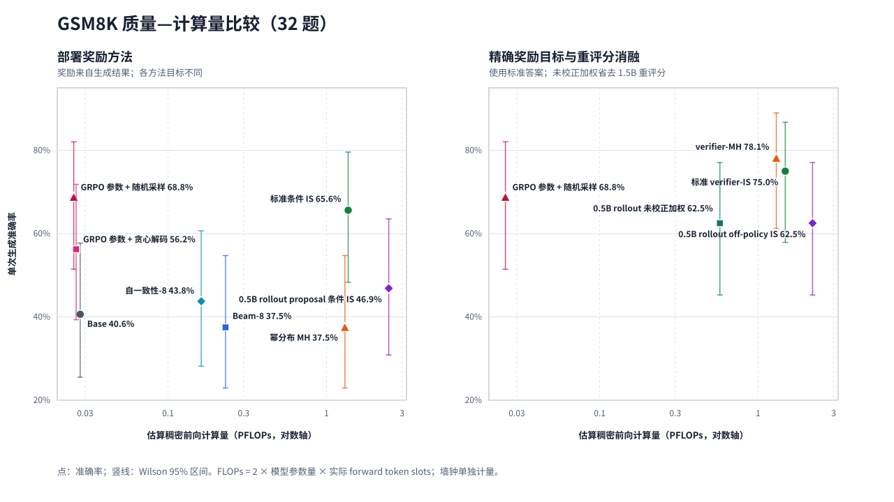
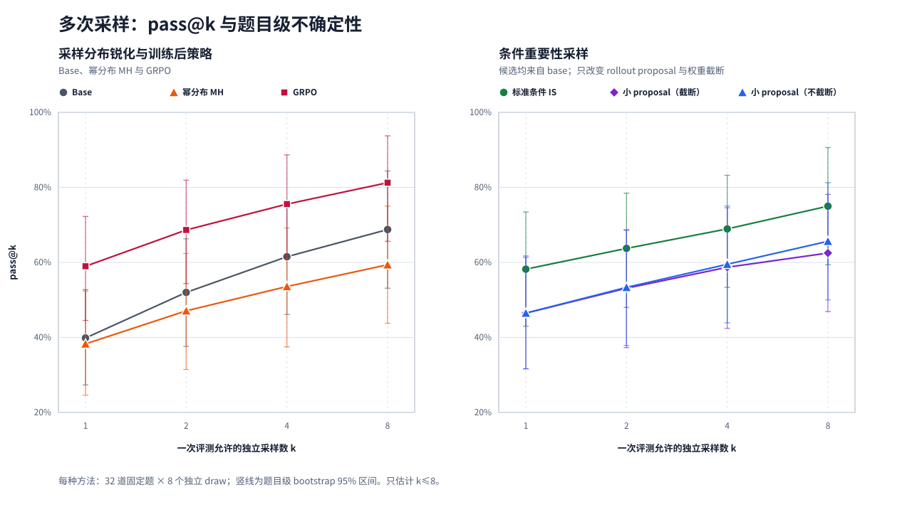
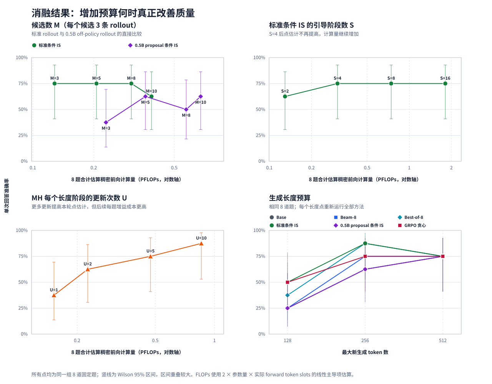

# GSM8K 单卡对齐实验

## 实验设置

### 数据、模型与硬件

- **数据**：GRPO 训练只使用官方 GSM8K train split 的 7,473 条样本；准确率均来自 test split。
  主实验固定 32 道题，消融固定另一组 8 道题，答案分布审计固定 4 道题并为每种方法独立采样 8 次。
- **主模型**：`Qwen/Qwen2.5-1.5B-Instruct`，revision
  `989aa7980e4cf806f80c7fef2b1adb7bc71aa306`。
- **rollout proposal**：`Qwen/Qwen2.5-0.5B-Instruct`，revision
  `7ae557604adf67be50417f59c2c2f167def9a775`。
- **训练对照**：从同一 1.5B checkpoint 出发训练的 GRPO LoRA，共 205 个优化步，每个 prompt
  生成 4 条 completion，奖励为最终数值答案是否正确。
- **硬件与精度**：单张 RTX 3090 24 GiB；主结果使用 FP32，以避免低精度和不同 batch 形状造成的
  概率与重评分偏差。

### 方法、目标与主要比较对象

| 方法 | 目标或决策规则 | 主要比较目的 |
| --- | --- | --- |
| Base | 从 `p_base(y|x)` 采样一次 | 单次生成基线 |
| Beam-8 | 8-beam 确定性搜索 | 搜索基线 |
| Best-of-8 | 8 条独立 Base 回答，以数值答案众数选择 | 并行采样基线 |
| 幂分布 MH | 后缀重采样，目标为 `p_base(y|x)^4` | 检验直接概率锐化 |
| 标准条件 IS | Base 候选与 Base rollout，以累积 self-consistency 选择 | training-free 质量主方法 |
| 小 proposal 条件 IS | Base 候选、0.5B rollout，并乘精确 `p_base/q` 后缀权重 | 检验 off-policy rollout |
| GRPO | 正确性奖励加 KL 正则的训练后策略 | 训练方法对照 |
| verifier-MH / verifier-IS | 统一目标 `p_base × exp(exact_reward/0.04)` | 排除奖励不同造成的混淆 |

主表中的标准 IS、幂分布 MH 与 GRPO 分别优化 self-consistency、基模概率幂和正确性奖励，所以主表只
比较任务质量和成本。共享目标实验直接读取测试集答案，并单独报告准确率与经验答案分布距离。

### 推理预算与公平性约束

| 项目 | 主实验设置 |
| --- | --- |
| 最大新生成长度 | 192 token |
| Base 与采样温度 | temperature 1.0；不使用 top-k/top-p 硬截断 |
| Beam / Best-of-N | 8 beams / 8 samples |
| 条件 IS | `M=8` 个候选，每候选 `K=3` 条 rollout，`S=4` 个引导阶段 |
| 幂分布 MH | `α=4`，16 个递增长度阶段，每阶段 3 次更新，共 48 次后缀更新 |
| 小 proposal 权重 | 后缀 log 重要性比默认截到 `[-10,10]`；另运行非截断对照 |
| pass@k | 每题 8 个独立 draw；不同 draw 不共享候选、rollout 或 replay |

所有主要方法使用相同题目、prompt、最大长度和请求级随机种子。主质量表中的候选均来自 1.5B Base；
小 proposal 只替换 rollout 生成器。动态候选实验在后文单独使用 base/0.5B defensive mixture，并以精确
候选层概率比修正。replay 比较固定候选数和每候选 rollout 总预算。连续批处理只合并物理模型调用，
不改变算法预算。

### 指标与统计

主指标为单次最终回答准确率。多次采样报告标准 pass@k 估计；点估计的不确定性使用 Wilson 区间或
题目级 bootstrap，方法差异使用逐题配对 bootstrap。计算量采用
`2 × 参数量 × 实际 forward token slots` 的稠密矩阵主导项估算，分别计入主模型、proposal、重复
prompt 和重评分。墙钟排除模型与数据加载，并在每题起止处同步 CUDA；它只作为硬件相关补充指标。

## 比较目标

实验围绕四个问题展开：

1. **最终回答质量**：不更新模型参数的幂分布 MH 和条件 IS，能否相对 Base、Beam 与 Best-of-N 提高
   GSM8K 准确率，并达到本地 GRPO 的水平？
2. **目标分布的影响**：幂分布 MH、self-consistency IS 与正确性奖励 GRPO 的目标不同。把 MH、IS
   和 GRPO 统一到 `p_base × exp(reward / beta)` 后，它们能否得到接近的准确率和答案分布？
3. **off-policy 与 rollout 复用**：小 proposal、候选层与 rollout 层重要性权重、历史 replay 以及
   方差—成本分配能否在保持质量的同时减少计算？比较分母始终明确为同候选数和 rollout 预算的
   base-candidate/fresh-only 或前一个增量版本。
4. **推理效率**：候选数、rollout 数、引导阶段、MH 更新次数、生成长度和连续批处理如何改变质量、
   forward token slots、FLOPs 与墙钟？

第一个问题比较实际可用方法的最终任务质量，不要求目标分布相同；第二个问题才用于检验不同算法对同一
显式目标的近似。使用测试集答案的结果统一标记为 oracle，不与可部署方法混合。

## 主结果

| 方法 | 正确数 / 32 | 准确率 | 推理 PFLOPs | 相对 Base FLOPs | 墙钟 |
| --- | ---: | ---: | ---: | ---: | ---: |
| Base | 13 | 40.625% | 0.0279 | 1.00× | 91.1 s |
| Beam-8 | 12 | 37.500% | 0.2306 | 8.27× | 130.6 s |
| Best-of-8 | 14 | 43.750% | 0.1621 | 5.81× | 136.8 s |
| 幂分布 MH | 12 | 37.500% | 1.3077 | 46.88× | 1485.3 s |
| 标准条件 IS | 21 | 65.625% | 1.3706 | 49.13× | 422.1 s |
| 0.5B proposal 条件 IS | 15 | 46.875% | 2.4724 | 88.63× | 422.8 s |
| GRPO 随机采样 | 22 | 68.750% | 0.0254 | 0.91× | 124.9 s |
| GRPO 贪心 | 18 | 56.250% | 0.0263 | 0.94× | 127.2 s |

标准条件 IS 与 GRPO 随机采样相差 -3.125 个百分点，逐题配对 bootstrap 95% 区间为
[-12.500, 6.250]；相对 Base 提高 25 个百分点。两者的奖励不同，因此该结果只说明单次回答质量
接近，不表示它们生成相同分布。标准条件 IS 的推理 FLOPs 是 GRPO 随机采样的约 54 倍；在已经完成
训练的场景下，GRPO 推理明显更便宜。

0.5B proposal 条件 IS 比标准版本低 18.75 个百分点，区间为 [-34.375, -6.250]，同时使用标准版本
`1.804×` 的 FLOPs 和 `1.002×` 的墙钟。当前实现仍需由 1.5B 模型精确重评分 off-policy rollout，
因此小 proposal 没有带来相对标准条件 IS 的计算或墙钟加速。

幂分布 MH 的目标是 `p_base(y|x)^4`，而不是正确性奖励目标。它在本轮得到 12/32，说明概率锐化
本身没有提高 GSM8K 正确率；该结果不能直接用于判断共享奖励目标下的 MH。

## 多次采样

每种方法在相同 32 道题上独立采样 8 次，共生成 256 条回答。不同 draw 不共享候选、rollout 或
replay 数据；连续批处理只改变物理执行方式。

| 方法 | pass@1 | pass@2 | pass@4 | pass@8 | 8 draw 推理 PFLOPs |
| --- | ---: | ---: | ---: | ---: | ---: |
| Base | 39.844% | 52.009% | 61.518% | 68.750% | 0.1613 |
| 幂分布 MH | 38.281% | 47.098% | 53.571% | 59.375% | 13.2872 |
| GRPO 随机采样 | 58.984% | 68.638% | 75.536% | 81.250% | 0.1516 |
| 标准条件 IS | 58.203% | 63.728% | 68.929% | 75.000% | 11.0284 |
| 小 proposal IS（截断） | 46.484% | 53.125% | 58.705% | 62.500% | 19.4781 |
| 小 proposal IS（非截断） | 46.484% | 53.348% | 59.509% | 65.625% | 19.2690 |

标准条件 IS 相对 GRPO 的 pass@1 差异为 -0.781 个百分点，区间为 [-6.250, 4.297]；pass@8 差异
为 -6.250 个百分点，区间为 [-15.625, 0]。因此标准 IS 的单次成功率与 GRPO 接近，但 GRPO 在较大
采样预算下保持更高的覆盖率。两个小 proposal 版本的 pass@1 均比标准 IS 低 11.719 个百分点；去掉
截断只把 pass@8 从 62.500% 提高到 65.625%，没有消除 proposal 与 base 重叠不足造成的有限样本
方差。

幂分布 MH 相对 Base 没有提高 pass@1，并把每题不同数值答案从 4.56 降到 3.25。其主要效果是压缩
多样性，而不是提高当前任务的成功率。

## 共享奖励目标

为区分“算法差异”和“奖励差异”，受控实验统一使用

`p_target(y|x) ∝ p_base(y|x) × exp(exact_reward(y) / 0.04)`。

精确奖励读取测试集答案，因此这些结果只用于算法诊断，不能作为可部署方法。verifier-MH 的状态和
候选都是完整序列；每次保留前缀后，proposal 后缀仍生成到 EOS，再计算终局奖励和接受率。

| 方法 | 正确数 / 32 | 准确率 | 推理 PFLOPs | 墙钟 |
| --- | ---: | ---: | ---: | ---: |
| verifier-MH | 25 | 78.125% | 1.3028 | 2319.7 s |
| 标准 verifier-IS | 24 | 75.000% | 1.4839 | 439.7 s |
| 0.5B proposal verifier-IS | 20 | 62.500% | 2.2077 | 374.5 s |
| GRPO 随机采样 | 22 | 68.750% | 0.0254 | 124.9 s |

verifier-MH 与标准 verifier-IS 相差 3.125 个百分点，区间为 [-9.375, 15.625]；二者与 GRPO 的
差异分别为 +9.375 和 +6.250 个百分点。在相同奖励目标下，直接采样方法能够达到与本地 GRPO 相近
或更高的点估计，但 32 题不足以证明完整序列分布一致。小 proposal verifier-IS 比标准版本低
12.5 个百分点；它相对标准版本有 `1.174×` 墙钟吞吐提升，却使用 `1.488×` FLOPs，且质量更低，
因此不能称为相同效果下的加速。

在 4 道固定题、每题 8 次采样的答案分布审计中，相对 GRPO 的结果为：

| 方法 | 平均 TV | 平均 JS（bit） |
| --- | ---: | ---: |
| Base | 0.4375 | 0.3267 |
| verifier-MH | 0.2500 | 0.1423 |
| 标准 verifier-IS | 0.2500 | 0.1423 |
| 0.5B proposal verifier-IS | 0.2500 | 0.1423 |

三种直接采样方法的答案级距离点估计均小于 Base，但其 TV bootstrap 区间上界为 0.4063，样本规模
不足以支持稳定的分布等价结论。

## 计算量、回放与批处理

GRPO 的一次训练成本为 15.646 PFLOPs、5,007,660 个前向等价 token slots 和 9,545.2 秒。把训练
成本与后续推理相加，得到下列原始 FLOPs 交点：

| training-free 方法 | 每题推理 TFLOPs | 与“训练 + GRPO 推理”的 FLOPs 交点 |
| --- | ---: | ---: |
| verifier-MH | 40.713 | 392 次查询 |
| 标准 verifier-IS | 46.372 | 344 次查询 |
| 0.5B proposal verifier-IS | 68.991 | 230 次查询 |

三种方法与 GRPO 的准确率绝对差都超过预设的 5 个百分点阈值，因此这些数字只是累计计算量交点，
不是“达到相同效果”的查询数。在交点之前，免训练方案累计使用的估算 FLOPs 更少；超过交点后，GRPO
的一次训练成本被更多查询摊薄。

rollout replay 固定 8 个 base 候选和每候选 3 条 rollout。warm 路径最多使用 2 条已评分历史 rollout，
并始终保留 1 条 fresh base rollout：

| 路径 | 正确数 / 32 | 推理 PFLOPs | 墙钟 |
| --- | ---: | ---: | ---: |
| fresh-only | 23 | 1.3483 | 422.5 s |
| warm replay 在线阶段 | 22 | 1.0326 | 362.9 s |
| 缓存构建 + 首次 warm 查询 | 22 | 3.1563 | 763.4 s |

以 fresh-only 为分母，缓存已存在时 replay 减少 23.4% FLOPs 和 14.1% 墙钟，准确率差为 -3.125 个
百分点，区间为 [-12.500, 6.250]。首次查询包含缓存构建，成本反而更高；在本轮相同 replay-key
覆盖率下，缓存从第 7 次重复查询开始同时在 FLOPs 和墙钟上回本。

### 动态候选与方差—成本分配

这组实验单独检验两个增量机制，不与前面的可部署 self-consistency 主表混合。它在同一组 32 道题上
直接用 GSM8K 正确答案评价 rollout，因此是 oracle 算法诊断。主模型与 proposal 的采样温度均为 1.0；
奖励温度为 0.1，历史权重截断阈值为 8.0。三组都使用 8 个候选、48-token block、最长 192 token 和
每个非终止候选 3 条估计用 rollout：

1. `base_candidate_fixed` 只从 1.5B base 抽候选，不建缓存，每个候选使用 3 条 fresh rollout；
2. `replay_aware_fixed` 从 `0.5 × base + 0.5 × 0.5B proposal` 抽候选，乘精确外层 `p_base/q`，
   并为辅助候选预先保存 2 条 evaluation rollout；库存允许时使用 2 条历史加 1 条 fresh；
3. `replay_aware_optimal` 保持相同 defensive proposal 和缓存规则，在读取 evaluation 值以前，另为每个
   候选生成 2 条 base design rollout，并为命中候选生成 2 条 proposal design rollout，再按估计方差
   与单样本成本分配固定版本在相同候选元数据上对应的代理成本预算。

重复候选共享同一个一次性 evaluation 库存；库存不足的槽由 fresh 补齐，所以固定组始终保持每个
非终止候选恰好 3 条 rollout，历史记录不会重复消费。预算代理把历史重评分记为 1，把 fresh 生成加
0.5B 重评分记为 1.3200；最终成本仍按实际 forward token slots 与各模型参数量计算。

| 方法 | 正确数 / 32 | 辅助候选占比 | 候选 key 命中率 | 历史 / fresh | 实际 rollout 复用率 | 平均外层 ESS | 平均最终 ESS |
| --- | ---: | ---: | ---: | ---: | ---: | ---: | ---: |
| base 候选 + 固定 fresh | 23 | 0% | 0% | 0 / 2,145 | 0% | 8.000 | 6.323 |
| 动态候选 + 固定 replay | 21 | 51.282% | 52.983% | 738 / 1,374 | 34.943% | 4.365 | 3.424 |
| 动态候选 + 方差—成本分配 | 23 | 51.282% | 52.443% | 109 / 1,801 | 5.707% | 4.382 | 3.315 |

动态固定组相对 base 固定组的准确率差为 -6.25 个百分点，逐题配对 bootstrap 95% 区间为
[-21.875, 9.375]；它逐题赢 2、输 4、平 26。方差—成本版本相对动态固定组为 +6.25 个百分点，
区间为 [-6.250, 18.750]；逐题赢 3、输 1、平 28。两个区间都跨 0，因而 32 题只支持“没有检测到
稳定质量差异”，不支持质量不变或完整版本更优。完整版本与 base 固定组的点估计同为 23/32。

| 方法 | 稳态 forward slots | 稳态 PFLOPs | 稳态墙钟 | cache PFLOPs | design PFLOPs | 一次性总 PFLOPs | 一次性总墙钟 |
| --- | ---: | ---: | ---: | ---: | ---: | ---: | ---: |
| base 候选 + 固定 fresh | 679,287 | 2.0973 | 705.7 s | 0 | 0 | 2.0973 | 705.7 s |
| 动态候选 + 固定 replay | 765,160 | 1.9312 | 704.0 s | 2.9452 | 0 | 4.8764 | 1,401.5 s |
| 动态候选 + 方差—成本分配 | 873,220 | 2.3172 | 706.6 s | 2.9255 | 2.0525 | 7.2951 | 2,186.2 s |

这里的“稳态”只排除已经完成的 cache/design 构建，并不把离线计算声明为免费。以 base 固定组为分子、
动态固定组为分母，稳态 FLOPs 因子为 `1.086×`，即动态固定组少 7.9% FLOPs；它处理的 token slots
反而多 12.6%，因为一部分工作转移到 0.5B 模型。稳态墙钟因子仅为 `1.002×`，只快 0.2%，不能视为
实质硬件加速。
把 cache 构建计入第一次完整执行后，动态固定组使用 base 固定组 `2.325×` 的 FLOPs。evaluation
记录又是一次性的，因此稳态数字只能解释为缓存由独立异步资源提前生产时的在线关键路径收益，不能
解释为端到端总计算加速。

以动态固定组为分子、方差—成本组为分母，稳态 FLOPs 因子为 `0.833×`；小于 1 表示完整版本反而使用
`1.200×` FLOPs。计入 cache 和 design 后，一次性总 FLOPs 是固定组的 `1.496×`。分配器只使用 109 条
历史记录，缓存利用率为 7.864%，远低于固定组的 738 条和 52.865%；平均最终 ESS 还低 0.109。当前
2 条/来源的 design 设置没有显示出方差或效率收益，其主要行为是拒绝大多数低价值 replay，而不是把
缓存命中自动转化为加速。

最终连续批处理实现用 8 个 prompt worker 共享一张 RTX 3090，并保持一次算法调用中的重复前缀组：

| 方法 | 同步墙钟 | 连续批处理墙钟 | 同步 / 连续批处理 | 连续批处理 / 同步 FLOPs | 数值答案一致 |
| --- | ---: | ---: | ---: | ---: | ---: |
| Base | 95.4 s | 19.7 s | 4.845× | 1.177× | 32/32 |
| Best-of-8 | 136.9 s | 67.9 s | 2.016× | 1.021× | 30/32 |
| 标准条件 IS | 427.1 s | 370.0 s | 1.154× | 1.008× | 32/32 |
| 0.5B proposal 条件 IS | 419.5 s | 399.5 s | 1.050× | 1.003× | 32/32 |

墙钟加速的分母是相同方法的连续批处理路径，FLOPs 比值则以同步路径为分母。Base 与小 proposal IS
的 token 输出均为 32/32 完全一致；Best-of-8 和标准 IS 存在少量 token 分叉，因此对应墙钟比按
相同配置的 workload 吞吐解释。连续批处理主要提高硬件利用率，不等同于减少算法计算量。

## 关键消融

所有消融点使用同一组 8 道题；每题只贡献 0 或 1，因此准确率的最小变化为 12.5%。图中误差线为
Wilson 95% 区间。

| 维度 | 设置与正确数 | 8 题合计 PFLOPs | 结论 |
| --- | --- | --- | --- |
| 标准 IS 候选数 `M`，`K=3` | `3/5/8/10 → 6/6/6/5` | `0.1281/0.2064/0.3068/0.3861` | `M=3` 已在本轮达到最高点估计 |
| 小 proposal IS 候选数 `M` | `3/5/8/10 → 3/5/4/5` | `0.2299/0.3602/0.5730/0.6755` | 未进入观测到的质量—FLOPs 前沿 |
| 标准 IS rollout 数 `K`，`M=10` | `1/3/5 → 5/5/6` | `0.2319/0.3861/0.6063` | `K=5` 多答对一题，但成本明显增加 |
| 引导阶段数 `S` | `2/4/8/16 → 5/6/6/6` | `0.1293/0.3068/0.7426/1.8104` | `S=4` 后点估计不再提高 |
| MH 幂次 `α` | `1/2/4/8 → 3/4/6/3` | `0.2895/0.3067/0.3108/0.3148` | `α=4` 只在当前小样本上最好 |
| MH 每阶段更新数 `U` | `1/2/5/10 → 3/5/6/7` | `0.1526/0.2266/0.4726/0.8569` | 更多更新改善有限链结果，但边际成本上升 |
| 小 proposal 权重 | `截断/非截断 → 4/5` | `0.5730/0.5253` | 单次消融差一题；32×8 网格的 pass@1 相同 |
| 最大生成长度 | 标准 IS：`128/256/512 → 4/7/6` | `0.2669/0.3151/0.2381` | 256 token 最适合当前模型与题目 |

在奖励消融中，标准 IS 的 self-consistency 得到 6/8；平均 token 对数概率、平均负熵和自确定性分别
得到 4/8、5/8、5/8，却各使用约 0.9 PFLOPs，明显高于 self-consistency 的 0.3068 PFLOPs。使用
测试集答案的 oracle 为 Best-of-8 和标准 IS 得到 8/8，说明候选池经常已经包含正确答案，主要瓶颈是
可部署的选择信号。sampling temperature 为 0.7、1.0、1.5 时，标准 IS 分别得到 4/8、6/8、1/8；
该模型在 1.5 下更容易生成无法解析或未完成的回答。

## 结论与适用范围

1. 标准条件 IS 在单次回答上达到与本地 GRPO 接近的准确率，并显著高于 Base，但推理计算量远高于
   已训练策略；它适合避免训练或查询量较少的场景，不适合直接替代高频部署中的 GRPO 推理。
2. 当前 0.5B off-policy proposal 没有相对标准 IS 提升质量或降低 FLOPs；精确主模型重评分与有限
   样本重要性权重方差抵消了小模型生成的收益。
3. 固定 replay 在缓存命中时能够减少在线 FLOPs，连续批处理能够提升墙钟吞吐；二者分别优化数据
   复用和硬件利用率，不能混为同一种加速。动态候选固定组相对 base 固定组只得到 `1.086×` 稳态
   FLOPs 因子，计入一次性建库后则更贵。
4. 当前方差—成本分配只复用了 5.7% 的估计用 rollout；它没有提高 ESS，稳态 FLOPs 还是固定分配
   的 `1.200×`，因此本轮不构成加速证据。
5. 幂分布 MH 只实现概率锐化，没有提高本轮正确率；在共享奖励目标的 oracle 诊断中，MH 与标准 IS
   能达到相近质量，但都需要对完整候选计算终局奖励。

这些结论来自 32 道固定题和单张 RTX 3090，不能替代完整 1,319 题评测。FLOPs 估算不包含二次
attention、逐元素 kernel、tokenization 和主机调度；墙钟用于补充反映这些实现成本。正式机器可读
结果保存在 `results/gsm8k_3090/gsm8k_3090_aligned_*_validated.json`，图表均由相应汇总 JSON
确定性生成。各文件用途见 [`results/README.md`](../../results/README.md)。
