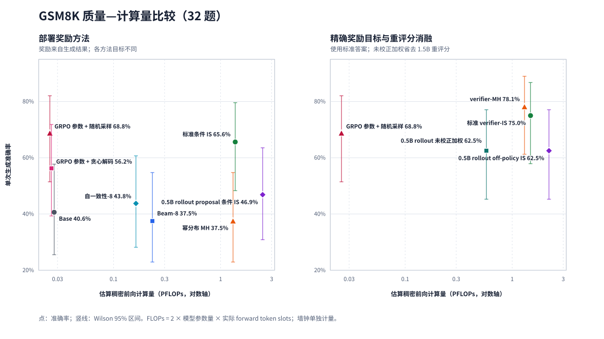
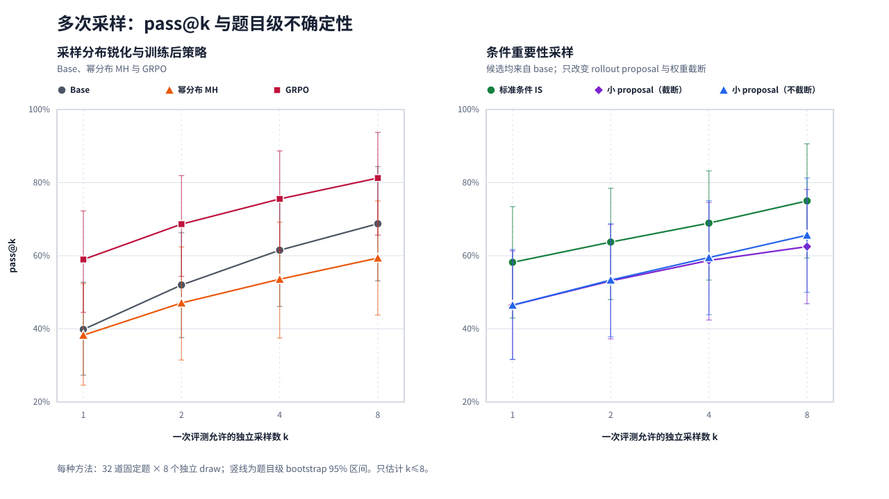
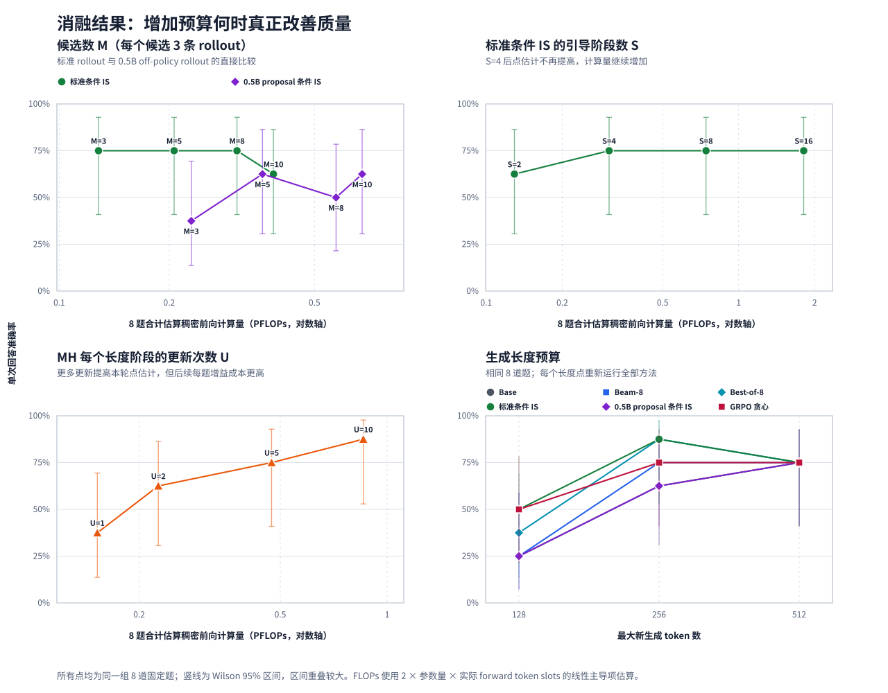

# 算法设计与准确率：Qwen2.5-1.5B / GSM8K

本报告比较采样方法、奖励信号、rollout 来源和 MH 更新策略对任务准确率的影响；执行成本见
[执行成本报告](RTX3090_ROLLOUT_INFRA.md)，方法见[算法文档](../methods/ALGORITHMS.md)。结论来自统一入口之前的
实验，数字按当时的实现测得。标注“旧方法”的方法已从代码中删除，这里只保留其说明与结论；其余方法的复现命令对应
当前实现（第 6 节）。

| 项目 | 设置 |
| --- | --- |
| 数据 | 官方 GSM8K test 中固定抽取 32 题，子集种子 20260808；GRPO 使用独立的 train 数据 |
| 模型 | Qwen2.5-1.5B-Instruct；旧方法的辅助补全模型为 Qwen2.5-0.5B-Instruct |
| 硬件与后端 | 单张 RTX 3090 24 GiB，Transformers，FP32 |
| 生成 | 最长 192 token，采样温度 1；Beam 与多数投票均为 8 路 |
| 条件 IS | 每步 8 个候选，每候选 3 条 rollout，块长 48，奖励温度 0.1 |
| 幂目标 MH | 目标为基础序列概率的四次幂；块长 12，每阶段 3 次更新，均匀选择后缀起点 |
| GRPO | 同一 1.5B 模型的 LoRA，秩 16；累计 205 步，每提示 4 条 rollout，KL 系数 0.04 |
| 统计 | 单次评测为每题生成一次；多次采样为每题独立运行 8 次；差值区间为题目级配对自助法 95% 区间 |

## 1. 采样选择不读取测试答案

多数投票按完整生成的数值答案选众数。条件 IS 当时用已评估补全中的累计数值众数构造自一致性奖励，再为下一生成块的
候选加权。GRPO 用训练集正确性奖励更新参数，推理时直接采样或逐 token 取最大概率项。

图 1：每点对应 32 题的一次评测，竖线为 Wilson 95% 区间；横轴为本次推理的总 PFLOPs（对数刻度）。左侧方法在采样
选择时不读取测试答案，右侧读取（第 2 节）。GRPO 只计训练后的推理成本，训练成本见
[执行成本报告](RTX3090_ROLLOUT_INFRA.md#infra-report-training)。

- **条件 IS 的单次准确率接近 GRPO，推理计算量高得多。** 条件 IS 为 65.6%（21/32），比基础采样高 25 个百分点；
  GRPO 训练后随机采样为 68.8%，差值区间为 [−12.5, 6.25] 个百分点。条件 IS 的推理 FLOPs 约为 GRPO 采样的 54 倍。
- **多数投票与 Beam 的收益有限。** 多数投票-8 为 43.8%，Beam-8 为 37.5%，基础采样为 40.6%；GRPO 贪心解码为 56.2%。
- **幂目标 MH 的计算增加没有带来本组准确率提升**，为 37.5%。
- **旧方法：0.5B 补全条件 IS。** 1.5B 生成候选、0.5B 生成补全，再由 1.5B 评分补全并按概率比修正。准确率为 46.9%，
  比 1.5B 补全低 18.75 个百分点（区间 [−34.4, −6.25]）。

### 多次独立采样

图 2：pass@k 为每题独立运行 k 次时至少一次正确的概率，竖线为题目级自助法 95% 区间。左侧比较基础模型、幂目标 MH
与训练后策略；右侧比较条件 IS 的补全模型与概率比截断。

- **条件 IS 的单次成功率接近 GRPO，GRPO 的覆盖更好。** pass@1 为 58.2% 对 59.0%（差值区间 [−6.25, 4.30]），
  pass@8 为 75.0% 对 81.3%（差值区间 [−15.63, 0]）。
- **幂目标 MH 主要降低多样性。** pass@1 为 38.3%（基础采样 39.8%），每题不同数值答案数从 4.56 降至 3.25。
- **旧方法：0.5B 补全的概率比修正。** “截断修正”把 rollout 的对数概率比截断到 ±10，
  “无截断修正”保留完整比值，“仅按奖励加权”省略该比值。三者的 pass@1 为 46.5%、46.5%、45.3%；省略修正相对截断
  版本差 −1.17 个百分点（区间 [−3.91, 1.17]），计算量明显下降，但改变了条件目标；三者比 1.5B 补全低 11.7 至
  12.9 个百分点。

## 2. 固定正确性奖励的诊断

本组以数值答案是否正确作为 0/1 奖励，奖励温度 0.04。MH 与条件 IS 面向“基础概率 × 指数奖励”的序列目标；GRPO
使用相同奖励定义和 KL 系数训练。这些方法在采样选择时读取测试答案，GRPO 只在训练阶段读取训练答案。

- **正确性奖励下 MH 与条件 IS 的准确率高于 GRPO。** MH 为 78.1%，条件 IS 为 75.0%，GRPO 随机采样为 68.8%；MH 与
  IS 相差 3.13 个百分点（区间 [−9.38, 15.63]）。它们读取测试答案，只作为上限诊断。
- **旧方法：0.5B 补全。** 带修正的版本与仅按奖励加权的版本均为 62.5%
  （成对差值区间 [−9.38, 9.38]），26/32 题数值答案相同；省略重评分的版本计算量明显更低（图 1 右侧左移），条件
  目标也随之改变。
- **答案分布更接近 GRPO。** 4 题各 8 次采样中，相对 GRPO 的平均总变差距离：基础采样 0.44，正确性奖励的 MH、条件 IS
  与带修正的 0.5B 条件 IS 均为 0.25；样本很少，只是初步估计。

## 3. 旧方法：历史 rollout 与动态候选

本组同样使用正确性奖励（温度 0.1），8 个候选、48 token 块、192 token 上限。固定 replay 每候选最多读取 2 条历史
rollout 加 1 条新 rollout；动态候选等比例使用基础模型与 0.5B proposal，并以外层 IS 修正候选来源；方差—成本分配
先用每来源 2 条独立设计样本确定最终配额。

- **三组成对比较的差值区间都覆盖 0。** 已有历史的 replay 对纯新生成为 −3.13 个百分点，动态候选对基础候选为
  −6.25，方差—成本分配对固定 replay 为 +6.25。
- **分配没有形成质量优势。** 方差—成本组与基础候选组同为 23/32，最终权重有效样本量均值 3.32，略低于动态固定组的
  3.42。采用与否应看单独测量的成本（[成本分解](RTX3090_ROLLOUT_INFRA.md#infra-report-dynamic)）。

## 4. 计算预算与 MH 后缀调度

以下预算对照使用同一组 8 道题；IS 使用自一致性奖励，MH 使用幂指数 4。候选数、引导阶段数与 MH 更新次数三组的
上限为 192 token，长度组另取 128、256、512 token。

图 3：前三个面板的横轴为 8 题合计 PFLOPs，标注对应预算参数；右下横轴为生成长度上限，纵轴均为准确率，竖线为
Wilson 95% 区间。

- 候选数：条件 IS 在 3、5、8 个候选时均为 6/8，10 个候选为 5/8，收益随预算增加出现波动。
- 引导阶段：每条序列的 IS 候选选择从 4 次增至 16 次，正确数保持 6/8，计算量从 0.31 增至 1.81 PFLOPs。
- MH 更新：每阶段更新从 1 次增至 10 次，正确数从 3/8 增至 7/8，较大更新预算改善了本组点估计。
- 生成长度：条件 IS 在 128、256、512 token 下分别为 4/8、7/8、6/8。
- 这些小样本结果只说明预算敏感性，区间较宽，不能据此确定最优参数。

**后缀长度分布。** 32 题、4 次重复、最长 128 token、块长 16、每阶段 2 次更新、幂指数 4，只改变后缀长度分布：均匀
策略为 12.5%，长度倒数为 13.3%，多尺度为 18.0%（相对均匀 +5.47 个百分点，区间 [−2.34, 14.84]）。多尺度的点估计
较高而区间覆盖 0，更明确的收益是生成 token 与墙钟下降（[MH 成本对照](RTX3090_ROLLOUT_INFRA.md#infra-report-mh)）。

**奖励选择。** 8 题筛选中，自一致性、token 平均对数概率以及两种旧奖励（平均负熵、自确定度）分别得到 6、4、5、5 题
正确，支持在该设置中使用自一致性。

## 5. 总结

在该 1.5B 模型和固定题目上，条件 IS 的单次成功率接近 GRPO，幂目标 MH 主要降低多样性；使用正确性奖励后，MH 与
IS 的准确率点估计更高。rollout 复用、动态候选和预算分配的质量差值区间较宽，采用依据应结合单独测量的成本。结论
范围限于上述模型、题目和预算。

## 6. 复现

本报告的模型、引擎与长度不是当前默认值，先改回：`ar.model.path = "Qwen/Qwen2.5-1.5B-Instruct"`、
`revision = "989aa7980e4cf806f80c7fef2b1adb7bc71aa306"`；`ar.engine.backend = "transformers"`、`dtype = "float32"`；
`ar.prompt.chat_template_kwargs = {}`、`ar.output.thinking_mode = "auto"`、`sampling_scope = "full"`；
`datasets.gsm8k.max_new_tokens = 192`；`mh` 与 `mh_power` 的 `block_size = 12`；
`ar.algorithms.is.fixed = {"candidate_count": 8, "rollout_count": 3, "block_size": 48}`。其余（32 题、温度 1、Beam 8 路、
Best-of-N 8 个样本、`mh_power` 的 α=4、每阶段 3 次更新、均匀后缀）与默认相同。自一致性奖励设
`rewards.verifier.source = "vote"`，正确性奖励保持 `"dataset"`。旧方法没有对应命令。

| 方法 | 命令 | 设置改动 |
| --- | --- | --- |
| 基础采样 | `python -m inference_scaling --algorithm sample` | — |
| Beam-8 | `python -m inference_scaling --algorithm beam` | — |
| 多数投票-8 | `python -m inference_scaling --algorithm best_of_n --reward verifier` | `rewards.verifier.source = "vote"` |
| 幂目标 MH | `python -m inference_scaling --algorithm mh_power` | — |
| 条件 IS，自一致性奖励 | `python -m inference_scaling --algorithm is --reward verifier` | `rewards.verifier.source = "vote"`，`ar.algorithms.is.planning = "fixed"` |
| 正确性奖励的 MH 与条件 IS | `--algorithm mh --reward verifier`、`--algorithm is --reward verifier` | `rewards.verifier.temperature = 0.04`；IS 设 `planning = "fixed"` |
| GRPO | `python -m training`，再用 `--algorithm sample`、`--algorithm greedy` 评测 | 训练时 `stages = ["grpo"]`；评测时 `ar.model.adapter` 指向 `grpo.output` |
| pass@k | 同上各命令 | `run.draws = 8` |
| 预算消融 | `--algorithm is --reward verifier`、`--algorithm mh_power` | `datasets.gsm8k.selection.count = 8`，IS 设 `source = "vote"`；`fixed.candidate_count`、`fixed.block_size`、`steps_per_block`、`datasets.gsm8k.max_new_tokens` |
| 后缀长度分布 | `--algorithm mh_power` | `suffix_schedule`；`max_new_tokens = 128`、`block_size = 16`、`steps_per_block = 2`、`run.draws = 4` |
| 奖励选择 | `--algorithm is --reward verifier`、`--reward self_certainty` | `selection.count = 8`，`planning = "fixed"`；verifier 设 `source = "vote"`。当时的自确定度还在每批候选内做 min-max 归一化，当前是逐序列的原始定义；平均对数概率与平均负熵已删除 |

与当时实现的差异：自一致性奖励现在与冻结的 `pool_size` 个独立样本比较，当时为已评估补全的累计众数。
