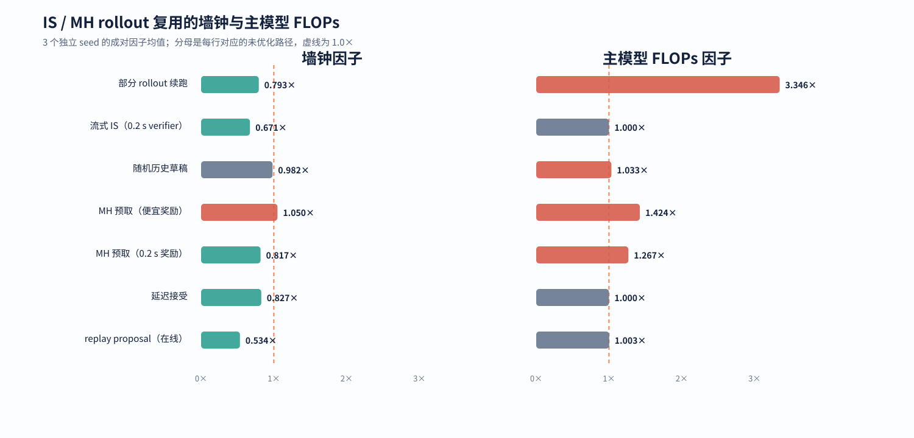
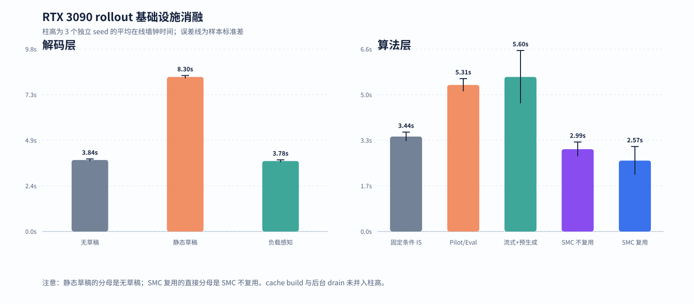

# RTX 3090 推理执行与 rollout 复用实验

本报告分析重要性采样、Metropolis–Hastings 采样及其 rollout 复用方法的执行效率。主要指标包括墙钟时间、
主模型浮点运算量、历史样本复用率和缓存摊销成本。准确率、pass@k 和共享奖励目标的比较见
[GSM8K 方法效果与准确率](GSM8K_3090_ALIGNED_RESULTS.md)。单题实验用于隔离基础设施变量，方法质量排序
以完整 GSM8K 实验为准。

## 术语与计量对象

| 术语 | 全称 | 本报告中的含义 |
| --- | --- | --- |
| LLM | Large Language Model，大语言模型 | 自回归生成 token 序列的主模型或辅助模型 |
| rollout | — | 从给定前缀生成至终止符或长度上限的一条完整轨迹；记录 token、生成概率和奖励 |
| base model | 基模型 | 定义目标生成分布并承担最终概率计算的 LLM |
| proposal | 提议分布或提议样本 | 为 IS 提供候选，或为 MH 提供状态转移候选的分布及其样本 |
| verifier | 验证器 | 根据完整生成序列计算奖励、约束或正确性信号的函数或模型 |
| IS | Importance Sampling，重要性采样 | 用目标概率与行为概率之比修正非同分布样本的蒙特卡洛方法 |
| MH | Metropolis–Hastings | 通过提议与接受步骤构造目标分布不变的马尔可夫链蒙特卡洛方法 |
| MCMC | Markov Chain Monte Carlo，马尔可夫链蒙特卡洛 | 以马尔可夫链产生目标分布样本的一类方法；MH 属于该类 |
| SMC | Sequential Monte Carlo，序贯蒙特卡洛 | 粒子按序列位置传播、加权和重采样的蒙特卡洛方法 |
| replay | 经验回放 | 保存并再次使用历史 rollout；统计估计使用其真实行为概率 |
| fresh / warm | 实时生成 / 已建库复用 | fresh rollout 在线生成；warm replay 读取已构建历史库 |
| frozen design | 固定实验设计 | 读取 rollout 数值前固定样本编号、归属和数量 |
| pilot / evaluation | 先导样本 / 正式评估样本 | pilot 仅估计方差与成本；独立 evaluation 进入最终估计量 |
| surrogate | 代理评分 | 计算成本低于精确 verifier 的近似奖励或近似目标 |
| prefill | 前缀计算 | 对 prompt 或已有前缀做一次并行前向计算并建立注意力缓存 |
| decode | 自回归解码 | 基于缓存逐步生成后续 token |
| KV cache | Key–Value cache，键值缓存 | Transformer 注意力层保存的历史 key/value 状态 |
| APC | Automatic Prefix Caching，自动前缀缓存 | vLLM 对重复前缀 KV 状态的自动复用机制 |
| ESS | Effective Sample Size，有效样本量 | 由归一化重要性权重衡量样本权重集中程度的指标 |
| pass@k | pass at k | 独立采样 `k` 次时至少一次成功的概率 |
| FLOPs | Floating-Point Operations，浮点运算次数 | 本报告估计主模型计算量的统一单位 |
| PFLOPs | Peta Floating-Point Operations，千万亿次浮点运算 | `1 PFLOP = 10^15 FLOPs` |
| GRPO | Group Relative Policy Optimization，组相对策略优化 | GSM8K 主实验采用的训练式强化学习基线 |
| SAO | Single-Rollout Asynchronous Optimization，单 rollout 异步优化 | 将单条 rollout 的生成和消费解耦的强化学习方法 |
| IMPALA | Importance Weighted Actor-Learner Architecture | 以重要性加权修正异步数据生成端与参数更新端策略差异的方法 |
| BF16 / FP32 | bfloat16 / 32-bit floating point | 模型执行采用的 16 位和 32 位浮点格式 |

## 推理执行阶段

一次条件推理包含请求调度、主模型计算、奖励计算和采样决策四个阶段：

```text
请求队列 ──> 主模型 prefill / decode ──> verifier 或奖励 ──> IS 权重或 MH 接受判断
   ↑                   ↑                         │
   │                   │                         │
历史 rollout ──> 统计复用 / 草稿 / proposal <────┘
```

基础设施优化分别作用于 GPU 批量利用率、重复前缀计算、串行解码轮次、verifier 关键路径和历史样本生成量。
各机制的成本对象存在差异，因此实验同时列出墙钟时间、主模型 FLOPs、缓存构建时间和后台排空时间。

## 优化机制与文献依据

下表中的文献对应母方法或设计原则。本仓库在这些方法上增加了冻结 evaluation 设计、跨后端 rollout
broker、历史后缀提议和条件后缀库存等实现；具体变体由本报告的成对消融验证。

| 方法 | 本仓库实现 | 效率来源 | 成本边界 | 文献依据 |
| --- | --- | --- | --- | --- |
| 连续批处理 | 汇合不同 prompt 在相近时刻提交的生成与评分请求 | 增大有效 batch，提高 GPU 利用率 | 逻辑 token 数和算法 FLOPs 通常保持不变 | [Orca：迭代级调度，Yu et al., 2022](https://www.usenix.org/conference/osdi22/presentation/yu) |
| 重复前缀 KV 复用 | 相同候选前缀只执行一次 prefill，并复制或共享 KV 状态 | 消除 rollout 之间的重复前缀计算 | 各 completion 的后续 decode 仍独立执行 | [PagedAttention，Kwon et al., 2023](https://doi.org/10.1145/3600006.3613165)；[RadixAttention，Zheng et al., 2024](https://proceedings.neurips.cc/paper_files/paper/2024/file/724be4472168f31ba1c9ac630f15dec8-Paper-Conference.pdf) |
| warm rollout replay | 读取历史 completion、奖励和真实行为概率，并补充固定数量的 fresh rollout | 历史样本替代在线生成与评分 | 冷启动阶段包含历史库构建成本 | [经验回放，Lin, 1992](https://doi.org/10.1007/BF00992699)；[off-policy IS，Precup et al., 2000](https://web.eecs.umich.edu/~baveja/Papers/OffPolicy.pdf) |
| 部分 rollout broker | 保存未完成请求的 token、行为概率和剩余预算，并从保存前缀继续执行 | 保留过量提交批次中已经完成的 decode 工作 | token 级恢复仍产生前缀 prefill；KV 句柄恢复可进一步消除该项 | [Orca 的细粒度调度，Yu et al., 2022](https://www.usenix.org/conference/osdi22/presentation/yu)；[SAO 的单 rollout 异步处理，Hou et al., 2026](https://arxiv.org/abs/2607.07508) |
| 历史 token tree | 从历史序列构造多 token 草稿，由主模型并行验证 | 草稿命中时减少串行 decode 轮次 | 被拒绝的草稿仍占用主模型验证 slots | [Speculative Decoding，Leviathan et al., 2023](https://proceedings.mlr.press/v202/leviathan23a.html)；[Retrieval-Based Speculative Decoding（REST），He et al., 2024](https://aclanthology.org/2024.naacl-long.88/)；[SpecInfer，Miao et al., 2024](https://doi.org/10.1145/3620666.3651335) |
| active-batch 草稿门控 | 密集 batch 使用普通解码，稀疏长尾启用历史草稿 | 保留批量解码效率并限制低接受率草稿的验证成本 | 该门控属于本仓库的负载调度策略 | [Speculative Decoding，Leviathan et al., 2023](https://proceedings.mlr.press/v202/leviathan23a.html)；[Orca，Yu et al., 2022](https://www.usenix.org/conference/osdi22/presentation/yu) |
| 流式 frozen-design IS | 生成前冻结 request id；rollout 完成后立即提交 verifier 和 IS 累积器 | 将有限 worker 的 verifier 队列与后续 GPU decode 重叠 | 便宜 verifier 和最长请求主导的 workload 提供较少重叠空间 | [off-policy IS，Precup et al., 2000](https://web.eecs.umich.edu/~baveja/Papers/OffPolicy.pdf)；[IMPALA，Espeholt et al., 2018](https://proceedings.mlr.press/v80/espeholt18a.html)；[SAO，Hou et al., 2026](https://arxiv.org/abs/2607.07508) |
| 低优先级 run-ahead | verifier、通信或调度空隙中预生成未来草稿 | 将 GPU 空闲区间转换为后续可用草稿 | GPU 饱和时产生资源竞争和后台排空成本 | [IMPALA，Espeholt et al., 2018](https://proceedings.mlr.press/v80/espeholt18a.html)；[SAO，Hou et al., 2026](https://arxiv.org/abs/2607.07508) |
| MH proposal-tree 预取 | 当前状态评分期间，同时生成接受分支和拒绝分支的下一 proposal | 将下一步 proposal 生成与当前奖励延迟重叠 | 每次更新丢弃一个未选分支，主模型 FLOPs 随之增加 | [MCMC prefetch，Brockwell, 2006](https://doi.org/10.1198/106186006X100579) |
| delayed acceptance | 便宜 surrogate 执行第一阶段筛选；通过后计算精确奖励并执行第二阶段校正 | 减少高成本 verifier 调用 | proposal 生成量和主模型 FLOPs 保持不变 | [Delayed-acceptance MCMC，Christen and Fox, 2005](https://doi.org/10.1198/106186005X76983) |
| replay-aware MH proposal | 从 base proposal 与冻结历史后缀的混合分布采样，并计算正反向提议概率 | 历史命中时以并行评分替代串行生成 | 历史库构建、评分和 Hastings 校正均计入成本 | [一般 MH 提议，Hastings, 1970](https://doi.org/10.1093/biomet/57.1.97)；[防御混合分布，Hesterberg, 1995](https://doi.org/10.1080/00401706.1995.10484303) |
| pilot / evaluation 分离 | pilot 估计成本与方差；随后冻结独立 evaluation 数量 | 依据方差和单样本成本配置预算 | 成本同质时，pilot 主要体现为额外开销 | [最优分层分配，Neyman, 1934](https://doi.org/10.1111/j.2397-2335.1934.tb04184.x)；[自适应最优分配，Étoré and Jourdain, 2010](https://doi.org/10.1007/s11009-008-9108-0) |
| SMC rollout forest | 所选 block 与历史 rollout 前缀匹配时，继承其条件后缀库存 | 在粒子传播阶段复用仍满足当前条件的 rollout | 未匹配粒子由 fresh rollout 补齐；有限库存按一次性观测消费 | [SMC samplers，Del Moral et al., 2006](https://doi.org/10.1111/j.1467-9868.2006.00553.x)；[LLM 的 SMC steering，Lew et al., 2023](https://arxiv.org/abs/2306.03081) |

## 统计复用与执行复用

| 复用类型 | 数据用途 | 正确性条件 | 计量方式 |
| --- | --- | --- | --- |
| 统计复用 | completion、奖励和行为概率进入 IS 估计量或 MH 提议分布 | 样本去重；记录真实行为概率；evaluation 设计在读取数值前冻结 | 计入 reused rollout、重评分和历史库构建 |
| 执行复用 | 历史 token 作为 speculative draft 或恢复前缀 | 主模型验证接受 token；草稿本身不增加统计样本数 | 计入 draft slots、接受率、恢复 prefill 和后台工作 |

同一历史序列可同时进入 replay 表和草稿树。统计估计对该序列计数一次，执行层将其视为计算提示。
rollout broker 在完整轨迹结束后生成 replay record；中间 token 状态仅用于后续恢复。

## 分布正确性条件

- 流式 IS 在读取 fresh rollout 数值前固定 request id、候选归属和样本数量；完成顺序仅改变更新时间。
- 随机历史草稿保存完整经验 proposal 概率。草稿接受采用标准 speculative acceptance；拒绝位置从
  主模型分布与草稿分布的正残差中采样。
- proposal-tree 预取仅改变 proposal 的生成时刻；MH 接受变量确定实际进入链的分支。
- delayed acceptance 的第二阶段包含 surrogate 与精确奖励之差，两个阶段的接受概率乘积保持目标分布。
- replay-aware MH 对新后缀和历史后缀使用同一个冻结混合 proposal，并保留具有完整支持集的 base 分量。
  Hastings ratio 使用未经裁剪的正反向 proposal 概率。

有限状态分布测试和逐随机流一致性测试覆盖上述性质。BF16 下的不同 batch 形状可能选择不同数值 kernel，
从而形成不同的 token trace；分布测试是此类随机实现的正确性判据。

## 实验设置与指标

成对因子统一定义为“优化路径 / 对照路径”。小于 1 表示相应指标下降，大于 1 表示相应指标上升。
墙钟时间排除模型和数据加载。主模型 FLOPs 采用
`2 × 参数量 × 实际 forward token slots` 估算，覆盖 prefill、decode、完整评分和 speculative target
verification。估算范围未包含 attention 的长度二次项、逐元素 kernel、CPU token tree、tokenization、
奖励解析和调度成本；墙钟时间用于补充这些系统开销。

| 实验组 | 研究对象 | setting | 重复方式 |
| --- | --- | --- | --- |
| GSM8K 完整网格 | 连续批处理、warm replay、动态候选和累计训练成本 | 32 道固定 test 题；Qwen2.5-1.5B-Instruct；FP32；最长 192 token | 固定请求级随机数 |
| rollout 加速栈 | 历史树、负载门控、progressive、run-ahead 和 SMC forest | 固定公开 test 第 1311 题；同一 1.5B 模型；BF16；最长 64 token | 3 个独立 seed |
| IS / MH 复用诊断 | 部分续跑、流式 IS、随机草稿、预取、delayed acceptance 和 replay proposal | 同一公开题与模型；16-token chunk；部分实验采用 0.2 s 受控 verifier | 3 个独立 seed；replay 每 seed 4 条链 |

后两组采用缩小的公开任务隔离基础设施变量。0.2 s 延迟构造 verifier 关键路径，仅进入墙钟时间。

## IS 与 MH rollout 复用消融

图中绿色表示对应指标下降，红色表示对应指标上升。墙钟因子与 FLOPs 因子分别对应执行时间和主模型
逻辑计算量。



| 优化路径 | 对照路径 | 墙钟因子 | 主模型 FLOPs 因子 | 直接观测 |
| --- | --- | ---: | ---: | --- |
| 部分 rollout 续跑 | 丢弃部分 token 后从头生成 | 0.793 ± 0.080× | 3.346 ± 0.000× | 有效生成 token 因子 0.769×；保存 96 token |
| 流式 IS，便宜 verifier | 完整 batch 结束后提交 verifier | 1.027 ± 0.040× | 1.000 ± 0.000× | verifier 队列接近零成本 |
| 流式 IS，0.2 s verifier | 完整 batch 结束后提交 verifier | 0.671 ± 0.008× | 1.000 ± 0.000× | 首次估计更新时间因子 0.367 ± 0.002× |
| 确定性历史草稿 | 普通自回归解码 | 0.981 ± 0.064× | 1.036 ± 0.006× | 草稿接受率 17.7% ± 13.0% |
| 精确随机历史草稿 | 普通自回归解码 | 0.982 ± 0.075× | 1.033 ± 0.004× | 草稿接受率 24.0% ± 9.0% |
| MH proposal-tree 预取，便宜奖励 | 普通 MH | 1.050 ± 0.040× | 1.424 ± 0.004× | 额外分支缺少可重叠延迟 |
| MH proposal-tree 预取，0.2 s 奖励 | 普通 MH | 0.817 ± 0.016× | 1.267 ± 0.007× | 每步预取两个分支并消费一个分支 |
| delayed acceptance，0.2 s 精确奖励 | 普通 MH | 0.827 ± 0.111× | 1.000 ± 0.000× | 精确奖励调用因子 0.556 ± 0.294× |
| 冻结 replay 混合 proposal，在线 | base suffix proposal | 0.534 ± 0.078× | 1.003 ± 0.001× | 32 次更新中历史 proposal 占 35.4% ± 9.5% |

### rollout token 续跑

对照路径与续跑路径均产生 8 条完整 rollout，共包含 320 个有效 completion token。首轮过量提交批次中的
6 条轨迹各生成 16 token。丢弃路径共生成 416 token；续跑路径保存其中 96 token，总生成量降至 320。

当前跨后端 broker 保存可序列化 token 状态，恢复 6 个不同前缀时重新执行 prefill。续跑路径的 prefill
token 数为对照的 `7.700×`，主模型 FLOPs 因子为 `3.346×`。墙钟因子为 `0.793×`，反映 RTX 3090 上
批量 prefill 相对重复串行 decode 的执行效率。结合 vLLM APC 或可复用 KV 句柄后，token 续跑可进一步
降低恢复 prefill 成本。

### 流式 IS 的 verifier 重叠

实验固定 12 条 rollout 和 2 个 verifier worker。最终 IS request id 在生成前完成冻结，两条路径包含
相同数量的完整贡献。便宜 verifier 对应 `1.027×` 墙钟因子。单条 verifier 延迟为 0.2 s 时，短序列
完成后立即占用 CPU worker，verifier 队列与剩余 GPU decode 重叠，墙钟因子降至 `0.671×`，首次估计
更新时间因子降至 `0.367×`。两条路径的主模型 workload 相同，FLOPs 因子为 1。

### 历史草稿的接受率

确定性草稿选择历史树中的最高频 token。精确随机草稿按完整经验分布抽样，并在拒绝位置执行残差校正；
其算法依据来自精确 speculative decoding 和检索式草稿
([Leviathan et al., 2023](https://proceedings.mlr.press/v202/leviathan23a.html)；
[He et al., 2024](https://aclanthology.org/2024.naacl-long.88/))。随机草稿的平均接受率由 17.7% 升至
24.0%。两种草稿的墙钟区间均覆盖 1，主模型 FLOPs 增加约 3%–4%。当前 8 条历史和 4 条单请求解码的
规模下，接受率增量尚未覆盖验证与 CPU 分布处理成本。

### MH proposal-tree 预取

该实现将 [Brockwell (2006)](https://doi.org/10.1198/106186006X100579) 的 MCMC prefetch 思路应用于
序列 MH。4 次 MH 更新消费 4 个 proposal；预取路径实际生成 7 个 proposal，其中 3 个对应未选分支。
便宜奖励条件下，墙钟与 FLOPs 同时增加。单次奖励加入 0.2 s 受控延迟后，下一状态的两个 proposal 与
当前奖励并行，墙钟因子为 `0.817×`，主模型 FLOPs 因子为 `1.267×`。该配置适用于外部 verifier、
远程工具或高成本 CPU 奖励。

有限状态后端中，预取路径与普通 MH 在相同随机流下逐字段一致。BF16 真实模型的双分支 batch 和单分支
batch 可能形成不同 token trace；本组数据表示相同更新预算下的吞吐比较。

### Delayed acceptance

[Christen and Fox (2005)](https://doi.org/10.1198/106186005X76983) 提出的 delayed-acceptance MCMC 使用
近似目标执行第一阶段筛选，再以精确目标执行第二阶段校正。本实验的 surrogate 采用与精确奖励相同的
token 谓词，并移除 0.2 s 延迟。第一阶段拒绝的 proposal 省略精确奖励调用；通过的 proposal 执行完整
校正。三个 seed 的精确调用因子均值为 0.556，墙钟因子为 0.827，主模型 FLOPs 因子为 1。收益方差由
各随机流中的第一阶段拒绝比例产生。

### 冻结 replay 混合 proposal

一般 MH 接受率允许状态相关的非对称 proposal，并通过正反向 proposal 概率完成校正
([Hastings, 1970](https://doi.org/10.1093/biomet/57.1.97))。本实现将 30% base proposal 与 70% 冻结
历史后缀组成防御混合分布；base 分量提供完整支持集，混合设计与防御重要性采样
([Hesterberg, 1995](https://doi.org/10.1080/00401706.1995.10484303)) 采用相同的支持集原则。

4 条独立链共享一个冻结历史库，共执行 32 次更新。历史后缀占 35.4%；命中时以一次 teacher-forced
forward 计算 base 概率，替代逐 token 自回归生成。在线墙钟因子为 `0.534×`，主模型 FLOPs 因子为
`1.003×`。计入 8 条历史序列的 cache build 后，墙钟因子为 `0.586 ± 0.078×`，FLOPs 因子为
`1.070 ± 0.001×`。部署监控项包括前缀命中率、MH 接受率、评分长度和历史库摊销次数。

## GSM8K 完整网格的执行优化

### 连续批处理

连续批处理采用 [Orca](https://www.usenix.org/conference/osdi22/presentation/yu) 的迭代级调度原则。
8 个 prompt worker 共享一张 RTX 3090，并保留单次算法调用中的重复前缀组。分母为同一方法的逐 prompt
同步路径。

| 方法 | 同步墙钟 | 连续批处理墙钟 | 墙钟因子 | FLOPs 因子 | 数值答案一致 |
| --- | ---: | ---: | ---: | ---: | ---: |
| Base | 95.4 s | 19.7 s | 0.206× | 1.177× | 32/32 |
| Best-of-8 | 136.9 s | 67.9 s | 0.496× | 1.021× | 30/32 |
| 标准条件 IS | 427.1 s | 370.0 s | 0.866× | 1.008× | 32/32 |
| 0.5B proposal 条件 IS | 419.5 s | 399.5 s | 0.952× | 1.003× | 32/32 |

Base 请求最容易形成密集 batch，墙钟收益最大。IS 包含多个依赖阶段，可跨 prompt 合并的串行段较少。
padding 和 batch 分叉增加了部分逻辑 slots；因此连续批处理主要改善 GPU 利用率。Best-of-8 的两道题
出现数值答案分叉，该行仅用于相同配置 workload 的吞吐比较。

### Warm rollout replay

经验回放由 [Lin (1992)](https://doi.org/10.1007/BF00992699) 系统化用于强化学习；off-policy 数据的
重要性比校正可追溯至 [Precup et al. (2000)](https://web.eecs.umich.edu/~baveja/Papers/OffPolicy.pdf)。
本实验固定 8 个 base 候选、每候选 3 条总 rollout。warm 路径最多读取 2 条已评分历史记录，并保留
1 条 fresh base rollout。

| 路径 | 推理 PFLOPs | 墙钟 | 相对 fresh-only FLOPs | 相对 fresh-only 墙钟 |
| --- | ---: | ---: | ---: | ---: |
| fresh-only | 1.3483 | 422.5 s | 1.000× | 1.000× |
| warm cache 在线阶段 | 1.0326 | 362.9 s | 0.766× | 0.859× |
| cache build + 首次 warm 查询 | 3.1563 | 763.4 s | 2.341× | 1.807× |

在线阶段的 FLOPs 降低 23.4%，墙钟降低 14.1%。完整计入历史库构建后，同一 replay key 需要重复查询
7 次，累计 FLOPs 和累计墙钟才同时低于 fresh-only。准确率差及配对区间见质量报告。

### 动态候选与方差—成本预算

预算分配采用 pilot/evaluation 数据分离。方差与单样本成本的分配原则来自最优分层抽样
([Neyman, 1934](https://doi.org/10.1111/j.2397-2335.1934.tb04184.x)；
[Étoré and Jourdain, 2010](https://doi.org/10.1007/s11009-008-9108-0))。实验固定 8 个候选、48-token
block、最长 192 token 和每个非终止候选 3 条 evaluation rollout。

| 路径 | 实际复用率 | 稳态 PFLOPs | 稳态墙钟 | 一次性总 PFLOPs | 一次性总墙钟 |
| --- | ---: | ---: | ---: | ---: | ---: |
| base 候选 + 固定 fresh | 0% | 2.0973 | 705.7 s | 2.0973 | 705.7 s |
| 动态候选 + 固定 replay | 34.943% | 1.9312 | 704.0 s | 4.8764 | 1,401.5 s |
| 动态候选 + 方差—成本分配 | 5.707% | 2.3172 | 706.6 s | 7.2951 | 2,186.2 s |

动态固定组相对 base 固定组的稳态 FLOPs 因子为 `0.921×`，墙钟因子为 `0.998×`。方差—成本组相对
动态固定组为 `1.200×` FLOPs 和 `1.004×` 墙钟。每来源 2 条 design rollout 形成较高的方差估计噪声，
分配器最终复用 5.707% rollout，平均 ESS 略低于动态固定组。本组验证了 pilot/evaluation 数据分离，
尚未观测到预算分配的效率增益。

### GRPO 训练与免训练推理的累计计算量

GRPO 由 [DeepSeekMath](https://arxiv.org/abs/2402.03300) 提出。本地 GRPO 一次训练消耗 15.646 PFLOPs、
5,007,660 个前向等价 token slots 和 9,545.2 秒。仅按累计 FLOPs 计算时，verifier-MH、标准
verifier-IS 和 0.5B proposal verifier-IS 与“训练 + GRPO 推理”的交点分别为 392、344 和 230 次查询。
这些方法与 GRPO 的准确率绝对差超过预设阈值，因此交点仅表示计算账本，不表示质量匹配所需查询数。

## 历史树、progressive 与 SMC 消融

下图对应 rollout 加速栈实验，分别列出 cache build、在线路径和后台 drain。



### 历史 token tree 与负载门控

历史树延续检索式 speculative decoding 的执行结构
([REST，He et al., 2024](https://aclanthology.org/2024.naacl-long.88/)；
[SpecInfer，Miao et al., 2024](https://doi.org/10.1145/3620666.3651335))。请求依次使用 active batch
4、2、1，模拟 rollout 尾部逐渐变稀。

| 路径 | 在线墙钟（s） | 输出 token/s | 主模型 PFLOPs | cache build（s） | 草稿接受率 | 墙钟因子 | FLOPs 因子 |
| --- | ---: | ---: | ---: | ---: | ---: | ---: | ---: |
| 普通自回归解码 | 3.838 ± 0.059 | 116.8 ± 1.8 | 0.00247 ± 0.00000 | 0.000 ± 0.000 | 0.0% | 1.000× | 1.000× |
| 历史树，始终草稿 | 8.297 ± 0.075 | 54.0 ± 0.5 | 0.00411 ± 0.00001 | 1.280 ± 0.027 | 13.1% | 2.162× | 1.660× |
| 历史树，负载感知 | 3.783 ± 0.067 | 118.5 ± 2.1 | 0.00249 ± 0.00001 | 1.335 ± 0.058 | 37.5% | 0.986× | 1.006× |

始终草稿路径验证了较多随后被拒绝的 token。batch 1 长尾门控将墙钟因子恢复至 `0.986×`，其三 seed
波动范围覆盖 1。该门控在本组实验中的作用是限制低接受率草稿造成的吞吐退化。

### Progressive、run-ahead 与 SMC rollout forest

SMC 的全称为 Sequential Monte Carlo（序贯蒙特卡洛）。标准 SMC 以粒子传播、重要性加权和重采样
近似序列目标分布
([Del Moral et al., 2006](https://doi.org/10.1111/j.1467-9868.2006.00553.x))；LLM 序列生成中的
对应实现见 [Lew et al. (2023)](https://arxiv.org/abs/2306.03081)。本仓库的 rollout forest 为每个粒子
保存条件后缀库存，并在下一 block 与库存前缀匹配时消费该后缀。

算法层使用 3 个候选、每候选 2 条总 rollout；SMC 使用 3 个粒子、每粒子 2 个分支。

| 路径 | 在线墙钟（s） | 在线主模型 PFLOPs | cache build（s） | 后台 drain（s） | fresh / reused rollout |
| --- | ---: | ---: | ---: | ---: | ---: |
| 固定 rollout 条件 IS | 3.442 ± 0.162 | 0.00809 ± 0.00067 | 1.248 ± 0.057 | 0.000 ± 0.000 | 0.0 / 0.0 |
| pilot/evaluation 分离 | 5.313 ± 0.231 | 0.01250 ± 0.00000 | 1.269 ± 0.100 | 0.000 ± 0.000 | 0.0 / 0.0 |
| 流式奖励 + run-ahead | 5.605 ± 0.958 | 0.01261 ± 0.00192 | 1.256 ± 0.068 | 7.763 ± 1.927 | 0.0 / 0.0 |
| SMC forest，fresh-only | 2.985 ± 0.260 | 0.01271 ± 0.00038 | 1.250 ± 0.080 | 0.000 ± 0.000 | 35.3 / 0.0 |
| SMC forest，条件后缀复用 | 2.571 ± 0.510 | 0.01226 ± 0.00206 | 1.263 ± 0.042 | 0.000 ± 0.000 | 24.7 / 13.3 |

pilot/evaluation 分离相对固定 rollout 的墙钟因子为 `1.544×`，FLOPs 因子为 `1.553×`。候选成本接近
同质时，额外 pilot 增加在线开销。run-ahead 组的 verifier 仅包含低成本数值解析，在线墙钟为 progressive
组的 `1.051×`，并产生 `7.763 ± 1.927 s` 后台 drain。受控 0.2 s verifier 实验则显示流式执行可将
墙钟降至 `0.671×`；两组差异来自可供重叠的 verifier 延迟。

SMC 条件后缀复用相对 fresh-only SMC 的墙钟因子为 `0.856×`，FLOPs 因子为 `0.963×`，fresh rollout
均值由 35.3 降至 24.7。库存仅继承与所选 block 匹配的条件后缀；每条有限 rollout 按一次观测消费。

## 工作负载与推荐配置

| 工作负载 | 推荐配置 | 适用条件与成本记录 |
| --- | --- | --- |
| 大量独立请求 | 连续批处理、重复前缀 KV 复用 | 高并发草稿由接受率和 active batch 门控 |
| replay key 重复出现 | warm replay | 单列历史库构建并报告摊销次数 |
| 过量提交产生未完成 rollout | 部分 rollout broker、APC 或 KV 句柄 | 同时记录保存 token、恢复 prefill 和完整轨迹数 |
| verifier 含 CPU 或远程延迟 | 流式 IS、delayed acceptance；高延迟条件下启用 MH 预取 | 报告 verifier 延迟、精确调用数和未选预取分支 |
| 历史前缀命中率较高 | replay-aware MH proposal、接受率门控的历史草稿 | 报告前缀命中率、接受率、评分长度和 cache build |
| 逐 block 粒子推理 | SMC 条件后缀 forest | 有限 rollout 库存按一次性观测消费 |
| 候选 rollout 成本差异较大 | pilot/evaluation 分离和方差—成本分配 | 增加 design 样本量并同时报告 evaluation ESS |

## 主要结论

1. warm replay 与 SMC 条件后缀 forest 减少 fresh rollout；完整成本包含历史库构建和条件匹配。
2. 流式 IS、MH 预取和 delayed acceptance 缩短 verifier 关键路径；收益随 verifier 延迟和拒绝比例变化。
3. speculative draft 与 token 级续跑可能降低墙钟并增加逻辑 FLOPs；两个指标需要并列报告。
4. 冻结 evaluation 设计、精确 importance ratio 和 Hastings 校正使历史数据可用于 IS 与 MH，同时保持各自
   的目标分布。
5. 当前 RTX 3090 结果支持 replay-aware MH 和高延迟 verifier 下的流式 IS；历史草稿与方差—成本分配
   尚未形成稳定的默认加速。

## vLLM 后端与复现

rollout broker、流式 frozen-design IS、proposal-tree 调度、delayed acceptance 和 replay-aware MH
建立在公共后端接口上，可由 Transformers 或 vLLM 执行。vLLM 使用常驻 `AsyncLLM` 的完成回调和 APC；
历史 suffix draft 使用 vLLM 原生 target verifier。任意外部经验分布的随机 token tree 与残差校正目前
由 Transformers 后端实现，vLLM 路径采用其原生 suffix proposer 接口。

本机 RTX 3090 运行于 Windows，系统中未安装 WSL；vLLM 当前要求 Linux 环境。因此报告中的实测数值
来自 Transformers 后端。Linux/WSL2 环境可按相同结果 schema 运行后端无关部分；vLLM 原生 suffix 的
成对入口见 [vLLM 推理运行时](../methods/VLLM_RUNTIME.md)。

新增实验的复现命令如下：

```powershell
$env:PYTHONPATH = "src;."
foreach ($seed in 20260812, 20260813, 20260814) {
  .\.venv\Scripts\python experiments\benchmark_is_mh_reuse.py `
    --backend transformers --dtype bfloat16 --section all --seed $seed `
    --output "results\infra\rtx3090_transformers_is_mh_seed$seed.json"
}

.\.venv\Scripts\python experiments\summarize_is_mh_reuse.py `
  --inputs results\infra\rtx3090_transformers_is_mh_seed20260812.json `
           results\infra\rtx3090_transformers_is_mh_seed20260813.json `
           results\infra\rtx3090_transformers_is_mh_seed20260814.json `
  --output results\infra\rtx3090_transformers_is_mh_summary.json `
  --svg docs\assets\rtx3090_is_mh_reuse.svg
```

机器可读结果包括：

- [`results/gsm8k_3090/`](../../results/gsm8k_3090/) 中的 `compute`、`replay`、`dynamic_is` 和
  `async_grouped` 汇总；
- [`results/infra/rtx3090_transformers_summary.json`](../../results/infra/rtx3090_transformers_summary.json)
  及其六份 rollout seed 文件；
- [`results/infra/rtx3090_transformers_is_mh_summary.json`](../../results/infra/rtx3090_transformers_is_mh_summary.json)
  及三份 IS/MH seed 文件。

## 参考文献

1. Yu, G.-I., et al. (2022). [Orca: A Distributed Serving System for Transformer-Based Generative Models](https://www.usenix.org/conference/osdi22/presentation/yu). OSDI 2022, 521–538.
2. Kwon, W., et al. (2023). [Efficient Memory Management for Large Language Model Serving with PagedAttention](https://doi.org/10.1145/3600006.3613165). SOSP 2023.
3. Zheng, L., et al. (2024). [SGLang: Efficient Execution of Structured Language Model Programs](https://proceedings.neurips.cc/paper_files/paper/2024/file/724be4472168f31ba1c9ac630f15dec8-Paper-Conference.pdf). NeurIPS 2024.
4. Leviathan, Y., Kalman, M., and Matias, Y. (2023). [Fast Inference from Transformers via Speculative Decoding](https://proceedings.mlr.press/v202/leviathan23a.html). ICML 2023, 19274–19286.
5. He, Z., et al. (2024). [REST: Retrieval-Based Speculative Decoding](https://aclanthology.org/2024.naacl-long.88/). NAACL 2024, 1582–1595.
6. Miao, X., et al. (2024). [SpecInfer: Accelerating Generative Large Language Model Serving with Tree-Based Speculative Inference and Verification](https://doi.org/10.1145/3620666.3651335). ASPLOS 2024.
7. Lin, L.-J. (1992). [Self-Improving Reactive Agents Based on Reinforcement Learning, Planning and Teaching](https://doi.org/10.1007/BF00992699). Machine Learning, 8, 293–321.
8. Precup, D., Sutton, R. S., and Singh, S. (2000). [Eligibility Traces for Off-Policy Policy Evaluation](https://web.eecs.umich.edu/~baveja/Papers/OffPolicy.pdf). ICML 2000, 759–766.
9. Hesterberg, T. (1995). [Weighted Average Importance Sampling and Defensive Mixture Distributions](https://doi.org/10.1080/00401706.1995.10484303). Technometrics, 37(2), 185–194.
10. Espeholt, L., et al. (2018). [IMPALA: Scalable Distributed Deep-RL with Importance Weighted Actor-Learner Architectures](https://proceedings.mlr.press/v80/espeholt18a.html). ICML 2018, 1407–1416.
11. Hou, Z., Li, Y., Tang, J., and Dong, Y. (2026). [Single-Rollout Asynchronous Optimization for Agentic Reinforcement Learning](https://arxiv.org/abs/2607.07508). arXiv:2607.07508.
12. Hastings, W. K. (1970). [Monte Carlo Sampling Methods Using Markov Chains and Their Applications](https://doi.org/10.1093/biomet/57.1.97). Biometrika, 57(1), 97–109.
13. Brockwell, A. E. (2006). [Parallel Markov Chain Monte Carlo Simulation by Pre-Fetching](https://doi.org/10.1198/106186006X100579). Journal of Computational and Graphical Statistics, 15(1), 246–261.
14. Christen, J. A., and Fox, C. (2005). [Markov Chain Monte Carlo Using an Approximation](https://doi.org/10.1198/106186005X76983). Journal of Computational and Graphical Statistics, 14(4), 795–810.
15. Neyman, J. (1934). [On the Two Different Aspects of the Representative Method](https://doi.org/10.1111/j.2397-2335.1934.tb04184.x). Journal of the Royal Statistical Society, 97, 558–606.
16. Étoré, P., and Jourdain, B. (2010). [Adaptive Optimal Allocation in Stratified Sampling Methods](https://doi.org/10.1007/s11009-008-9108-0). Methodology and Computing in Applied Probability, 12, 335–360.
17. Del Moral, P., Doucet, A., and Jasra, A. (2006). [Sequential Monte Carlo Samplers](https://doi.org/10.1111/j.1467-9868.2006.00553.x). Journal of the Royal Statistical Society: Series B, 68(3), 411–436.
18. Lew, A. K., Tan, Z.-X., Grand, G., and Mansinghka, V. K. (2023). [Sequential Monte Carlo Steering of Large Language Models Using Probabilistic Programs](https://arxiv.org/abs/2306.03081). arXiv:2306.03081.
19. Shao, Z., et al. (2024). [DeepSeekMath: Pushing the Limits of Mathematical Reasoning in Open Language Models](https://arxiv.org/abs/2402.03300). arXiv:2402.03300.
