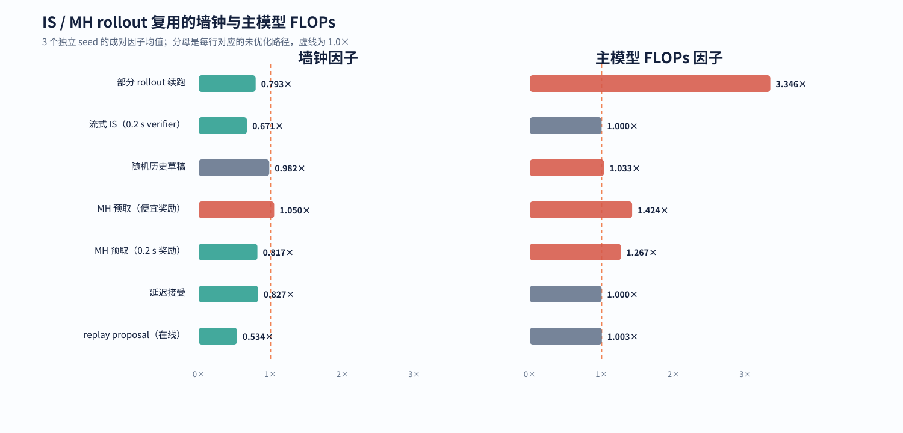
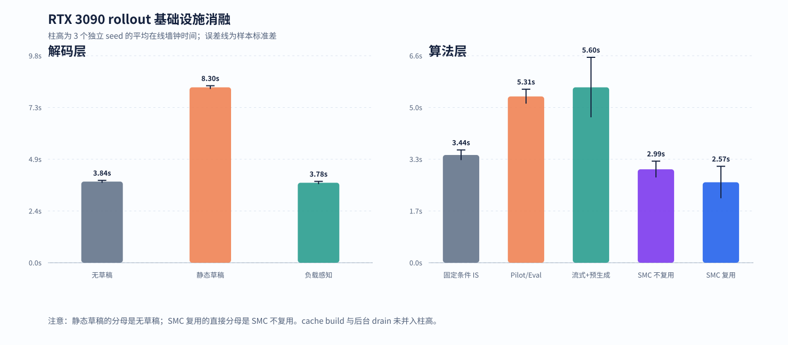

# 推理成本与执行效率：RTX 3090

本报告比较批处理、rollout 复用、MH proposal 和奖励调度的执行成本；准确率见
[算法质量报告](GSM8K_3090_ALIGNED_RESULTS.md)，机制见[算法文档](../methods/ALGORITHMS.md#alg-runtime)，成本口径见
[BUDGET.md](../methods/BUDGET.md#budget-accounting)。结论来自统一入口之前的实验，数字按当时的实现测得。标注“旧方法”
的机制已从代码中删除，这里只保留其说明与结论；其余机制的复现命令对应当前实现（第 6 节）。

主模型为 Qwen2.5-1.5B-Instruct，旧方法的辅助模型为 Qwen2.5-0.5B-Instruct，硬件为单张 RTX 3090 24 GiB，全部数值
来自 Transformers。成本比统一为“实验路径 / 本组基线”，小于 1 表示成本下降；墙钟不含模型与数据加载，建库与后台
收尾单列。FLOPs 按“2 × 参数量 × 实际前向 token 位置数”估算，覆盖预填充、生成、重评分与草稿验证，不含注意力的
长度平方项；“±”为三个随机种子的样本标准差。

## 1. 连续批处理

32 道题、同一方法与请求种子，比较逐题执行与 8 个题目并发共享后端。

- **连续批处理主要提高设备利用率。** 基础采样的墙钟下降 79%（每秒完成题目数约为 4.85 倍），多数投票-8 下降 50%，
  条件 IS 只下降 13%（0.5B 补全的旧方法下降 5%），受候选、补全与选择之间的阶段依赖限制。
- 填充增加参与前向的 token 位置数，墙钟下降可能伴随 FLOPs 上升（基础采样为 1.18 倍）。

## 2. 旧方法：IS 的历史复用与候选缓存

replay 从历史库读取与当前条件匹配的 rollout（每条最终估计记录只用一次），再加入新样本校正；候选缓存直接复用建库时
已生成的同一组基础模型候选。

- **已有匹配历史时在线成本下降，为当前请求新建历史则更贵。** 32 题上，已有历史时在线 FLOPs 下降 23%、墙钟下降 14%；
  建库加首次查询的 FLOPs 为纯新生成的 2.34 倍、墙钟 1.81 倍。
- **候选缓存与批处理可以叠加。** 4 题组合实验中，候选缓存相对逐题 replay 的墙钟比为 0.70，完整组合相对批处理纯新
  生成的在线墙钟比为 0.75、1.5B FLOPs 比为 0.74，平均 rollout 复用率 31.6%；计入建库后首次查询的墙钟比为 1.36、
  总 FLOPs 比为 1.94。各组对照逐 token 一致。

## 3. MH 后缀与冻结历史 proposal

- **短后缀减少串行生成。** 32 题 × 4 次、最长 128 token 的幂目标 MH 中，相对均匀后缀，长度倒数与多尺度后缀分别
  减少 50% 与 32% 的生成 token，墙钟降为 0.54 与 0.59 倍。当时每次提议都重新预填充保留的前缀，FLOPs 基本不变；
  当前的前缀 KV 存储复用这部分计算。
- **冻结历史 proposal 以评分替代部分后缀生成。** 1 题、4 条链、30% 基础模型加 70% 冻结历史的混合 proposal（正反
  混合概率都进入 Hastings 比）：与多尺度后缀组合时，在线墙钟为“基础模型 / 均匀后缀”的 0.36 倍，主模型 FLOPs
  基本不变，接受率从 61% 升至 80%；建库平均 0.66 s，计入后首次查询墙钟仍低于基线，计算量略高。

## 4. 奖励调度与补全复用

图 1：左侧为墙钟比，右侧为主模型 FLOPs 比，均为三个随机种子的成对比值均值，虚线 1 表示本组基线。除冻结历史 MH
外，各行均为旧方法：部分续跑对比从头生成，流式 IS 对比整批生成后评分，历史草稿对比普通解码，MH 各行对比同设置下
的基础模型 proposal。

单题 BF16 诊断，奖励为人工 token 判定；延迟由奖励计算后人工等待 0.2 s 构造。

- **旧方法：奖励重叠。** 流式 IS 在 0.2 s 延迟下墙钟比为 0.67，计算量不变；近零延迟时为 1.03。收益来自隐藏评分等待。
- **旧方法：MH 预取。** 有延迟时墙钟比 0.82，但 FLOPs 增加 27%；近零延迟时墙钟与 FLOPs 均增加。
- **旧方法：两阶段接受。** 墙钟比 0.83，精确奖励调用降至 0.56 倍；该结果依赖理想近似奖励。
- **旧方法：部分续跑。** 新生成 token 减少 23%，却因重复预填充使 FLOPs 增至 3.35 倍。
- **历史复用。** 旧方法随机历史草稿的墙钟比为 0.98，收益很小；冻结历史 MH 的在线墙钟比为 0.53、FLOPs 比 1.00，
  计入建库后墙钟比 0.59、FLOPs 比 1.07。

图 2：柱高为三个种子的平均在线墙钟，误差线为样本标准差。左侧以普通解码为基线；右侧比较固定条件 IS 与两阶段估计，
以及同一 SMC 的纯新生成与条件后缀复用。以下均为旧方法（1 题、BF16、最长 64 token、块长 16）。

- **历史 token 树草稿需要按负载启用。** 始终使用时墙钟从 3.84 s 增至 8.30 s、FLOPs 1.66 倍；只在批量 1 时启用为
  3.78 s、FLOPs 1.01 倍。
- **两阶段估计没有收益。** 先用独立初始样本分配预算的两阶段估计为 5.31 s，高于固定 IS 的 3.44 s，FLOPs 1.55 倍；
  加入流式与预生成为 5.60 s。
- **SMC 后缀复用略有收益。** 复用匹配前缀的补全后在线墙钟从 2.99 s 降至 2.57 s（成对比 0.86），FLOPs 比 0.96。
- **0.5B 草稿模型未取得加速。** 草稿长 2 时接受率 86.5%，相对普通 1.5B 生成的墙钟比 1.06、FLOPs 比 1.44。

## 5. 算法配置的成本分解

- **旧方法：0.5B 补全与主模型重评分。** 省略 1.5B 重评分后，自一致性组与正确性组的 FLOPs 分别降至 23.9% 与 26.0%，
  同时改变条件权重的目标；正确性组成对运行的墙钟反而从 476.5 s 增至 556.2 s，因为生成 token 增加而批量评分的并行度
  高于逐 token 生成。
- **旧方法：动态候选与方差—成本分配。** 已有历史时，
  动态候选相对基础候选的在线 FLOPs 比为 0.92、墙钟比 1.00；方差—成本分配的设计阶段开销大，最终 rollout 复用率只有
  5.7%（动态固定组 34.9%）。
- **训练与推理成本需要一并比较。** 该 GRPO 检查点训练消耗 15.6 PFLOPs、500 万个前向
  等价 token 位置和 9,545 s；32 题单次评测中，GRPO 随机采样、基础采样、条件 IS 与幂目标 MH 的推理计算量分别为 0.025、
  0.028、1.37、1.31 PFLOPs。条件 IS 的单次准确率点估计接近 GRPO，对应约 54 倍的训练后推理 FLOPs。

总体上，连续批处理主要提高设备利用率，候选缓存与已有历史减少在线生成，冻结历史 MH 以评分替代部分串行生成，奖励
调度的收益依赖可重叠的等待时间。选择方案时应同时比较墙钟、各模型的 FLOPs 以及当前请求实际承担的建库与设计成本。

## 6. 复现

每条记录的 `cost` 按阶段给出前向 token 位置数与 FLOPs，结果目录的 `summary.json` 汇总墙钟与成本。旧方法没有对应命令。

| 机制 | 命令 | 设置改动 |
| --- | --- | --- |
| 连续批处理 | `python -m inference_scaling --algorithm sample`（或 `best_of_n`、`is`） | `ar.engine.continuous_batching.workers = 8`，对照为 1；多数投票设 `rewards.verifier.source = "vote"`，IS 设 `planning = "fixed"` |
| 后缀长度分布 | `--algorithm mh_power` | `suffix_schedule` 三选一；`datasets.gsm8k.max_new_tokens = 128`、`block_size = 16`、`steps_per_block = 2`、`run.draws = 4` |
| 冻结历史 proposal | `--algorithm mh` | `ar.algorithms.mh.proposal = "frozen_history"`，对照为 `"base"`；组合时再设 `suffix_schedule = "multiscale"` |
| 训练成本 | `python -m training` | `stages = ["grpo"]`；训练成本写入 `grpo.output` 下的 `training_cost.json` |

与当时实现的差异：冻结历史与后缀对照当时用人工奖励（末 token 奇偶）在单题上测成本，当前命令用正式奖励在 GSM8K 上
测量同一机制。
